# 🐢 JemmaPass — Spécification & Documentation UML Fonctionnelle Complète (Plateforme-Agnostique)

> **Document de Référence pour l'Ingénierie Système & Métier**  
> **Auteur** : Orchestrateur Principal de Sub-Agents  
> **Version** : 3.0.0-UML · Octobre 2026  
> **Statut** : Approuvé pour Implémentation Multiplateforme (iOS / Android / Web / Embedded)  
> **Périmètre** : Spécification Fonctionnelle Formelle Indépendante de la Plateforme (Acteurs, Cas d'Usage, Modèle de Domaine, Machines à États, Diagrammes de Séquence, Algorithmes Métier et Contrats d'Interface).

---

## Sommaire

1. [Principes Directeurs & Indépendance Plateforme](#1-principes-directeurs--indépendance-plateforme)
2. [Diagrammes des Cas d'Utilisation Métier (Use Cases)](#2-diagrammes-des-cas-dutilisation-métier-use-cases)
   - 2.1. Cartographie Globale des Acteurs et Cas d'Usage
   - 2.2. Package 1 : Gestion du Passeport IPS (Patient & Aidant)
   - 2.3. Package 2 : Prise en Charge d'Urgence & Scan (Secouriste / DMAT)
   - 2.4. Package 3 : Triage en Zone de Catastrophe (SALT Mesh)
   - 2.5. Package 4 : Éducation Thérapeutique & Vulgarisation IA
3. [Modèle du Domaine Fonctionnel (Class Diagrams)](#3-modèle-du-domaine-fonctionnel-class-diagrams)
   - 3.1. Structure des 18 Piliers IPS & Dualité FHIR R4 vs Projection `_j 1.2`
   - 3.2. Moteur Clinique, Pharmacologique & Verdicts de Sécurité
   - 3.3. Canaux de Transfert Multi-Supports Hors-Ligne
   - 3.4. Pipeline d'Intelligence Artificielle & Outils Embarqués
4. [Machines à États-Transitions (State Diagrams)](#4-machines-à-états-transitions-state-diagrams)
   - 4.1. Cycle de Vie & Persistance du Dossier Patient
   - 4.2. Matrice Inviolable du Verdict de Sécurité Clinique (`KbSafetyVerdict`)
   - 4.3. Protocole de Tri de Catastrophe SALT
   - 4.4. Cycle d'Assemblage des Trames QR Multi-Frames (`JF:i/N`)
5. [Diagrammes de Séquence des Flux Fonctionnels Clés (Sequence Diagrams)](#5-diagrammes-de-séquence-des-flux-fonctionnels-clés-sequence-diagrams)
   - 5.1. Détection de Collision Létale : Scénario Kurodo (Pénicilline × Augmentin)
   - 5.2. Contrôle d'Interaction Non-Contre-Indiquée : Scénario Haru (Edoxaban × Aspirine)
   - 5.3. Génération du QR Texte 25 Langues avec Budget d'Éviction Strict (1800 octets UTF-8)
   - 5.4. Découverte, Alerte et Propagation Maillée P2P SALT (Zone Sinistrée)
   - 5.5. Pipeline de Vulgarisation Pédagogique Multilingue et Cache Local
6. [Diagrammes d'Activités & Algorithmes Métier (Activity Diagrams)](#6-diagrammes-dactivités--algorithmes-métier-activity-diagrams)
   - 6.1. Algorithme de Résolution Sémantique d'un Médicament (Katakana / DCI / Marque)
   - 6.2. Algorithme de Détection d'Allergie Croisée par Arborescence de Classes
   - 6.3. Algorithme d'Éviction Prioritaire du QR Texte Universel
   - 6.4. Algorithme de Réconciliation et d'Inviolabilité du Groupe Sanguin
7. [Spécifications Formelles des Contrats d'Interface Plateforme-Agnostiques](#7-spécifications-formelles-des-contrats-dinterface-plateforme-agnostiques)

---

## 1. Principes Directeurs & Indépendance Plateforme

Ce document établit la **vérité fonctionnelle absolue** de JemmaPass. Toute implémentation, qu'elle soit en Kotlin/Android, Swift/iOS, C++, TypeScript ou Rust, doit se conformer rigoureusement aux règles, diagrammes et contrats définis ci-après.

```
┌────────────────────────────────────────────────────────────────────────┐
│                   LES 5 INVARIANTS SYSTÈME JEMMAPASS                   │
├────────────────────────────────────────────────────────────────────────┤
│ 1. ZERO-NETWORK AT RUNTIME                                             │
│    Aucune opération vitale (décisionnelle, transfert, IA) ne dépend    │
│    du réseau. Le système fonctionne 100% hors-ligne.                   │
│                                                                        │
│ 2. FHIR R4 AS SINGLE SOURCE OF TRUTH                                   │
│    Le document médical faisant foi est le Bundle HL7 FHIR R4 IPS.      │
│    Le format JSON court `_j 1.2` est une projection de transport.      │
│                                                                        │
│ 3. STRICT SAFETY DECISION MATRIX                                       │
│    Interdiction mathématique d'afficher "Rien à signaler" si un        │
│    élément du profil n'a pas été contrôlé (KB absente ou nom inconnu). │
│                                                                        │
│ 4. DETERMINISTIC OFFLINE TRANSFER                                      │
│    Les transferts QR et BLE garantissent la réception intégrale ou     │
│    l'avertissement explicite de troncature (jamais de coupure muette). │
│                                                                        │
│ 5. MULTILINGUAL NATIVE EXPERIENCE                                      │
│    La restitution s'effectue dans la langue locale de l'opérateur      │
│    (25 langues couvertes), quel que soit le pays d'origine du patient. │
└────────────────────────────────────────────────────────────────────────┘
```

---

## 2. Diagrammes des Cas d'Utilisation Métier (Use Cases)

### 2.1. Cartographie Globale des Acteurs et Cas d'Usage

Le système interagit avec 4 acteurs principaux :
- **Patient / Porteur du Pass** : Crée, édite et présente son passeport médical d'urgence.
- **Aidant / Famille** : Gère le profil d'un proche dépendant ou âgé (ex: petit-fils pour Haru).
- **Secouriste / DMAT / Soignant** : Scanne, vérifie la sécurité médicamenteuse, effectue le tri en catastrophe.
- **Agent IA Embarqué (Jemma)** : Exécute les requêtes terminologiques et vulgarise les alertes.

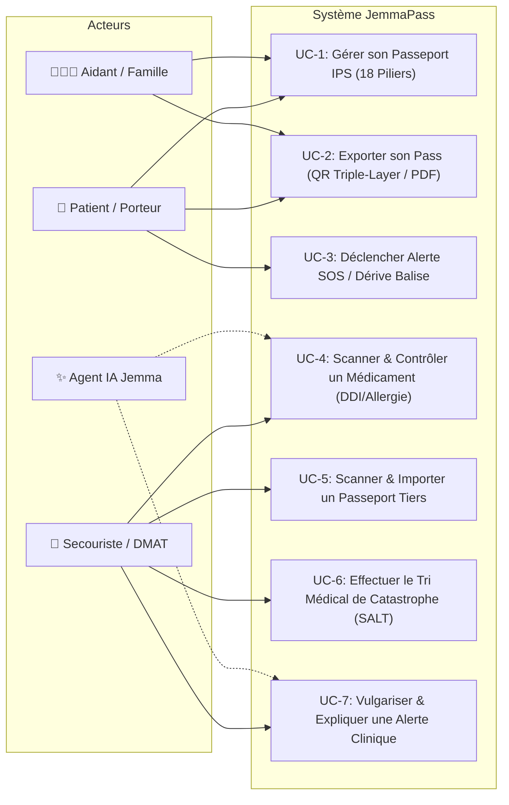
```mermaid
flowchart LR
    subgraph Acteurs
        P["👤 Patient / Porteur"]
        A["👨‍👩‍👦 Aidant / Famille"]
        S["🎒 Secouriste / DMAT"]
        J["✨ Agent IA Jemma"]
    end

    subgraph Cas_d_Usage_Globaux ["Système JemmaPass"]
        UC1["UC-1: Gérer son Passeport IPS (18 Piliers)"]
        UC2["UC-2: Exporter son Pass (QR Triple-Layer / PDF)"]
        UC3["UC-3: Déclencher Alerte SOS / Dérive Balise"]
        UC4["UC-4: Scanner & Contrôler un Médicament (DDI/Allergie)"]
        UC5["UC-5: Scanner & Importer un Passeport Tiers"]
        UC6["UC-6: Effectuer le Tri Médical de Catastrophe (SALT)"]
        UC7["UC-7: Vulgariser & Expliquer une Alerte Clinique"]
    end

    P --> UC1
    P --> UC2
    P --> UC3
    A --> UC1
    A --> UC2
    S --> UC4
    S --> UC5
    S --> UC6
    S --> UC7
    J -.-> UC4
    J -.-> UC7
```

### 2.2. Package 1 : Gestion du Passeport IPS (Patient & Aidant)

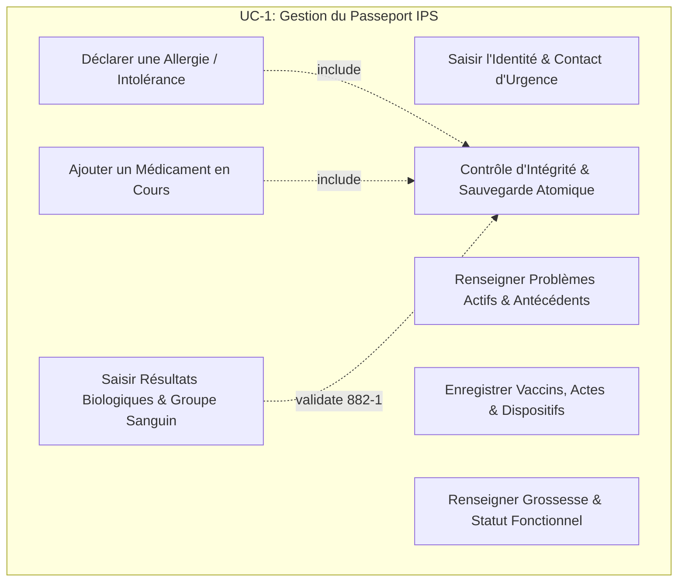
```mermaid
flowchart TD
    subgraph Gestion_Profil ["UC-1: Gestion du Passeport IPS"]
        UC1_1["Saisir l'Identité & Contact d'Urgence"]
        UC1_2["Déclarer une Allergie / Intolérance"]
        UC1_3["Ajouter un Médicament en Cours"]
        UC1_4["Renseigner Problèmes Actifs & Antécédents"]
        UC1_5["Enregistrer Vaccins, Actes & Dispositifs"]
        UC1_6["Saisir Résultats Biologiques & Groupe Sanguin"]
        UC1_7["Renseigner Grossesse & Statut Fonctionnel"]
        UC1_8["Contrôle d'Intégrité & Sauvegarde Atomique"]
    end

    UC1_2 -.->|include| UC1_8
    UC1_3 -.->|include| UC1_8
    UC1_6 -.->|validate 882-1| UC1_8
```

### 2.3. Package 2 : Prise en Charge d'Urgence & Scan (Secouriste / DMAT)

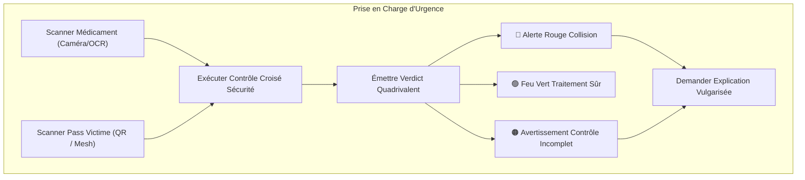
```mermaid
flowchart TD
    subgraph Prise_En_Charge ["Prise en Charge d'Urgence"]
        SCAN["Scanner Médicament (Caméra/OCR)"]
        IMPORT["Scanner Pass Victime (QR / Mesh)"]
        EVAL["Exécuter Contrôle Croisé Sécurité"]
        VERDICT["Émettre Verdict Quadrivalent"]
        RED["🔴 Alerte Rouge Collision"]
        GREEN["🟢 Feu Vert Traitement Sûr"]
        AMBER["🟠 Avertissement Contrôle Incomplet"]
        VULG["Demander Explication Vulgarisée"]
    end

    SCAN --> EVAL
    IMPORT --> EVAL
    EVAL --> VERDICT
    VERDICT --> RED
    VERDICT --> GREEN
    VERDICT --> AMBER
    RED --> VULG
    AMBER --> VULG
```

### 2.4. Package 3 : Triage en Zone de Catastrophe (SALT Mesh)

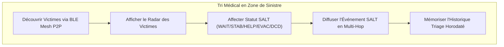
```mermaid
flowchart TD
    subgraph Triage_SALT ["Tri Médical en Zone de Sinistre"]
        DISC["Découvrir Victimes via BLE Mesh P2P"]
        RADAR["Afficher le Radar des Victimes"]
        ASSIGN["Affecter Statut SALT (WAIT/STAB/HELP/EVAC/DCD)"]
        BROADCAST["Diffuser l'Événement SALT en Multi-Hop"]
        STORE["Mémoriser l'Historique Triage Horodaté"]
    end

    DISC --> RADAR
    RADAR --> ASSIGN
    ASSIGN --> BROADCAST
    BROADCAST --> STORE
```

---

## 3. Modèle du Domaine Fonctionnel (Class Diagrams)

### 3.1. Structure des 18 Piliers IPS & Dualité FHIR R4 vs Projection `_j 1.2`

Le modèle métier sépare formellement le **Bundle FHIR R4 (Source de Vérité)** et la **Projection Compacte `_j 1.2` (Transport)**.

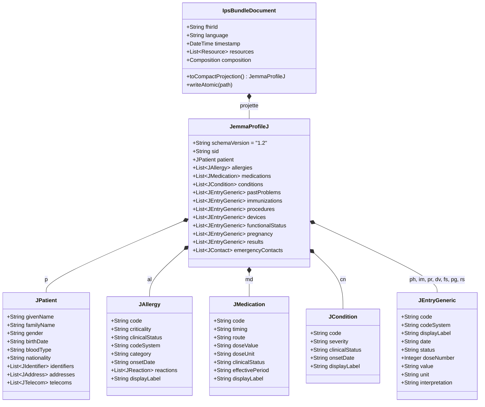
```mermaid
classDiagram
    class IpsBundleDocument {
        +String fhirId
        +String language
        +DateTime timestamp
        +List~Resource~ resources
        +Composition composition
        +toCompactProjection() JemmaProfileJ
        +writeAtomic(path)
    }

    class JemmaProfileJ {
        +String schemaVersion = "1.2"
        +String sid
        +JPatient patient
        +List~JAllergy~ allergies
        +List~JMedication~ medications
        +List~JCondition~ conditions
        +List~JEntryGeneric~ pastProblems
        +List~JEntryGeneric~ immunizations
        +List~JEntryGeneric~ procedures
        +List~JEntryGeneric~ devices
        +List~JEntryGeneric~ functionalStatus
        +List~JEntryGeneric~ pregnancy
        +List~JEntryGeneric~ results
        +List~JContact~ emergencyContacts
    }

    class JPatient {
        +String givenName
        +String familyName
        +String gender
        +String birthDate
        +String bloodType
        +String nationality
        +List~JIdentifier~ identifiers
        +List~JAddress~ addresses
        +List~JTelecom~ telecoms
    }

    class JAllergy {
        +String code
        +String criticality
        +String clinicalStatus
        +String codeSystem
        +String category
        +String onsetDate
        +List~JReaction~ reactions
        +String displayLabel
    }

    class JMedication {
        +String code
        +String timing
        +String route
        +String doseValue
        +String doseUnit
        +String clinicalStatus
        +String effectivePeriod
        +String displayLabel
    }

    class JCondition {
        +String code
        +String severity
        +String clinicalStatus
        +String onsetDate
        +String displayLabel
    }

    class JEntryGeneric {
        +String code
        +String codeSystem
        +String displayLabel
        +String date
        +String status
        +Integer doseNumber
        +String value
        +String unit
        +String interpretation
    }

    IpsBundleDocument *-- JemmaProfileJ : projette
    JemmaProfileJ *-- JPatient : p
    JemmaProfileJ *-- JAllergy : al
    JemmaProfileJ *-- JMedication : md
    JemmaProfileJ *-- JCondition : cn
    JemmaProfileJ *-- JEntryGeneric : ph, im, pr, dv, fs, pg, rs
```

### 3.2. Moteur Clinique, Pharmacologique & Verdicts de Sécurité

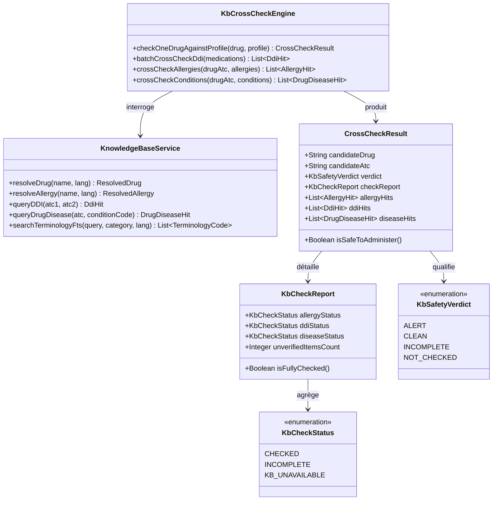
```mermaid
classDiagram
    class KnowledgeBaseService {
        +resolveDrug(name, lang) ResolvedDrug
        +resolveAllergy(name, lang) ResolvedAllergy
        +queryDDI(atc1, atc2) DdiHit
        +queryDrugDisease(atc, conditionCode) DrugDiseaseHit
        +searchTerminologyFts(query, category, lang) List~TerminologyCode~
    }

    class KbCrossCheckEngine {
        +checkOneDrugAgainstProfile(drug, profile) CrossCheckResult
        +batchCrossCheckDdi(medications) List~DdiHit~
        +crossCheckAllergies(drugAtc, allergies) List~AllergyHit~
        +crossCheckConditions(drugAtc, conditions) List~DrugDiseaseHit~
    }

    class CrossCheckResult {
        +String candidateDrug
        +String candidateAtc
        +KbSafetyVerdict verdict
        +KbCheckReport checkReport
        +List~AllergyHit~ allergyHits
        +List~DdiHit~ ddiHits
        +List~DrugDiseaseHit~ diseaseHits
        +Boolean isSafeToAdminister()
    }

    class KbCheckReport {
        +KbCheckStatus allergyStatus
        +KbCheckStatus ddiStatus
        +KbCheckStatus diseaseStatus
        +Integer unverifiedItemsCount
        +Boolean isFullyChecked()
    }

    class KbSafetyVerdict {
        <<enumeration>>
        ALERT
        CLEAN
        INCOMPLETE
        NOT_CHECKED
    }

    class KbCheckStatus {
        <<enumeration>>
        CHECKED
        INCOMPLETE
        KB_UNAVAILABLE
    }

    KbCrossCheckEngine --> KnowledgeBaseService : interroge
    KbCrossCheckEngine --> CrossCheckResult : produit
    CrossCheckResult --> KbSafetyVerdict : qualifie
    CrossCheckResult --> KbCheckReport : détaille
    KbCheckReport --> KbCheckStatus : agrège
```

### 3.3. Canaux de Transfert Multi-Supports Hors-Ligne

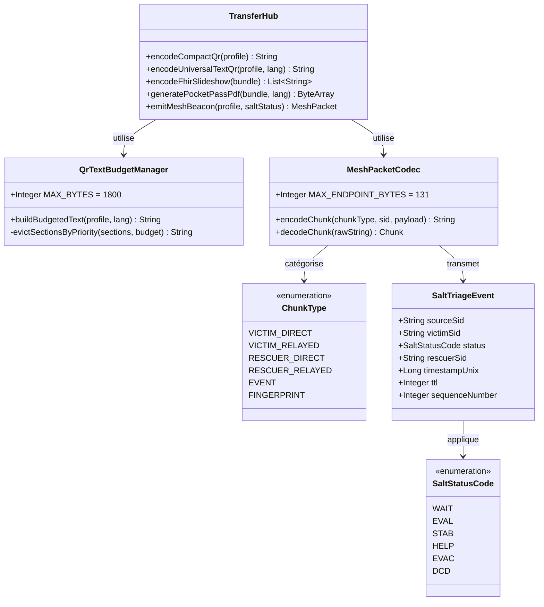
```mermaid
classDiagram
    class TransferHub {
        +encodeCompactQr(profile) String
        +encodeUniversalTextQr(profile, lang) String
        +encodeFhirSlideshow(bundle) List~String~
        +generatePocketPassPdf(bundle, lang) ByteArray
        +emitMeshBeacon(profile, saltStatus) MeshPacket
    }

    class QrTextBudgetManager {
        +Integer MAX_BYTES = 1800
        +buildBudgetedText(profile, lang) String
        -evictSectionsByPriority(sections, budget) String
    }

    class MeshPacketCodec {
        +Integer MAX_ENDPOINT_BYTES = 131
        +encodeChunk(chunkType, sid, payload) String
        +decodeChunk(rawString) Chunk
    }

    class ChunkType {
        <<enumeration>>
        VICTIM_DIRECT
        VICTIM_RELAYED
        RESCUER_DIRECT
        RESCUER_RELAYED
        EVENT
        FINGERPRINT
    }

    class SaltTriageEvent {
        +String sourceSid
        +String victimSid
        +SaltStatusCode status
        +String rescuerSid
        +Long timestampUnix
        +Integer ttl
        +Integer sequenceNumber
    }

    class SaltStatusCode {
        <<enumeration>>
        WAIT
        EVAL
        STAB
        HELP
        EVAC
        DCD
    }

    TransferHub --> QrTextBudgetManager : utilise
    TransferHub --> MeshPacketCodec : utilise
    MeshPacketCodec --> ChunkType : catégorise
    MeshPacketCodec --> SaltTriageEvent : transmet
    SaltTriageEvent --> SaltStatusCode : applique
```

---

## 4. Machines à États-Transitions (State Diagrams)

### 4.1. Cycle de Vie & Persistance du Dossier Patient

Toute modification suit une séquence transactionnelle atomique stricte pour éliminer tout risque de corruption en cas d'arrêt brutal du processus.

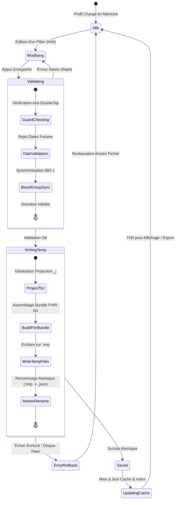
```mermaid
stateDiagram-v2
    [*] --> Idle : Profil Chargé en Mémoire

    Idle --> Modifying : Édition d'un Pilier (IHM)
    Modifying --> Validating : Appui Enregistrer
    
    state Validating {
        [*] --> GuardChecking : Vérification Anti-DoubleTap
        GuardChecking --> DateValidation : Rejet Dates Futures
        DateValidation --> BloodGroupSync : Synchronisation 882-1
        BloodGroupSync --> [*] : Données Valides
    }

    Validating --> Modifying : Erreur Saisie (Rejet)
    Validating --> WritingTemp : Validation OK

    state WritingTemp {
        [*] --> ProjectToJ : Génération Projection _j
        ProjectToJ --> BuildFhirBundle : Assemblage Bundle FHIR R4
        BuildFhirBundle --> WriteTempFiles : Écriture sur .tmp
        WriteTempFiles --> AtomicRename : Renommage Atomique (.tmp -> .json)
        AtomicRename --> [*]
    }

    WritingTemp --> ErrorRollback : Échec Écriture / Disque Plein
    ErrorRollback --> Idle : Restauration Ancien Fichier
    WritingTemp --> Saved : Succès Atomique

    Saved --> UpdatingCache : Mise à Jour Cache & Index
    UpdatingCache --> Idle : Prêt pour Affichage / Export
```

### 4.2. Matrice Inviolable du Verdict de Sécurité Clinique (`KbSafetyVerdict`)

Cette machine à états formalise le principe fondamental interdisant les faux "Rien à signaler".

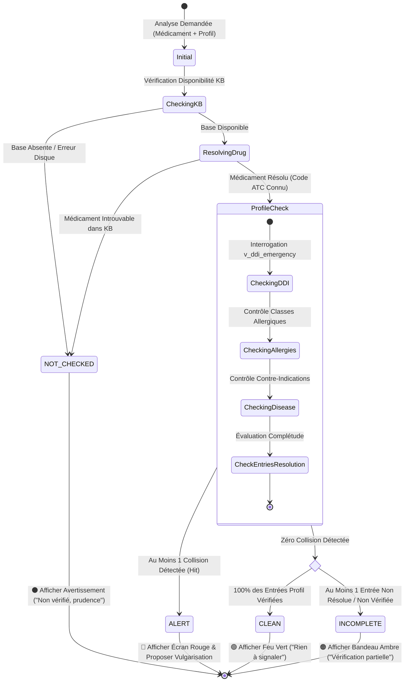
```mermaid
stateDiagram-v2
    [*] --> Initial : Analyse Demandée (Médicament + Profil)

    Initial --> CheckingKB : Vérification Disponibilité KB
    CheckingKB --> NOT_CHECKED : Base Absente / Erreur Disque
    CheckingKB --> ResolvingDrug : Base Disponible

    ResolvingDrug --> NOT_CHECKED : Médicament Introuvable dans KB
    ResolvingDrug --> ProfileCheck : Médicament Résolu (Code ATC Connu)

    state ProfileCheck {
        [*] --> CheckingDDI : Interrogation v_ddi_emergency
        CheckingDDI --> CheckingAllergies : Contrôle Classes Allergiques
        CheckingAllergies --> CheckingDisease : Contrôle Contre-Indications
        CheckingDisease --> CheckEntriesResolution : Évaluation Complétude
        CheckEntriesResolution --> [*]
    }

    ProfileCheck --> ALERT : Au Moins 1 Collision Détectée (Hit)
    
    state DecisionNoHit <<choice>>
    ProfileCheck --> DecisionNoHit : Zéro Collision Détectée

    DecisionNoHit --> CLEAN : 100% des Entrées Profil Vérifiées
    DecisionNoHit --> INCOMPLETE : Au Moins 1 Entrée Non Résolue / Non Vérifiée

    ALERT --> [*] : 🔴 Afficher Écran Rouge & Proposer Vulgarisation
    CLEAN --> [*] : 🟢 Afficher Feu Vert ("Rien à signaler")
    INCOMPLETE --> [*] : 🟠 Afficher Bandeau Ambre ("Vérification partielle")
    NOT_CHECKED --> [*] : ⚫ Afficher Avertissement ("Non vérifié, prudence")
```

### 4.3. Protocole de Tri de Catastrophe SALT

Cycle de gestion d'une victime lors d'un afflux massif de blessés (séisme, accident majeur).

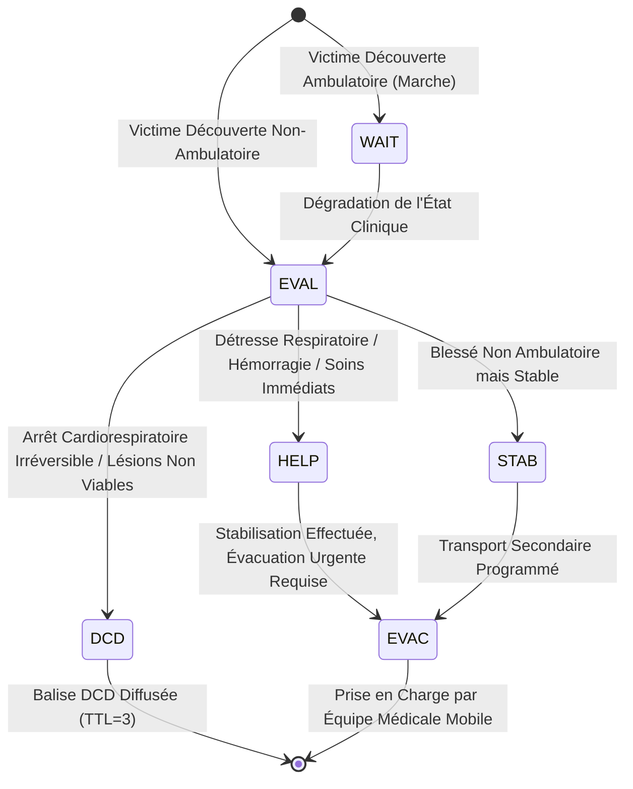
```mermaid
stateDiagram-v2
    [*] --> WAIT : Victime Découverte Ambulatoire (Marche)
    [*] --> EVAL : Victime Découverte Non-Ambulatoire

    EVAL --> STAB : Blessé Non Ambulatoire mais Stable
    EVAL --> HELP : Détresse Respiratoire / Hémorragie / Soins Immédiats
    EVAL --> DCD : Arrêt Cardiorespiratoire Irréversible / Lésions Non Viables

    HELP --> EVAC : Stabilisation Effectuée, Évacuation Urgente Requise
    STAB --> EVAC : Transport Secondaire Programmé
    WAIT --> EVAL : Dégradation de l'État Clinique

    DCD --> [*] : Balise DCD Diffusée (TTL=3)
    EVAC --> [*] : Prise en Charge par Équipe Médicale Mobile
```

### 4.4. Cycle d'Assemblage des Trames QR Multi-Frames (`JF:i/N`)

Protocole de reconstitution d'un Bundle FHIR R4 volumineux scanné à travers un diaporama de QR codes.

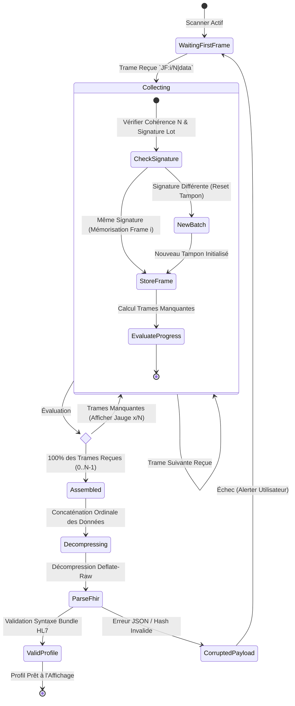
```mermaid
stateDiagram-v2
    [*] --> WaitingFirstFrame : Scanner Actif

    WaitingFirstFrame --> Collecting : Trame Reçue `JF:i/N|data`
    
    state Collecting {
        [*] --> CheckSignature : Vérifier Cohérence N & Signature Lot
        CheckSignature --> NewBatch : Signature Différente (Reset Tampon)
        CheckSignature --> StoreFrame : Même Signature (Mémorisation Frame i)
        NewBatch --> StoreFrame : Nouveau Tampon Initialisé
        StoreFrame --> EvaluateProgress : Calcul Trames Manquantes
        EvaluateProgress --> [*]
    }

    Collecting --> Collecting : Trame Suivante Reçue
    
    state IsComplete <<choice>>
    Collecting --> IsComplete : Évaluation

    IsComplete --> Collecting : Trames Manquantes (Afficher Jauge x/N)
    IsComplete --> Assembled : 100% des Trames Reçues (0..N-1)

    Assembled --> Decompressing : Concaténation Ordinale des Données
    Decompressing --> ParseFhir : Décompression Deflate-Raw
    ParseFhir --> ValidProfile : Validation Syntaxe Bundle HL7
    ParseFhir --> CorruptedPayload : Erreur JSON / Hash Invalide
    
    CorruptedPayload --> WaitingFirstFrame : Échec (Alerter Utilisateur)
    ValidProfile --> [*] : Profil Prêt à l'Affichage
```

---

## 5. Diagrammes de Séquence des Flux Fonctionnels Clés (Sequence Diagrams)

### 5.1. Détection de Collision Létale : Scénario Kurodo (Pénicilline × Augmentin)

Flux exécuté en **~200 millisecondes** sur le terminal hors-ligne du secouriste.

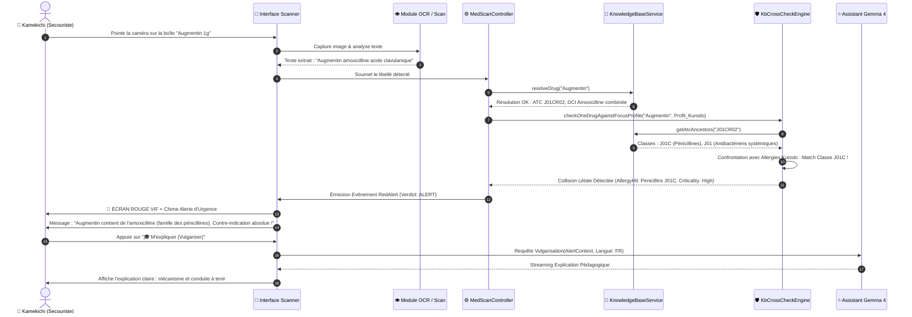
```mermaid
sequenceDiagram
    autonumber
    actor Secouriste as 🎒 Kamekichi (Secouriste)
    participant UI as 📱 Interface Scanner
    participant Vision as 👁️ Module OCR / Scan
    participant Controller as ⚙️ MedScanController
    participant KB as 🧠 KnowledgeBaseService
    participant Engine as 🛡️ KbCrossCheckEngine
    participant IA as ✨ Assistant Gemma 4

    Secouriste->>UI: Pointe la caméra sur la boîte "Augmentin 1g"
    UI->>Vision: Capture image & analyse texte
    Vision-->>UI: Texte extrait : "Augmentin amoxicilline acide clavulanique"
    UI->>Controller: Soumet le libellé détecté
    Controller->>KB: resolveDrug("Augmentin")
    KB-->>Controller: Résolution OK : ATC J01CR02, DCI Amoxicilline combinée
    Controller->>Engine: checkOneDrugAgainstFocusProfile("Augmentin", Profil_Kurodo)
    Engine->>KB: getAtcAncestors("J01CR02")
    KB-->>Engine: Classes : J01C (Pénicillines), J01 (Antibactériens systémiques)
    Engine->>Engine: Confrontation avec Allergies Kurodo : Match Classe J01C !
    Engine-->>Controller: Collision Létale Détectée (AllergyHit: Penicillins J01C, Criticality: High)
    Controller->>UI: Émission Evénement RedAlert (Verdict: ALERT)
    UI->>Secouriste: 🔴 ÉCRAN ROUGE VIF + Chime Alerte d'Urgence
    UI->>Secouriste: Message : "Augmentin contient de l'amoxicilline (famille des pénicillines). Contre-indication absolue !"
    Secouriste->>UI: Appuie sur "🎓 M'expliquer (Vulgariser)"
    UI->>IA: Requête Vulgarisation(AlertContext, Langue: FR)
    IA-->>UI: Streaming Explication Pédagogique
    UI->>Secouriste: Affiche l'explication claire : mécanisme et conduite à tenir
```

### 5.2. Contrôle d'Interaction Non-Contre-Indiquée : Scénario Haru (Edoxaban × Aspirine)

Illustration d'un verdict **CLEAN** avec note de prudence pharmacologique (DDInter 2.0).

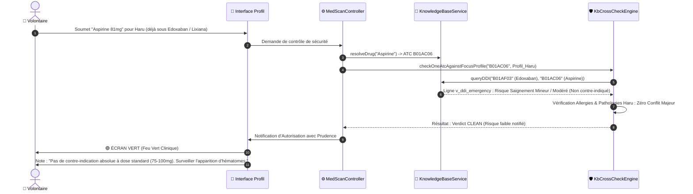
```mermaid
sequenceDiagram
    autonumber
    actor Secouriste as 🎒 Volontaire
    participant UI as 📱 Interface Profil
    participant Controller as ⚙️ MedScanController
    participant KB as 🧠 KnowledgeBaseService
    participant Engine as 🛡️ KbCrossCheckEngine

    Secouriste->>UI: Soumet "Aspirine 81mg" pour Haru (déjà sous Edoxaban / Lixiana)
    UI->>Controller: Demande de contrôle de sécurité
    Controller->>KB: resolveDrug("Aspirine") -> ATC B01AC06
    Controller->>Engine: checkOneAtcAgainstFocusProfile("B01AC06", Profil_Haru)
    Engine->>KB: queryDDI("B01AF03" (Edoxaban), "B01AC06" (Aspirine))
    KB-->>Engine: Ligne v_ddi_emergency : Risque Saignement Mineur / Modéré (Non contre-indiqué)
    Engine->>Engine: Vérification Allergies & Pathologies Haru : Zéro Conflit Majeur
    Engine-->>Controller: Résultat : Verdict CLEAN (Risque faible notifié)
    Controller->>UI: Notification d'Autorisation avec Prudence
    UI->>Secouriste: 🟢 ÉCRAN VERT (Feu Vert Clinique)
    UI->>Secouriste: Note : "Pas de contre-indication absolue à dose standard (75-100mg). Surveiller l'apparition d'hématomes."
```

### 5.3. Génération du QR Texte 25 Langues avec Budget d'Éviction Strict (1800 octets UTF-8)

Ce flux garantit qu'un QR code texte généré ne dépasse **jamais 1800 octets**, pour rester scannable en 1 seule trame par n'importe quel iPhone Camera standard.

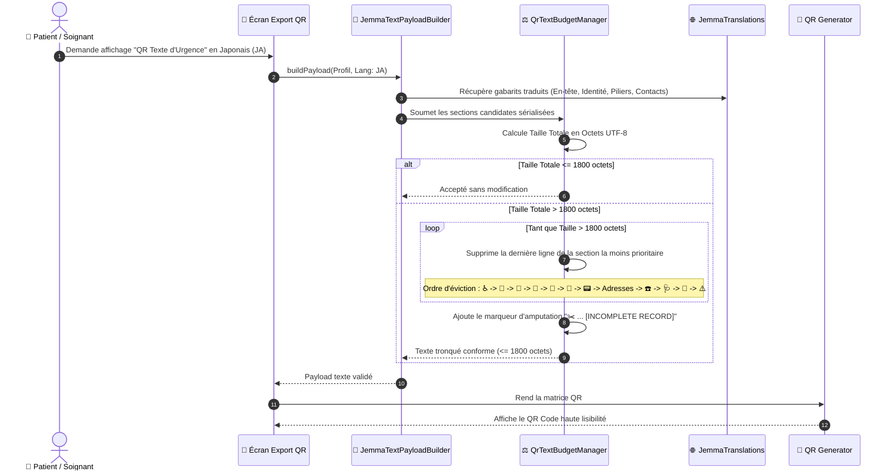
```mermaid
sequenceDiagram
    autonumber
    actor Patient as 👤 Patient / Soignant
    participant UI as 📱 Écran Export QR
    participant Builder as 📝 JemmaTextPayloadBuilder
    participant Budget as ⚖️ QrTextBudgetManager
    participant Trans as 🌐 JemmaTranslations
    participant Encoder as 🔲 QR Generator

    Patient->>UI: Demande affichage "QR Texte d'Urgence" en Japonais (JA)
    UI->>Builder: buildPayload(Profil, Lang: JA)
    Builder->>Trans: Récupère gabarits traduits (En-tête, Identité, Piliers, Contacts)
    Builder->>Budget: Soumet les sections candidates sérialisées
    Budget->>Budget: Calcule Taille Totale en Octets UTF-8
    alt Taille Totale <= 1800 octets
        Budget-->>Builder: Accepté sans modification
    else Taille Totale > 1800 octets
        loop Tant que Taille > 1800 octets
            Budget->>Budget: Supprime la dernière ligne de la section la moins prioritaire
            Note over Budget: Ordre d'éviction : ♿ -> 🤰 -> 💉 -> 🧪 -> 🏥 -> 📜 -> 📟 -> Adresses -> ☎️ -> 🩺 -> 💊 -> ⚠️
        end
        Budget->>Budget: Ajoute le marqueur d'amputation "✂️ ... [INCOMPLETE RECORD]"
        Budget-->>Builder: Texte tronqué conforme (<= 1800 octets)
    end
    Builder-->>UI: Payload texte validé
    UI->>Encoder: Rend la matrice QR
    Encoder-->>UI: Affiche le QR Code haute lisibilité
```

### 5.4. Découverte, Alerte et Propagation Maillée P2P SALT (Zone Sinistrée)

Flux de communication inter-terminaux 100% hors-ligne via paquets BLE de 131 octets UTF-8.

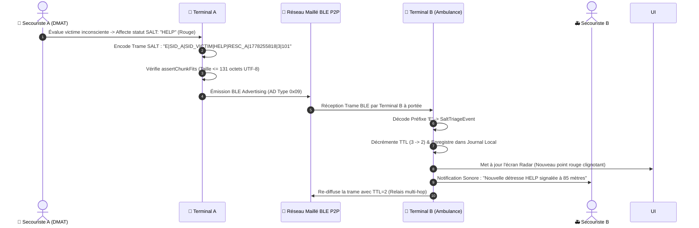
```mermaid
sequenceDiagram
    autonumber
    actor Secouriste1 as 🎒 Secouriste A (DMAT)
    participant PhoneA as 📱 Terminal A
    participant Mesh as 📡 Réseau Maillé BLE P2P
    participant PhoneB as 📱 Terminal B (Ambulance)
    actor Secouriste2 as 🚑 Secouriste B

    Secouriste1->>PhoneA: Évalue victime inconsciente -> Affecte statut SALT: "HELP" (Rouge)
    PhoneA->>PhoneA: Encode Trame SALT : "E|SID_A|SID_VICTIM|HELP|RESC_A|1778255818|3|101"
    PhoneA->>PhoneA: Vérifie assertChunkFits (Taille <= 131 octets UTF-8)
    PhoneA->>Mesh: Émission BLE Advertising (AD Type 0x09)
    Mesh->>PhoneB: Réception Trame BLE par Terminal B à portée
    PhoneB->>PhoneB: Décode Préfixe 'E' -> SaltTriageEvent
    PhoneB->>PhoneB: Décrémente TTL (3 -> 2) & Enregistre dans Journal Local
    PhoneB->>UI: Met à jour l'écran Radar (Nouveau point rouge clignotant)
    PhoneB->>Secouriste2: Notification Sonore : "Nouvelle détresse HELP signalée à 85 mètres"
    PhoneB->>Mesh: Re-diffuse la trame avec TTL=2 (Relais multi-hop)
```

### 5.5. Pipeline de Vulgarisation Pédagogique Multilingue et Cache Local

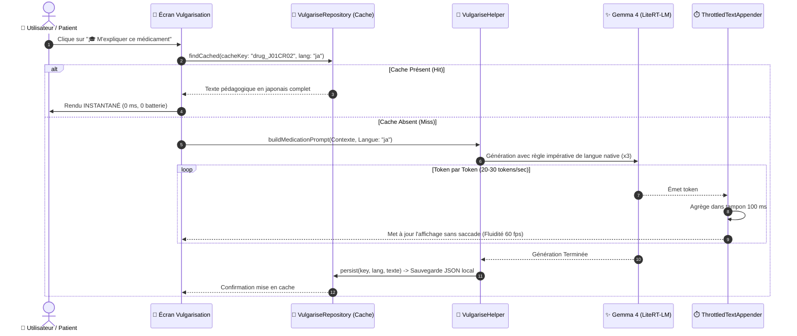
```mermaid
sequenceDiagram
    autonumber
    actor User as 👤 Utilisateur / Patient
    participant UI as 📱 Écran Vulgarisation
    participant Repo as 💾 VulgariseRepository (Cache)
    participant Helper as 🤖 VulgariseHelper
    participant IA as ✨ Gemma 4 (LiteRT-LM)
    participant Buffer as ⏱️ ThrottledTextAppender

    User->>UI: Clique sur "🎓 M'expliquer ce médicament"
    UI->>Repo: findCached(cacheKey: "drug_J01CR02", lang: "ja")
    alt Cache Présent (Hit)
        Repo-->>UI: Texte pédagogique en japonais complet
        UI->>User: Rendu INSTANTANÉ (0 ms, 0 batterie)
    else Cache Absent (Miss)
        UI->>Helper: buildMedicationPrompt(Contexte, Langue: "ja")
        Helper->>IA: Génération avec règle impérative de langue native (x3)
        loop Token par Token (20-30 tokens/sec)
            IA-->>Buffer: Émet token
            Buffer->>Buffer: Agrège dans tampon 100 ms
            Buffer-->>UI: Met à jour l'affichage sans saccade (Fluidité 60 fps)
        end
        IA-->>Helper: Génération Terminée
        Helper->>Repo: persist(key, lang, texte) -> Sauvegarde JSON local
        Repo-->>UI: Confirmation mise en cache
    end
```

---

## 6. Diagrammes d'Activités & Algorithmes Métier (Activity Diagrams)

### 6.1. Algorithme de Résolution Sémantique d'un Médicament

Garantit la réconciliation d'une saisie libre ou d'une lecture OCR japonaise vers une entité pharmacologique codée.

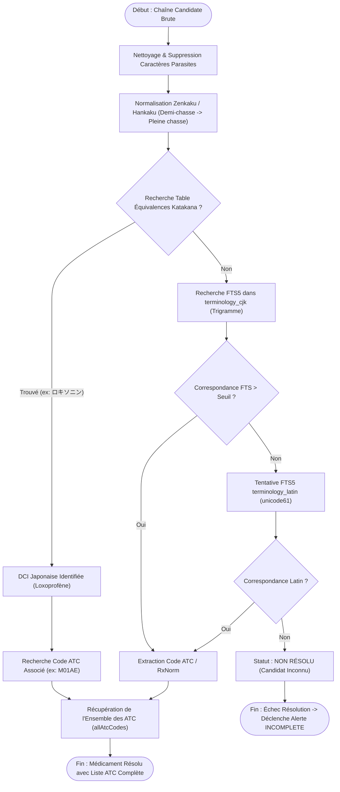
```mermaid
flowchart TD
    Start(["Début : Chaîne Candidate Brute"]) --> Clean["Nettoyage & Suppression Caractères Parasites"]
    Clean --> Zenkaku["Normalisation Zenkaku / Hankaku (Demi-chasse -> Pleine chasse)"]
    Zenkaku --> DictKatakana{"Recherche Table Équivalences Katakana ?"}
    
    DictKatakana -- "Trouvé (ex: ロキソニン)" --> MapDci["DCI Japonaise Identifiée (Loxoprofène)"]
    DictKatakana -- Non --> SearchFTS["Recherche FTS5 dans terminology_cjk (Trigramme)"]
    
    MapDci --> LookupATC["Recherche Code ATC Associé (ex: M01AE)"]
    SearchFTS --> FtsHit{"Correspondance FTS > Seuil ?"}
    
    FtsHit -- Oui --> ExtractCode["Extraction Code ATC / RxNorm"]
    FtsHit -- Non --> SearchLatinFTS["Tentative FTS5 terminology_latin (unicode61)"]
    
    SearchLatinFTS --> LatinHit{"Correspondance Latin ?"}
    LatinHit -- Oui --> ExtractCode
    LatinHit -- Non --> Unresolved["Statut : NON RÉSOLU (Candidat Inconnu)"]
    
    ExtractCode --> MultiAtcCheck["Récupération de l'Ensemble des ATC (allAtcCodes)"]
    LookupATC --> MultiAtcCheck
    
    MultiAtcCheck --> Success(["Fin : Médicament Résolu avec Liste ATC Complète"])
    Unresolved --> Failure(["Fin : Échec Résolution -> Déclenche Alerte INCOMPLETE"])
```

### 6.2. Algorithme de Détection d'Allergie Croisée par Arborescence de Classes

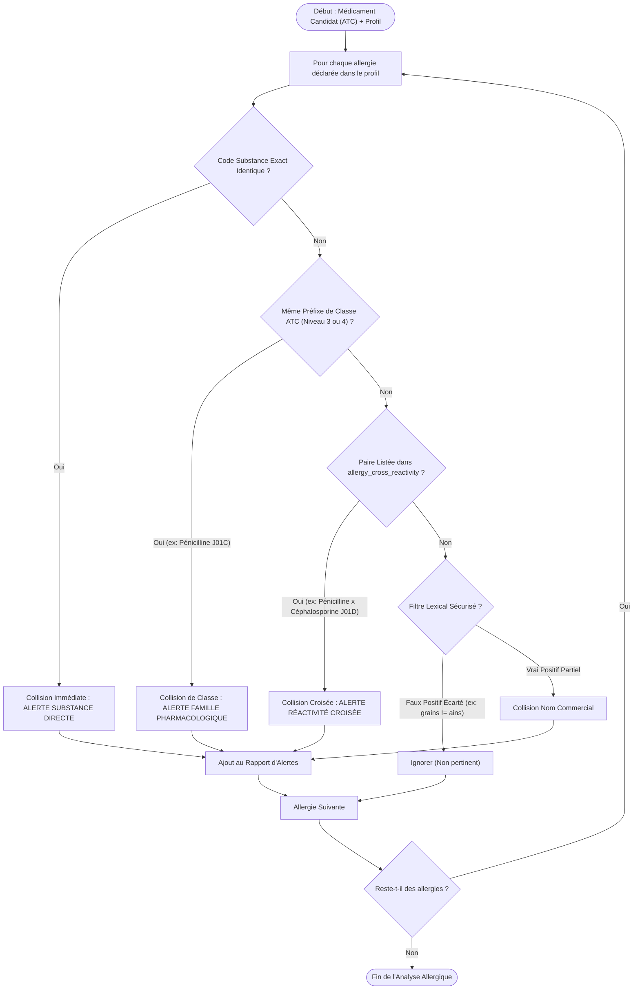
```mermaid
flowchart TD
    Start(["Début : Médicament Candidat (ATC) + Profil"]) --> LoopAllergies["Pour chaque allergie déclarée dans le profil"]
    
    LoopAllergies --> ExactCode{"Code Substance Exact Identique ?"}
    ExactCode -- Oui --> DirectHit["Collision Immédiate : ALERTE SUBSTANCE DIRECTE"]
    
    ExactCode -- Non --> ClassCheck{"Même Préfixe de Classe ATC (Niveau 3 ou 4) ?"}
    ClassCheck -- "Oui (ex: Pénicilline J01C)" --> ClassHit["Collision de Classe : ALERTE FAMILLE PHARMACOLOGIQUE"]
    
    ClassCheck -- Non --> TableCross{"Paire Listée dans allergy_cross_reactivity ?"}
    TableCross -- "Oui (ex: Pénicilline x Céphalosporine J01D)" --> CrossHit["Collision Croisée : ALERTE RÉACTIVITÉ CROISÉE"]
    
    TableCross -- Non --> SubstringFuzzy{"Filtre Lexical Sécurisé ?"}
    SubstringFuzzy -- "Faux Positif Écarté (ex: grains != ains)" --> SkipHit["Ignorer (Non pertinent)"]
    SubstringFuzzy -- "Vrai Positif Partiel" --> FuzzyHit["Collision Nom Commercial"]
    
    DirectHit --> Collect["Ajout au Rapport d'Alertes"]
    ClassHit --> Collect
    CrossHit --> Collect
    FuzzyHit --> Collect
    SkipHit --> NextAllergy["Allergie Suivante"]
    
    Collect --> NextAllergy
    NextAllergy --> MoreAllergies{"Reste-t-il des allergies ?"}
    MoreAllergies -- Oui --> LoopAllergies
    MoreAllergies -- Non --> Done(["Fin de l'Analyse Allergique"])
```

### 6.3. Algorithme d'Éviction Prioritaire du QR Texte Universel

Garantit le respect du plafond physique de **1800 octets UTF-8** sans jamais compromettre l'identité ni les allergies vitales.

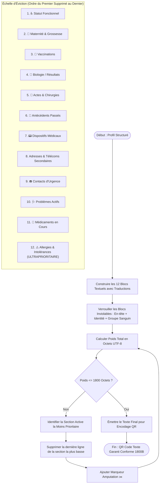
```mermaid
flowchart TD
    Start(["Début : Profil Structuré"]) --> BuildBlocks["Construire les 12 Blocs Textuels avec Traductions"]
    BuildBlocks --> LockVital["Verrouiller les Blocs Inviolables : En-tête + Identité + Groupe Sanguin"]
    LockVital --> Measure["Calculer Poids Total en Octets UTF-8"]
    
    Measure --> CheckBudget{"Poids <= 1800 Octets ?"}
    CheckBudget -- Oui --> GenerateQR["Émettre le Texte Final pour Encodage QR"]
    
    CheckBudget -- Non --> EvictStep["Identifier la Section Active la Moins Prioritaire"]
    
    subgraph Echelle_Priorite_Eviction ["Échelle d'Éviction (Ordre du Premier Supprimé au Dernier)"]
        E1["1. ♿ Statut Fonctionnel"]
        E2["2. 🤰 Maternité & Grossesse"]
        E3["3. 💉 Vaccinations"]
        E4["4. 🧪 Biologie / Résultats"]
        E5["5. 🏥 Actes & Chirurgies"]
        E6["6. 📜 Antécédents Passés"]
        E7["7. 📟 Dispositifs Médicaux"]
        E8["8. Adresses & Télécoms Secondaires"]
        E9["9. ☎️ Contacts d'Urgence"]
        E10["10. 🩺 Problèmes Actifs"]
        E11["11. 💊 Médicaments en Cours"]
        E12["12. ⚠️ Allergies & Intolérances (ULTRAPRIORITAIRE)"]
    end
    
    EvictStep --> PopLine["Supprimer la dernière ligne de la section la plus basse"]
    PopLine --> StampTrunc["Ajouter Marqueur Amputation ✂️"]
    StampTrunc --> Measure
    
    GenerateQR --> End(["Fin : QR Code Texte Garanti Conforme 1800B"])
```

### 6.4. Algorithme de Réconciliation et d'Inviolabilité du Groupe Sanguin

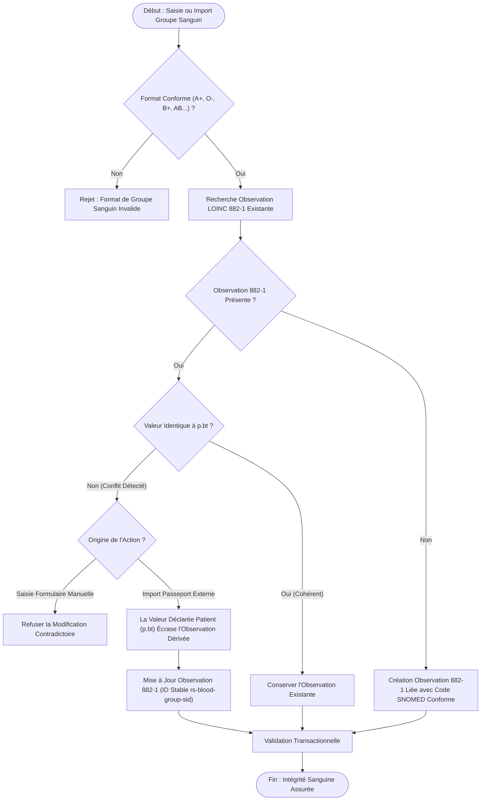
```mermaid
flowchart TD
    Start(["Début : Saisie ou Import Groupe Sanguin"]) --> FormatCheck{"Format Conforme (A+, O-, B+, AB...) ?"}
    FormatCheck -- Non --> RejectInput["Rejet : Format de Groupe Sanguin Invalide"]
    
    FormatCheck -- Oui --> SearchObs["Recherche Observation LOINC 882-1 Existante"]
    SearchObs --> ObsFound{"Observation 882-1 Présente ?"}
    
    ObsFound -- Oui --> ConflictCheck{"Valeur Identique à p.bt ?"}
    ConflictCheck -- "Non (Conflit Détecté)" --> BlockOrReconcile{"Origine de l'Action ?"}
    BlockOrReconcile -- "Saisie Formulaire Manuelle" --> RefuseEdit["Refuser la Modification Contradictoire"]
    BlockOrReconcile -- "Import Passeport Externe" --> ForceProfileValue["La Valeur Déclarée Patient (p.bt) Écrase l'Observation Dérivée"]
    
    ObsFound -- Non --> CreateObs["Création Observation 882-1 Liée avec Code SNOMED Conforme"]
    ForceProfileValue --> UpdateObs["Mise à Jour Observation 882-1 (ID Stable rs-blood-group-sid)"]
    ConflictCheck -- "Oui (Cohérent)" --> KeepObs["Conserver l'Observation Existante"]
    
    CreateObs --> Save["Validation Transactionnelle"]
    UpdateObs --> Save
    KeepObs --> Save
    Save --> End(["Fin : Intégrité Sanguine Assurée"])
```

---

## 7. Spécifications Formelles des Contrats d'Interface Plateforme-Agnostiques

Toute plateforme (iOS, Android, etc.) doit exposer les abstractions de service suivantes, ici formalisées en pseudo-code d'interface typé :

### 7.1. Contrat du Service de Connaissance Médicale (`IKnowledgeBaseService`)

```typescript
interface IKnowledgeBaseService {
    // Résolution sémantique d'un médicament (nom commercial, katakana ou DCI)
    resolveDrug(candidateName: string, userLang: string): Promise<ResolvedDrug>;

    // Résolution sémantique d'un allergène
    resolveAllergy(candidateName: string, userLang: string): Promise<ResolvedAllergy>;

    // Interrogation DDI directe par codes ATC
    queryDDI(atcCodeA: string, atcCodeB: string): Promise<DdiHit | null>;

    // Interrogation contre-indication médicament x pathologie
    queryDrugDisease(atcCode: string, conditionSnomedCode: string): Promise<DrugDiseaseHit | null>;

    // Recherche plein-texte FTS5 multilingue (avec trigramme pour le CJK)
    searchTerminology(query: string, category: TermCategory, lang: string, maxHits: number): Promise<List<TerminologyCode>>;
}
```

### 7.2. Contrat du Moteur de Contrôle Clinique (`ICrossCheckEngine`)

```typescript
interface ICrossCheckEngine {
    // Vérification maître d'un médicament contre l'intégralité d'un profil
    checkCandidateDrug(drug: ResolvedDrug, profile: JemmaProfileJ): CrossCheckResult;

    // Vérification globale interne d'un profil (polymédication existante)
    auditProfileSafety(profile: JemmaProfileJ): ProfileSafetyReport;
}

interface CrossCheckResult {
    verdict: KbSafetyVerdict; // ALERT | CLEAN | INCOMPLETE | NOT_CHECKED
    checkReport: KbCheckReport;
    allergyCollisions: List<AllergyHit>;
    ddiCollisions: List<DdiHit>;
    diseaseCollisions: List<DrugDiseaseHit>;
    generatedTimestamp: number;
}
```

### 7.3. Contrat du Hub de Transfert Multi-Supports (`ITransferHub`)

```typescript
interface ITransferHub {
    // Compression QR compact Channel 1 (RFC 1951 deflate-raw)
    encodeCompactPayload(profile: JemmaProfileJ): string; // Retourne "_j2:<base64>"
    decodeCompactPayload(payload: string): DecodeResult<JemmaProfileJ>;

    // Génération QR texte universel Channel 2 avec budget 1800 octets
    buildUniversalTextPayload(profile: JemmaProfileJ, langCode: string): string;

    // Découpage et réassemblage FHIR Slideshow Channel 3
    splitFhirBundleToSlideshow(bundleJson: string, maxFrameBytes: number): List<string>; // Format "JF:i/N|data"
    assembleSlideshowFrame(frame: string): AssemblerState;

    // Encodage et décodage des paquets maillés BLE (131 octets UTF-8 max)
    encodeMeshPacket(chunk: MeshChunk): string;
    decodeMeshPacket(rawPayload: string): MeshChunk;
}
```

---

> **Validation d'Architecture de l'Orchestrateur** :  
> Ce document fige l'intégralité de la logique fonctionnelle de JemmaPass. Toute équipe de développement débutant l'implémentation sur iOS ou toute autre cible doit utiliser ces diagrammes et contrats comme unique spécification normative.
