# 🐢 JemmaPass — Documentation & Spécification UML Fonctionnelle (Conforme au Code Réel)

> **Document Technique d'Architecture & Modèle Métier**  
> **Auteur** : Équipe d'Ingénierie JemmaPass & Sub-Agent Documentation Architecture  
> **Version** : 1.0.14-UML (aligné sur l'application Android v1.0.14, `app/build.gradle.kts:38`)  
> **Statut** : Document de Travail & Spécification d'Architecture Révisée (En cours de révision technique — non approuvé comme norme unique)  
> **Périmètre** : Spécification Fonctionnelle, Modèles de Domaine, Diagrammes d'États et de Séquence vérifiés sur pièces contre le code source de JemmaPass. Toute classe, méthode ou propriété figurant dans les sections 1 à 7 est sourcée avec son chemin et sa ligne exacte (`fichier:ligne`). Les évolutions futures et propositions non encore implémentées sont regroupées dans la [Section 8 (Proposé — n'existe pas encore)](#8-proposé--nexiste-pas-encore-cibles-dévolution--portages).

---

## Sommaire

1. [Principes Directeurs & Invariants Système](#1-principes-directeurs--invariants-système)
2. [Diagrammes des Cas d'Utilisation Métier (Use Cases)](#2-diagrammes-des-cas-dutilisation-métier-use-cases)
   - 2.1. Cartographie Globale des Acteurs et Cas d'Usage
   - 2.2. Package 1 : Gestion du Passeport IPS (Patient & Aidant)
   - 2.3. Package 2 : Prise en Charge d'Urgence & Scan (Secouriste / DMAT)
   - 2.4. Package 3 : Triage en Zone de Catastrophe (SALT Mesh)
   - 2.5. Package 4 : Éducation Thérapeutique & Vulgarisation IA
3. [Modèle du Domaine Fonctionnel (Class Diagrams)](#3-modèle-du-domaine-fonctionnel-class-diagrams)
   - 3.1. Structure des 18 Piliers IPS & Dualité FHIR R4 vs Projection `_j 1.2`
   - 3.2. Moteur Clinique, Pharmacologique & Sécurité Décisionnelle
   - 3.3. Canaux de Transfert Multi-Supports Hors-Ligne
   - 3.4. Pipeline d'Intelligence Artificielle & Outils Embarqués (`@Tool`)
4. [Machines à États-Transitions (State Diagrams)](#4-machines-à-états-transitions-state-diagrams)
   - 4.1. Cycle de Vie & Persistance du Dossier Patient
   - 4.2. Matrice Inviolable du Verdict de Sécurité Clinique (`KbSafetyVerdict`)
   - 4.3. Protocole de Tri de Catastrophe SALT (Asymmetric LWW & Grace Window)
   - 4.4. Cycle d'Assemblage des Trames QR Multi-Frames (`JF:i/N`)
5. [Diagrammes de Séquence des Flux Fonctionnels Clés (Sequence Diagrams)](#5-diagrammes-de-séquence-des-flux-fonctionnels-clés-sequence-diagrams)
   - 5.1. Détection de Collision Létale : Scénario Kurodo (Pénicilline × Augmentin)
   - 5.2. Contrôle Sans Interaction : Scénario Paracétamol chez un Profil Sain (Verdict CLEAN)
   - 5.3. Génération du QR Texte 25 Langues avec Budget d'Éviction Strict (1800 octets UTF-8)
   - 5.4. Découverte, Alerte et Propagation Maillée P2P SALT (Zone Sinistrée)
   - 5.5. Pipeline de Vulgarisation Pédagogique Multilingue et Cache Local
6. [Diagrammes d'Activités & Algorithmes Métier (Activity Diagrams)](#6-diagrammes-dactivités--algorithmes-métier-activity-diagrams)
   - 6.1. Algorithme de Résolution Sémantique d'un Médicament (Normalisation & FTS5)
   - 6.2. Algorithme de Détection d'Allergie Croisée par Arborescence de Classes
   - 6.3. Algorithme d'Éviction Prioritaire du QR Texte Universel
   - 6.4. Algorithme de Réconciliation et d'Inviolabilité du Groupe Sanguin
7. [Spécifications Formelles des Contrats d'Interface Vérifiés](#7-spécifications-formelles-des-contrats-dinterface-vérifiés)
   - 7.1. Contrat Réel du Service de Connaissance Médicale (`KnowledgeBaseService`)
   - 7.2. Contrat Réel du Moteur de Contrôle Croisé (`KbCrossCheck`)
   - 7.3. Contrat Réel des Codecs QR, Trames et Triage
8. [Proposé — N'existe pas encore (Cibles d'Évolution & Portages)](#8-proposé--nexiste-pas-encore-cibles-dévolution--portages)

---

## 1. Principes Directeurs & Invariants Système

Le système JemmaPass repose sur 5 invariants fonctionnels vérifiés dans le code Android existant :

```
┌────────────────────────────────────────────────────────────────────────┐
│                   LES 5 INVARIANTS SYSTÈME JEMMAPASS                   │
├────────────────────────────────────────────────────────────────────────┤
│ 1. ZERO-NETWORK AT RUNTIME                                             │
│    Aucune opération vitale en intervention (scan, contrôle clinique,   │
│    triage SALT, transfert QR/BLE) ne dépend du réseau. Le runtime     │
│    opère 100% hors-ligne. Les modèles (.litertlm) et la base KB       │
│    (knowledge_full.db) sont pré-téléchargés au besoin depuis           │
│    https://jemmapass.net/models/ (downloads/JemmaModelCatalog.kt:33). │
│                                                                        │
│ 2. FHIR R4 AS SOURCE OF TRUTH FOR FHIR-NATIVE PILLARS                  │
│    Le document médical d'autorité est le Bundle HL7 FHIR R4 IPS        │
│    (<sid>.fhir.json) pour les seuls piliers FHIR-natifs (vaccins,      │
│    actes, dispositifs, résultats... - profiles/ProfilesRepository.kt:  │
│    23-27). Les 4 piliers historiques (patient, allergies, médocs,     │
│    conditions) restent issus de la saisie _j 1.2 (<sid>.json).         │
│                                                                        │
│ 3. STRICT SAFETY DECISION MATRIX                                       │
│    Tout conflit détecté donne ALERT (kb/KbCrossCheck.kt:131).          │
│    Le verdict CLEAN ("Rien à signaler") n'est possible que si la KB    │
│    est active, le candidat résolu et qu'aucune collision n'existe.     │
│    Nuance du code : une allergie sans code ATC est évaluée par mots-   │
│    clés et compte comme CHECKED (kb/KbCrossCheck.kt:418).              │
│                                                                        │
│ 4. DETERMINISTIC OFFLINE TRANSFER                                      │
│    Le QR texte universel respecte un plafond strict de 1800 octets     │
│    UTF-8 (qr/JemmaTextPayloadBuilder.kt:67). En cas de dépassement,    │
│    les sections sont évincées par rangs et marquées ✂️ (jamais de coupure│
│    silencieuse). Les trames QR multi-frames sont indexées 1..N         │
│    (qr/JemmaQrFrameAssembler.kt:26).                                   │
│                                                                        │
│ 5. MULTILINGUAL NATIVE EXPERIENCE                                      │
│    Restitution dans la langue locale (25 langues) via les dictionnaires│
│    embarqués (qr/JemmaTranslations.kt:12) et l'agent Gemma 4.          │
└────────────────────────────────────────────────────────────────────────┘
```

---

## 2. Diagrammes des Cas d'Utilisation Métier (Use Cases)

### 2.1. Cartographie Globale des Acteurs et Cas d'Usage

Le système interagit avec 4 acteurs :
- **Patient / Porteur du Pass** : Édite son passeport IPS et affiche son QR d'urgence.
- **Aidant / Famille** : Configure le profil d'un proche dépendant.
- **Secouriste / DMAT / Soignant** : Scanne les pass et médicaments, réalise le triage SALT.
- **Agent IA Embarqué (Gemma 4)** : Exécute les 21 outils `@Tool` de `ai/JemmaTools.kt:8-41` et vulgarise les alertes.

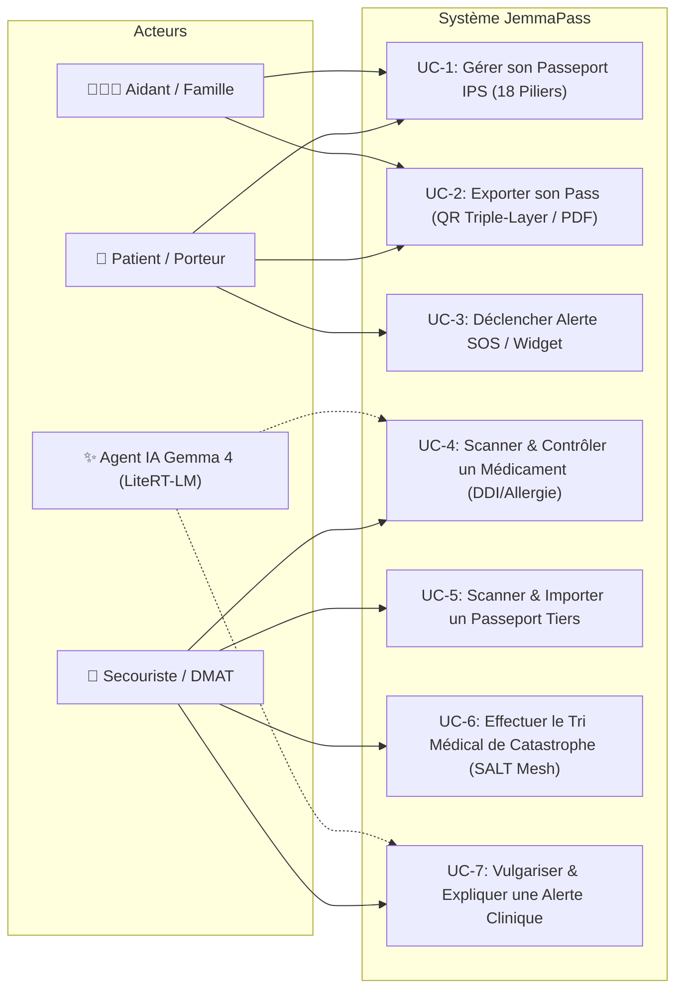

### 2.2. Package 1 : Gestion du Passeport IPS (Patient & Aidant)

Implémenté dans `ui/profile/` et persisté via `profiles/ProfilesRepository.kt:254-375`.

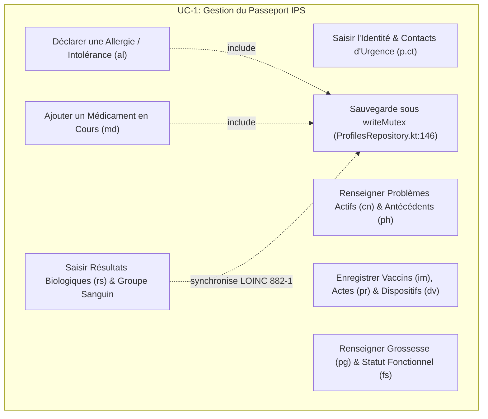

### 2.3. Package 2 : Prise en Charge d'Urgence & Scan (Secouriste / DMAT)

Implémenté dans `ai/medscan/MedScanController.kt:1-40` et `kb/KbCrossCheck.kt:130-135`.

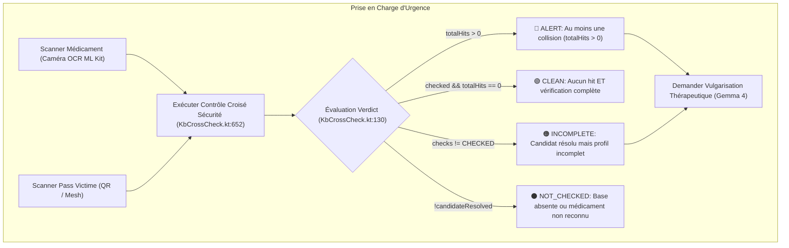

### 2.4. Package 3 : Triage en Zone de Catastrophe (SALT Mesh)

Implémenté dans `triage/SaltCode.kt:34-51` et `triage/StatusResolver.kt:46-99`. Les couleurs réelles du code sont :
- **WAIT** : Gris (`#9E9E9E`, "⏳", `SaltCode.kt:36`)
- **EVAL** : Jaune (`#FFC107`, "🔍", `SaltCode.kt:39`)
- **STAB** : Vert (`#4CAF50`, "✅", `SaltCode.kt:42`)
- **HELP** : Rouge (`#F44336`, "🆘", `SaltCode.kt:45`)
- **EVAC** : Bleu (`#2196F3`, "🚑", `SaltCode.kt:48`)
- **DCD** : Noir (`#000000`, "🕊️", `SaltCode.kt:51`)

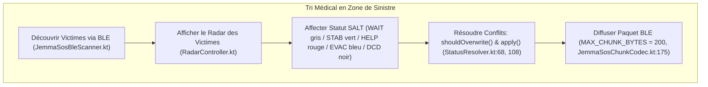

---

## 3. Modèle du Domaine Fonctionnel (Class Diagrams)

### 3.1. Structure des 18 Piliers IPS & Dualité FHIR R4 vs Projection `_j 1.2`

Sur Android, la persistance locale maintient deux fichiers par profil (`profiles/ProfilesRepository.kt:23-28`) :
- `<sid>.fhir.json` : Le Bundle FHIR R4 (source de vérité pour les piliers FHIR-natifs, généré via `qr/JemmaFhirBundleBuilder.kt:30` et `ips/IpsFhirCodec.kt:18`).
- `<sid>.json` : La projection compacte `JemmaProfileJ` (`qr/JemmaProfileJ.kt:43-103`).

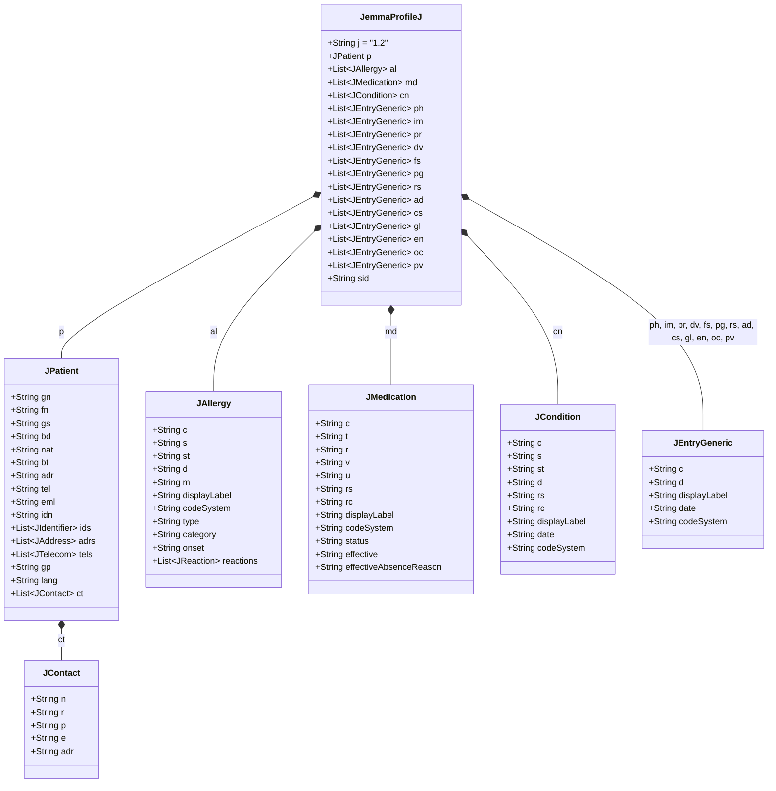

### 3.2. Moteur Clinique, Pharmacologique & Sécurité Décisionnelle

Modèle strictement aligné sur `kb/KbCrossCheck.kt` et `kb/KbSafety.kt` :

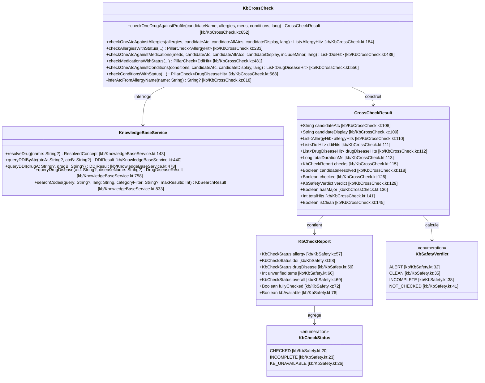

### 3.3. Canaux de Transfert Multi-Supports Hors-Ligne

Modèle réel des composants d'exportation et de transmission hors-ligne :

```mermaid
classDiagram
    class JemmaPayloadCodec {
        +String MAGIC_PREFIX = "_j2:" [qr/JemmaPayloadCodec.kt:57]
        +encode(profile: JemmaProfileJ) EncodeResult [qr/JemmaPayloadCodec.kt:189]
        +decode(text: String?) DecodeResult [qr/JemmaPayloadCodec.kt:122]
    }

    class JemmaTextPayloadBuilder {
        +Int MAX_BYTES = 1800 [qr/JemmaTextPayloadBuilder.kt:67]
        +String TRUNCATION_MARK = "✂️ …" [qr/JemmaTextPayloadBuilder.kt:73]
        +build(hydrated: HydratedProfile, lang: Lang, maxBytes: Int) String [qr/JemmaTextPayloadBuilder.kt:152]
    }

    class JemmaQrFrameSplitter {
        +Int QR_MAX_SINGLE = 1800 [qr/JemmaQrFrameSplitter.kt:53]
        +split(payload: String, maxSingle: Int, frameChunk: Int) List~String~ [qr/JemmaQrFrameSplitter.kt:94]
    }

    class JemmaQrFrameAssembler {
        +offer(raw: String?) Result [qr/JemmaQrFrameAssembler.kt:65]
        +missing() List~Int~ [qr/JemmaQrFrameAssembler.kt:53]
        +reset() [qr/JemmaQrFrameAssembler.kt:57]
    }

    class JemmaSosChunkCodec {
        +Int MAX_CHUNK_BYTES = 200 [sos/JemmaSosChunkCodec.kt:175]
    }

    class JemmaNearbyEndpointCodec {
        +Int MAX_ENDPOINT_NAME_LEN = 131 [sos/JemmaNearbyEndpointCodec.kt:51]
    }

    class SaltCode {
        <<enumeration>>
        WAIT = "WAIT" / "#9E9E9E" [triage/SaltCode.kt:36]
        EVAL = "EVAL" / "#FFC107" [triage/SaltCode.kt:39]
        STAB = "STAB" / "#4CAF50" [triage/SaltCode.kt:42]
        HELP = "HELP" / "#F44336" [triage/SaltCode.kt:45]
        EVAC = "EVAC" / "#2196F3" [triage/SaltCode.kt:48]
        DCD  = "DCD"  / "#000000" [triage/SaltCode.kt:51]
        +parse(code: String) SaltCode? [triage/SaltCode.kt:59]
    }

    class StatusResolver {
        +Long DCD_GRACE_SEC = 30L [triage/StatusResolver.kt:56]
        +shouldOverwrite(existing: StatusEvent, incoming: StatusEvent) Boolean [triage/StatusResolver.kt:68]
        +apply(incoming: StatusEvent) StatusEvent [triage/StatusResolver.kt:108]
    }
```

### 3.4. Pipeline d'Intelligence Artificielle & Outils Embarqués (`@Tool`)

L'agent Jemma (Gemma 4 via LiteRT-LM) dispose de **21 outils typés** exposés dans `ai/JemmaTools.kt:128` :

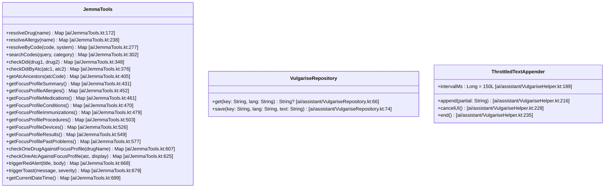

---

## 4. Machines à États-Transitions (State Diagrams)

### 4.1. Cycle de Vie & Persistance du Dossier Patient

La persistance dans `profiles/ProfilesRepository.kt:370-375` protège le cycle par un `writeMutex` (`Mutex()`, non-réentrant, ligne 146).

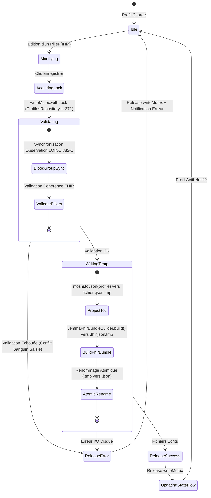

### 4.2. Matrice Inviolable du Verdict de Sécurité Clinique (`KbSafetyVerdict`)

Implémentée dans `kb/KbCrossCheck.kt:129-135` et `kb/KbSafety.kt:30-42` :

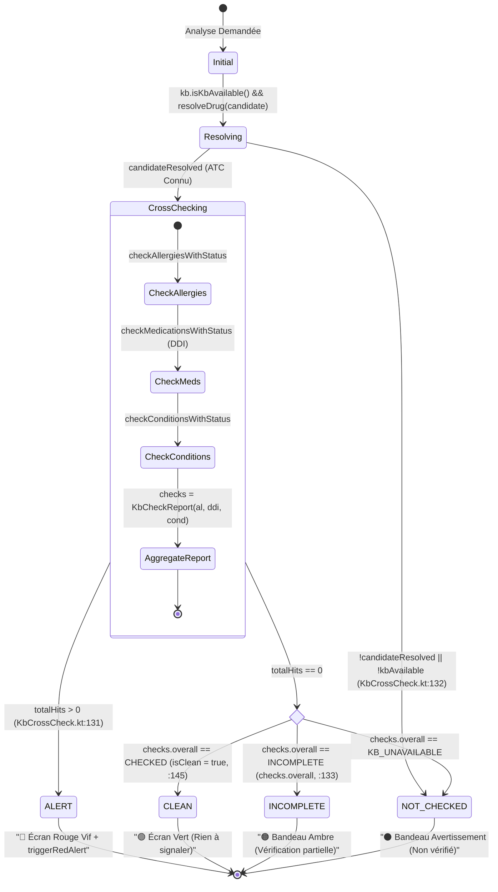

> **Règle vérifiée dans le code (`kb/KbCrossCheck.kt:418`)** : Une allergie sans code ATC est testée via `inferAtcFromAllergyName` (`kb/KbCrossCheck.kt:818`). Si aucun mot-clé ne correspond, elle ne bloque pas le pilier et retourne le statut `KbCheckStatus.CHECKED` (`KbSafety.pillarStatus(kbUp, allergies.size)` sans `unverifiedItems`).

### 4.3. Protocole de Tri de Catastrophe SALT (Asymmetric LWW & Grace Window)

Le code dans `triage/StatusResolver.kt:68-98` et `triage/SaltCode.kt:36-51` applique un **Last-Write-Wins asymétrique** avec fenêtre de grâce de 30 secondes pour rétrograder un statut décédé (DCD) :

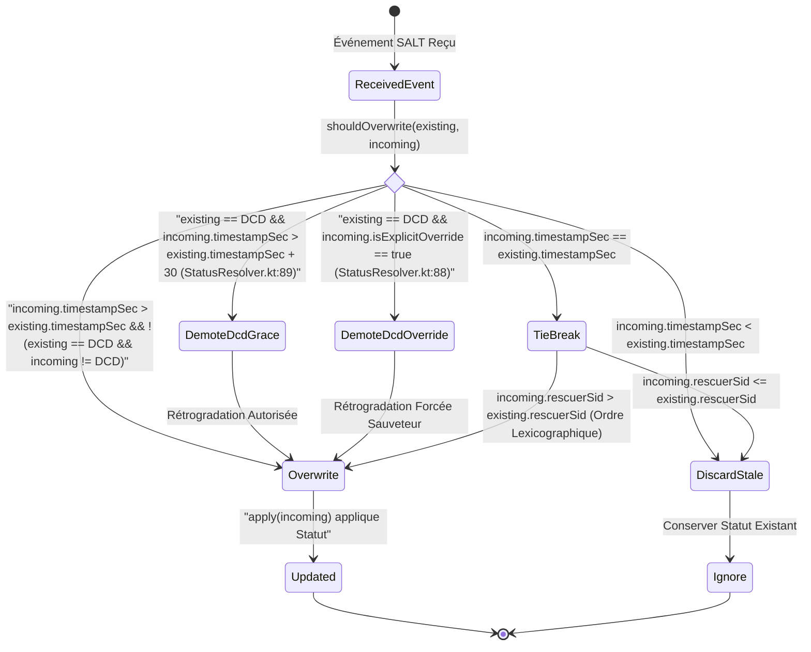

### 4.4. Cycle d'Assemblage des Trames QR Multi-Frames (`JF:i/N`)

Conforme à `qr/JemmaQrFrameAssembler.kt:25-85` :
- Format des trames : `JF:<index>/<total>|<data>` où `index` est **1-based** (`1..N`).
- **Absence d'identifiant de lot et de checksum au niveau de la trame** (`qr/JemmaQrFrameAssembler.kt:16-19`) : Si une trame annonce un total différent ou un contenu divergent pour un même index, la collecte redémarre à zéro (`restarted = true`).
- Pour le canal FHIR Slideshow, les données sont le JSON FHIR brut découpé, sans compression deflate.

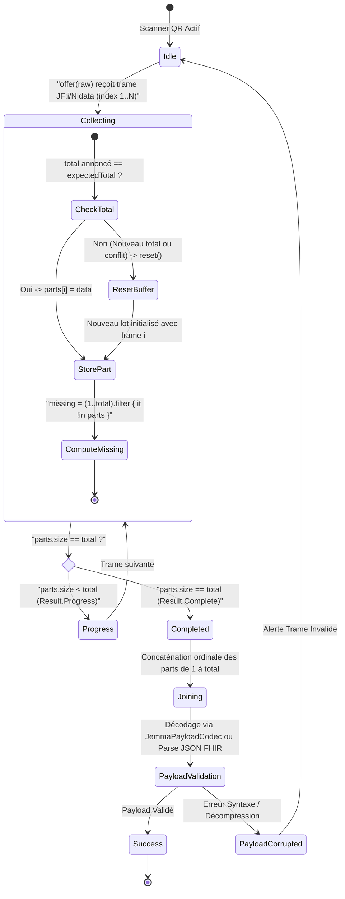

---

## 5. Diagrammes de Séquence des Flux Fonctionnels Clés (Sequence Diagrams)

### 5.1. Détection de Collision Létale : Scénario Kurodo (Pénicilline × Augmentin)

Flux démontrant l'intervention de l'agent Gemma 4 via les outils `@Tool` de `ai/medscan/MedScanController.kt:10-12` et `ai/JemmaTools.kt:668` :

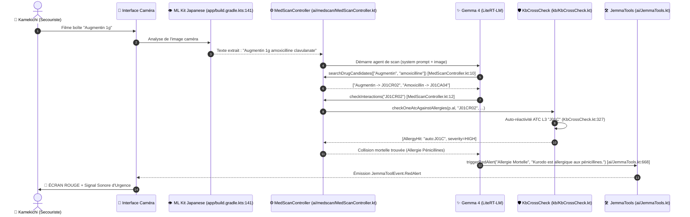

### 5.2. Contrôle Sans Interaction : Scénario Paracétamol chez un Profil Sain (Verdict CLEAN)

Illustration d'un contrôle de sécurité complet aboutissant au verdict **CLEAN** (`kb/KbCrossCheck.kt:145`) :

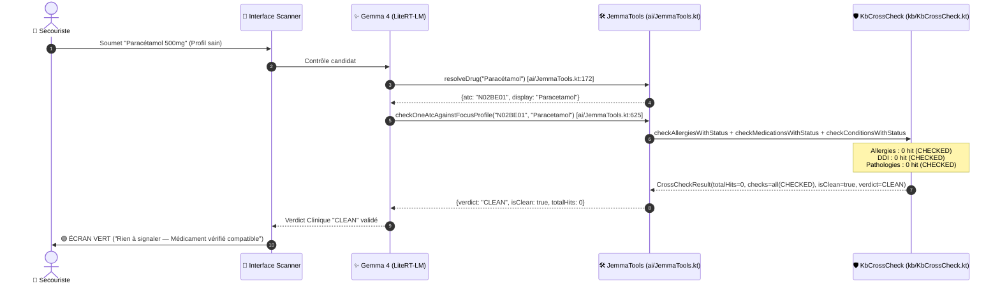

> **Note sur Edoxaban × Aspirine** : Le résultat de l'interaction Edoxaban × Aspirine dépend de la présence de la paire dans la base locale (`v_ddi_emergency` / `ddi_facts`), à vérifier par `kb-sql`. Si la paire est présente, elle donne `ALERT` (`kb/KbCrossCheck.kt:131`).

### 5.3. Génération du QR Texte 25 Langues avec Budget d'Éviction Strict (1800 octets UTF-8)

Implémenté dans `qr/JemmaTextPayloadBuilder.kt:152-290` :

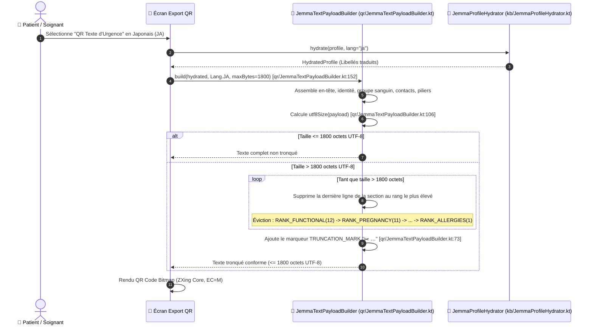

### 5.4. Découverte, Alerte et Propagation Maillée P2P SALT (Zone Sinistrée)

Implémenté dans `sos/JemmaSosBleScanner.kt`, `sos/JemmaSosChunkCodec.kt:175` (`MAX_CHUNK_BYTES = 200`), `sos/JemmaNearbyEndpointCodec.kt:51` (`MAX_ENDPOINT_NAME_LEN = 131`) et `triage/StatusResolver.kt:68, 108` :

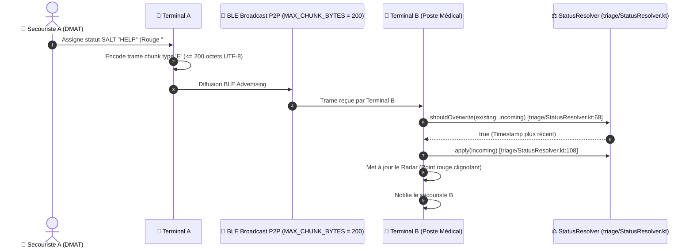

### 5.5. Pipeline de Vulgarisation Pédagogique Multilingue et Cache Local

Implémenté dans `ai/assistant/VulgariseRepository.kt:27-92` et `ai/assistant/VulgariseHelper.kt:186-245` :

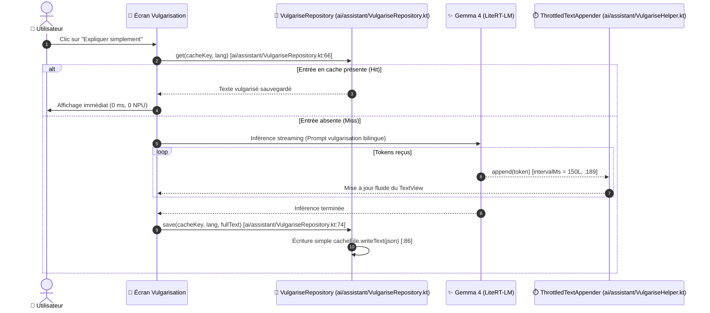

---

## 6. Diagrammes d'Activités & Algorithmes Métier (Activity Diagrams)

### 6.1. Algorithme de Résolution Sémantique d'un Médicament

Implémentation exacte observée dans `kb/KnowledgeBaseService.kt:143-250,833-855` :

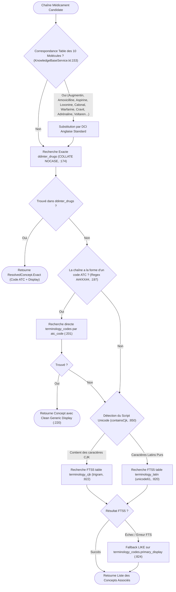

### 6.2. Algorithme de Détection d'Allergie Croisée par Arborescence de Classes

Implémentation exacte observée dans `kb/KbCrossCheck.kt:304-418,818-885` :

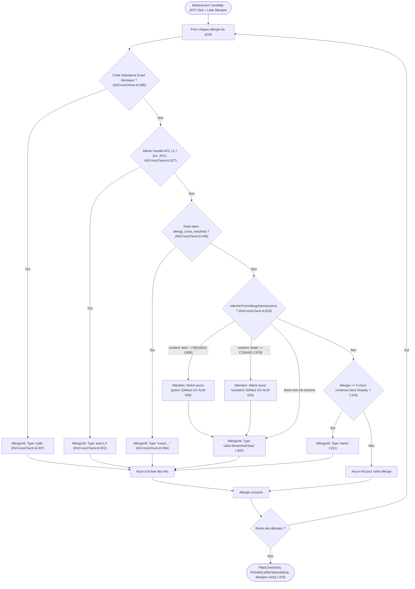

### 6.3. Algorithme d'Éviction Prioritaire du QR Texte Universel

Implémenté dans `qr/JemmaTextPayloadBuilder.kt:82-93,237-290` :

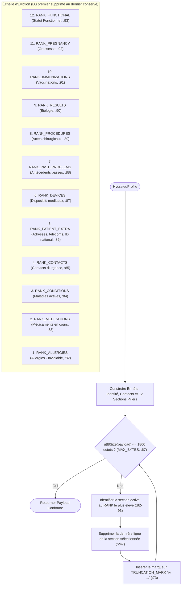

### 6.4. Algorithme de Réconciliation et d'Inviolabilité du Groupe Sanguin

Implémenté dans `ips/IpsBloodGroup.kt:1-90` et `profiles/ProfilesRepository.kt:82-114` :

```mermaid
flowchart TD
    Start(["Profil Patient avec p.bt et liste des résultats rs"]) --> NormBT["Normaliser p.bt (IpsBloodGroup.normalize, A+, O-, B+, AB...)"]
    NormBT --> ScanObs["Rechercher Observation LOINC 882-1 dans rs"]
    
    ScanObs --> ObsPresent{"Observation 882-1 présente ?"}
    ObsPresent -- Non --> GenerateObs["Générer Observation LOINC 882-1 avec Code SNOMED Conforme"]
    
    ObsPresent -- Oui --> Compare{"Valeur Observation == p.bt ?"}
    Compare -- Oui --> Consistent["Conserver Observation Valide"]
    Compare -- Non --> ConflictDetected["Conflit Détecté : p.bt fait foi (ProfilesRepository.kt:80)"]
    
    ConflictDetected --> IsManualEdit{"Action en cours ?"}
    IsManualEdit -- "Saisie Formulaire Manuelle" --> RejectEdit["Bloquer la modification contradictoire"]
    IsManualEdit -- "Import / Réconciliation Fichiers" --> DropContradictory["Évincer l'observation contradictoire et notifier BloodGroupConflict"]
    
    GenerateObs --> SaveProfile["Persistance sous writeMutex (ProfilesRepository.kt:146)"]
    Consistent --> SaveProfile
    DropContradictory --> SaveProfile
    SaveProfile --> Finish(["Profil Persisté avec Intégrité Sanguine Assurée"])
```

---

## 7. Spécifications Formelles des Contrats d'Interface Vérifiés

Signatures réelles en Kotlin relevées ligne par ligne dans le code source :

### 7.1. Contrat Réel du Service de Connaissance Médicale (`KnowledgeBaseService`)

```kotlin
// Source : JemmaPassAndroidDemo/app/src/main/java/be/heyman/android/jemmapassdemo/kb/KnowledgeBaseService.kt
package be.heyman.android.jemmapassdemo.kb

@Singleton
class KnowledgeBaseService @Inject constructor(
    private val kbManager: KnowledgeBaseManager,
) {
    // Résolution sémantique d'un médicament (nom de marque, DCI, katakana ou code ATC)
    // Ligne 143
    suspend fun resolveDrug(name: String?): ResolvedConcept

    // Résolution sémantique d'une allergie (nom de substance ou aliment)
    // Ligne 263
    suspend fun resolveAllergy(name: String?): ResolvedConcept

    // Interrogation DDI rapide sur la vue v_ddi_emergency (Major + Moderate)
    // Ligne 440
    suspend fun queryDDIByAtc(atcA: String?, atcB: String?): DDIResult

    // Interrogation DDI avec résolution automatique de noms libres
    // Ligne 478
    suspend fun queryDDI(drugA: String?, drugB: String?): DDIResult

    // Interrogation contre-indication médicament x pathologie
    // Ligne 758
    suspend fun queryDrugDisease(atc: String?, diseaseName: String?): DrugDiseaseResult

    // Recherche FTS5 plein-texte (terminology_latin ou terminology_cjk selon script)
    // Ligne 833
    suspend fun searchCodes(
        query: String?,
        lang: String = "en",
        categoryFilter: String? = null,
        maxResults: Int = SEARCH_MAX_RESULTS,
    ): KbSearchResult
}
```

### 7.2. Contrat Réel du Moteur de Contrôle Croisé (`KbCrossCheck`)

```kotlin
// Source : JemmaPassAndroidDemo/app/src/main/java/be/heyman/android/jemmapassdemo/kb/KbCrossCheck.kt
package be.heyman.android.jemmapassdemo.kb

@Singleton
class KbCrossCheck @Inject constructor(
    private val kb: KnowledgeBaseService,
    private val kbManager: KnowledgeBaseManager,
) {
    // Contrôle maître d'un médicament contre les 3 piliers (allergies, médocs, pathologies)
    // Ligne 652
    suspend fun checkOneDrugAgainstProfile(
        candidateName: String,
        allergies: List<JAllergy>,
        meds: List<JMedication>,
        conditions: List<JCondition>,
        lang: String = "en",
    ): CrossCheckResult

    // Contrôle spécifique contre les allergies avec statut de vérification
    // Ligne 233
    suspend fun checkAllergiesWithStatus(
        allergies: List<JAllergy>,
        candidateAtc: String,
        candidateAllAtcs: List<String>,
        candidateDisplay: String,
        lang: String = "en",
        kbAvailable: Boolean? = null,
    ): PillarCheck<AllergyHit>

    // Contrôle DDI contre les médicaments existants avec statut de vérification
    // Ligne 481
    suspend fun checkMedicationsWithStatus(
        meds: List<JMedication>,
        candidateAtc: String,
        candidateAllAtcs: List<String>,
        candidateDisplay: String,
        includeMinor: Boolean = false,
        lang: String = "en",
        kbAvailable: Boolean? = null,
    ): PillarCheck<DdiHit>

    // Accès simplifié DDI
    // Ligne 439
    suspend fun checkOneAtcAgainstMedications(
        meds: List<JMedication>,
        candidateAtc: String,
        candidateAllAtcs: List<String>,
        candidateDisplay: String,
        includeMinor: Boolean = false,
        lang: String = "en",
    ): List<DdiHit>

    // Contrôle contre les pathologies actives avec statut de vérification
    // Ligne 568
    suspend fun checkConditionsWithStatus(
        conditions: List<JCondition>,
        candidateAtc: String,
        candidateDisplay: String,
        lang: String = "en",
        kbAvailable: Boolean? = null,
    ): PillarCheck<DrugDiseaseHit>
}
```

### 7.3. Contrat Réel des Codecs QR, Trames et Triage

```kotlin
// Source : qr/JemmaPayloadCodec.kt, qr/JemmaTextPayloadBuilder.kt, qr/JemmaQrFrameAssembler.kt, triage/StatusResolver.kt

object JemmaPayloadCodec {
    const val MAGIC_PREFIX = "_j2:" // Ligne 57
    fun encode(profile: JemmaProfileJ): EncodeResult // Ligne 189
    fun decode(text: String?): DecodeResult // Ligne 122
}

object JemmaQrFrameSplitter {
    const val QR_MAX_SINGLE = 1800 // Ligne 53
    fun split(payload: String, maxSingle: Int, frameChunk: Int): List<String> // Ligne 94
}

object JemmaTextPayloadBuilder {
    const val MAX_BYTES = 1800 // Ligne 67
    const val TRUNCATION_MARK = "✂️ …" // Ligne 73
    fun build(hydrated: HydratedProfile, lang: Lang, maxBytes: Int = MAX_BYTES): String // Ligne 152
}

class JemmaQrFrameAssembler {
    data class Frame(val index: Int, val total: Int, val data: String) // Ligne 26 (index 1-based)
    fun offer(raw: String?): Result // Ligne 65
    fun missing(): List<Int> // Ligne 53
    fun reset() // Ligne 57
}

class StatusResolver {
    companion object {
        const val DCD_GRACE_SEC = 30L // Ligne 56
        fun shouldOverwrite(existing: StatusEvent, incoming: StatusEvent): Boolean // Ligne 68
    }
    fun apply(incoming: StatusEvent): StatusEvent // Ligne 108
}
```

---

## 8. Proposé — N'existe pas encore (Cibles d'Évolution & Portages)

Cette section rassemble expressément les concepts, classes et propositions d'architecture qui **ne figurent pas dans le code Android actuel** mais représentent des cibles d'évolution technique pour les refactorings futurs et le portage iOS :

1. **Façade d'Abstractions Multiplateforme (`ITransferHub`, `ICrossCheckEngine`)** :
   - *Statut actuel* : Absentes du code. Les composants actuels sont des Singletons Hilt ou des `object` Kotlin directs (`KbCrossCheck`, `JemmaPayloadCodec`, `JemmaTextPayloadBuilder`).
   - *Proposition* : Créer des interfaces pures pour faciliter l'injection de dépendances multiplateforme (KMP / Swift).

2. **Résolution Lexicale Robuste par Frontières de Mots (Correction UC-ALM-009 / UC-ALM-010)** :
   - *Statut actuel* : Le code utilise `n.contains("ains")` et `n.contains("statin")` (`kb/KbCrossCheck.kt:858,878`), ce qui produit des faux positifs sur "grains" et "nystatine".
   - *Proposition* : Remplacer par une expression régulière avec frontières de mots `\bains\b` ou une tokenisation lexicale stricte pour exclure les sous-chaînes accidentelles.

3. **Normalisation Universelle Zenkaku / Hankaku & Table Katakana Dédiée** :
   - *Statut actuel* : Normalisation gérée par un bloc `when` codé en dur pour 10 molécules (`kb/KnowledgeBaseService.kt:153-166`).
   - *Proposition* : Intégrer un analyseur morphologique ou une table de correspondance formelle Katakana -> HOT / YJ / ATC pour l'ensemble de la pharmacopée japonaise.

4. **Somme de Contrôle et Identifiant de Lot dans les Trames QR Multi-Frames** :
   - *Statut actuel* : Le format `JF:i/N|data` ne comporte ni hash, ni identifiant de session, ni CRC (`qr/JemmaQrFrameAssembler.kt:16-19`).
   - *Proposition* : Étendre le format de trame à `JF:i/N:SESSION_HASH|data` pour prévenir les entrelacements de scans entre deux diaporamas différents.

5. **Signature Cryptographique de Lot et Chiffrement Bout-en-Bout** :
   - *Statut actuel* : Les trames transitent en clair (Base64 deflate-raw ou JSON brut).
   - *Proposition* : Intégrer une couche de signature numérique (Ed25519) pour authentifier l'émetteur du pass en milieu d'urgence.
