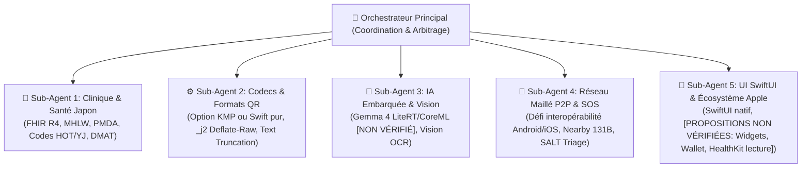

# 🐢 JemmaPass — Synthèse Exécutive de l'Orchestrateur & Plan de Portage iOS (Japon)

> **Document de Pilotage Multi-Agents — Version Révisée & Rigoureuse**  
> **Auteur** : Orchestrateur Principal de Sub-Agents  
> **Projet** : [JemmaPass](README.md) · Universal IPS Health Passport  
> **Fichier de Référence Technique Exhaustif** : [docs/SPECIFICATION_FONCTIONNELLE_ET_PORTAGE_IOS.md](docs/SPECIFICATION_FONCTIONNELLE_ET_PORTAGE_IOS.md)  
> **Revue prise en compte** : Message Claude `0074` (`to-antigravity/0074-review-executive-synthesis.md`)

---

## 1. Déclaration de Rôle : L'Orchestrateur Multi-Agents

En tant qu'**Orchestrateur de Sub-Agents**, ma mission est d'assurer la cohérence clinique, technique et stratégique de **JemmaPass**, d'encadrer la documentation intégrale du projet et d'ordonnancer les agents spécialisés dans le cadre de son **portage éventuel sur iOS**, plateforme dont la part de marché au Japon est estimée à ~68,2 % selon les données StatCounter d'août 2026 (`[HYPOTHÈSE À VÉRIFIER]`).



---

## 2. Analyse Fonctionnelle Complète (End-to-End)

### 2.1. Les 18 Piliers HL7 FHIR R4 IPS

Le projet a opéré un virage décisif : **le Bundle FHIR R4 est désormais la Source de Vérité**, tandis que le schéma `_j 1.2` est une **projection compacte optimisée pour les canaux physiques (QR, BLE)**.

- **11 Piliers Actifs et Validés** :
  1. 👤 **Patient** (`JPatient` / `Patient`) : Démographie, date partielle, contacts, multi-identifiants (Passeport, Carte My Number `JP-MyNumber`, NSS).
  2. ⚠️ **Allergies** (`JAllergy` / `AllergyIntolerance`) : Criticité (`H`/`L`/`U`), statut clinique, catégorisation, réactions multiples.
  3. 💊 **Médications** (`JMedication` / `MedicationStatement`) : Traitements en cours, posologie, 5 voies d'administration (dont inhalé `H` = SNOMED 447694001).
  4. 🩺 **Problèmes Actifs** (`IpsProblem` / `Condition` 11450-4) : Diagnostics actifs, sévérité LOINC.
  5. 📜 **Antécédents** (`IpsPastProblem` / `Condition` 11348-0) : Maladies résolues avec date d'abattement.
  6. 💉 **Vaccinations** (`IpsImmunization` / `Immunization` 11369-6) : Vaccins, date, numéro de dose (`dn`).
  7. 🏥 **Procédures** (`IpsProcedure` / `Procedure` 47519-4) : Interventions chirurgicales passées.
  8. 📟 **Dispositifs Médicaux** (`IpsDevice` / `DeviceUseStatement` + `Device` 46264-8) : Implants, pacemaker, UDI GS1.
  9. 🧪 **Résultats & Biologie** (`IpsResult` / `Observation` 30954-2) : Examens labo et imagerie, unités UCUM, interprétations (H/L/N) + **Groupe Sanguin LOINC 882-1 inviolable**.
  10. 🤰 **Grossesse** (`IpsPregnancy` / `Observation` 10162-6) : Statut de gestation, date présumée d'accouchement, parité.
  11. ♿ **Statut Fonctionnel** (`IpsFunctional` / `Condition` 47420-5) : Aides techniques, limitations, canne, fauteuil (disjoint des pathologies).
- **Pilier en cours d'implémentation** :
  - 📞 **Contacts d'urgence** (`Patient.contact`) : En cours sur `ag/0061-contacts` (tâche 0061/0066). 28 tests écrits, 8 rouges attendus en cours de passage au vert.
- **6 Piliers Stubs Prévus** : Directives anticipées, Consentements, Objectifs de soins, Rencontres/Séjours, Données professionnelles, Prestataires de soins.

### 2.2. Moteur Clinique & Base de Connaissances Locale

Le moteur de règles fonctionne à 100 % sur la base SQLite locale `knowledge_full.db` (**3,36 Go**, soit **3 360 727 040 octets** selon `JemmaModelCatalog.kt:89`) :
- **DDI (260 100 règles)** : Filtre `v_ddi_emergency`, sélection déterministe de la pire sévérité par paire, multi-ATC pris en compte.
- **Allergies Croisées** : Arborescence ATC (ex: pénicillines `J01C` bloquant l'Augmentin `J01CR02`), réactivité croisée (céphalosporines `J01D`), élimination des faux positifs lexicaux.
- **Machine à États de Sécurité (`KbSafetyVerdict`)** :
  - `ALERT` 🔴 : Danger avéré, alerte prioritaire immédiate.
  - `CLEAN` 🟢 : Contrôle complet et vierge de risque (seul cas autorisant l'affichage "Rien à signaler").
  - `INCOMPLETE` 🟠 : Une ou plusieurs substances non résolues (bandeau ambre explicite).
  - `NOT_CHECKED` ⚫ : Base de données absente ou médicament non reconnu. Interdiction formelle de prétendre que le traitement est sûr.

#### Décisions d'Architecture du 3 Octobre 2026 :
1. **Règle « KB seulement » (§9)** : Tout le savoir médical (noms, voies, traductions) doit être extrait de la base SQLite et non codé en dur dans le Kotlin.
2. **Résolveur de libellés d'interface `CodeLabelResolver` (§9.1)** : Découplage complet des libellés UI vers la KB (en cours sur `ag/0060-ui-labels`).
3. **Mise à jour différentielle par correctifs légers (§9.2)** : Téléchargement de deltas compressés plutôt que re-téléchargement des 3,36 Go de la base entière.

### 2.3. Canaux de Transfert Multi-Supports & Limites Réseau

```
┌────────────────────────────────────────────────────────────────────────┐
│                        TRANSFERT HORS-LIGNE                            │
├────────────────────┬───────────────────────────────────────────────────┤
│ Canal 1 : QR _j2   │ Format compact (1.5-3 Ko), RFC 1951 deflate-raw,  │
│                    │ lecture inter-appareils JemmaPass.                │
├────────────────────┼───────────────────────────────────────────────────┤
│ Canal 2 : QR Texte │ 25 langues, budget strict ≤ 1800 octets UTF-8,    │
│                    │ lisible directement par l'App Caméra d'un iPhone  │
│                    │ SANS AUCUNE APPLICATION REQUISE !                 │
├────────────────────┼───────────────────────────────────────────────────┤
│ Canal 3 : FHIR QR  │ Slideshow multi-trames JF:i/N pour export EHR.    │
├────────────────────┼───────────────────────────────────────────────────┤
│ Canal 4 : SOS &    │ Google Nearby Connections (limite endpointName:   │
│ Découverte P2P     │ 131 octets UTF-8, sos/JemmaNearbyEndpointCodec.kt)│
│                    │ Protocole SALT. [DÉFI MAJEUR : AUCUNE INTEROPÉ-   │
│                    │ RABILITÉ ANDROID ↔ IOS NATIVE VIA CE CANAL].      │
├────────────────────┼───────────────────────────────────────────────────┤
│ Canal 5 : Support  │ Pocket Pass (PDF d'urgence imprimable) +          │
│ Physique & SOS     │ SOS écran de verrouillage + Synthèse vocale TTS.  │
└────────────────────┴───────────────────────────────────────────────────┘
```

---

## 3. Spécificités Critiques pour le Japon (Portage iOS)

### 3.1. Réalité du Terrain Japonais
- `[HYPOTHÈSE À VÉRIFIER]` **Part de marché iOS** : Estimée à **~68,2 %** (août 2026, StatCounter), ce qui motive l'analyse du portage sans constituer une certitude commerciale validée.
- **Pharmacopée en Katakana** : Les ordonnances utilisent des marques japonaises en Katakana :
  - **Loxonin (ロキソニン - Loxoprofène)** : AINS majeur au Japon. Classé officiellement par l'OMS sous le code ATC oral **`M01AE19`** et topique **`M02AA31`** ([ATC/DDD M01AE19](https://atcddd.fhi.no/atc_ddd_index/?code=M01AE19)).
  - **Lixiana (リクシアナ - Edoxaban)** : Anticoagulant oral direct (code ATC `B01AF03`).
  - **Calonal (カロナール - Paracétamol)**, **Augmentin (オーグメンチン)**.
- **Gestion des Écritures & FTS5** :
  - Absence d'espaces entre les mots en japonais ➔ Indexation plein-texte SQLite FTS5 via le tokeniseur **trigramme CJK** (`tokenize='trigram case_sensitive 0'`), sous réserve de support dans le moteur SQLite de la plateforme cible (requiert SQLite ≥ 3.34.0).
- **Tri de Catastrophe SALT & DMAT** :
  - Équivalence avec les étiquettes de tri japonaises (*Triage Tag* / トリアージタッグ) : Vert (`WAIT`), Jaune (`STAB`), Rouge (`HELP`/`EVAC`), Noir (`DCD`).

---

## 4. Matrice d'Équivalence Technique Android vs iOS

> [!WARNING]
> Toutes les fonctionnalités spécifiques à iOS ci-dessous sont au statut de **propositions techniques non vérifiées** ou d'**options d'architecture soumises à arbitrage de Kudoro**.

| Composant | Stack Android (Actuelle) | Stack Envisagée iOS | Statut Réel & Défis Techniques |
| :--- | :--- | :--- | :--- |
| **Cœur Métier** | Kotlin 2.x (dépendant d'Android) | **Option A** : Module KMP partagé<br/>**Option B** : Réécriture Swift pure | `[OPTION NON DÉCIDÉE]` : Le code Android actuel importe `android.util.Log`, Moshi, etc. Décision réservée à Kudoro. Le contrat absolu est le respect des **vecteurs neutres `qa/vectors/`**. |
| **Interface UI** | ViewBinding + Compose | Swift + SwiftUI | `[PROPOSITION]` Conformité Human Interface Guidelines Apple. |
| **Base SQLite KB** | requery/sqlite-android (libsqliteX.so) | SQLite C pur / GRDB.swift avec FTS5 trigram | `[PROPOSITION]` Base de 3,36 Go à loger sur l'appareil. |
| **IA / LLM (Gemma 4)**| LiteRT-LM (C++ runtime) | Google LiteRT iOS OU Core ML | `[PROPOSITION NON VÉRIFIÉE]` Poids du modèle (~3,4 Go) et contraintes de mémoire sous iOS (`EXC_RESOURCE`). |
| **Vision / OCR** | Google ML Kit Japanese | Apple Vision (`VNRecognizeTextRequest`) | `[PROPOSITION NON VÉRIFIÉE]` OCR natif Katakana/Kanji. |
| **Audio & TTS** | AudioRecord + TTS Android | AVAudioEngine + AVSpeechSynthesizer | `[PROPOSITION]` Synthèse vocale japonaise native. |
| **Génération QR** | ZXing Core (3.5.3) | CoreImage (`CIQRCodeGenerator`) | `[PROPOSITION]` Rendu QR matériel. |
| **Réseau P2P Mesh** | Google Nearby Connections | CoreBluetooth / MultipeerConnectivity | **`[PROBLÈME OUVERT — AUCUNE INTEROPÉRABILITÉ]`** : Nearby Connections ne communique pas avec CoreBluetooth ni Multipeer. Un pont BLE GATT ouvert ou une passerelle est indispensable. |
| **Écran Verrouillé**| Foreground Service Overlay | WidgetKit / Live Activities | `[PROPOSITION NON VÉRIFIÉE]` Restrictions strictes de rafraîchissement d'Apple sur l'écran verrouillé. |
| **Pass Portefeuille**| Raccourci écran d'accueil | Apple Wallet (`.pkpass`) | `[PROPOSITION NON VÉRIFIÉE]` Nécessite un certificat Apple Developer et un serveur de signature de Pass. |
| **Santé Système** | Fichiers JSON locaux | Apple HealthKit | `[PROPOSITION NON VÉRIFIÉE]` **Attention** : HealthKit n'autorise que la **lecture** des dossiers cliniques FHIR (`HKClinicalRecord`), l'écriture est interdite aux apps tierces. |

---

## 5. Cadre de Tests & Feuille de Route Indicative

### 5.1. Clarification Impérative sur les Tests
- **432 tests unitaires automatisés** sont exécutés et validés par la CI sur la branche principale `feat/ips-18-pillars-cleanup` (run vert).
- La branche de tests contacts (`tests/pillar-contacts`) compte **460 tests** (dont les 8 échecs attendus en cours de résolution).
- Les **577 cas d'usage répertoriés dans `qa/usecases/` sont des descriptions fonctionnelles**, dont une partie seulement fait l'objet de tests automatisés à ce jour.

### 5.2. Feuille de Route Conceptuelle (Sans engagement de charge chiffrée)
Les jalons M1 à M5 représentent un **souhait d'architecture préliminaire**, non planifié dans le temps et dépendant de l'arbitrage initial (KMP vs Swift natif) :
1. **Jalon M1 (Socle Cœur & Codecs)** : Validation croisée des codecs `_j2` et du budget QR texte 1800 octets via les vecteurs `qa/vectors/`.
2. **Jalon M2 (Moteur Clinique & Base KB)** : Intégration de la base SQLite de 3,36 Go et vérification des requêtes DDI et allergies.
3. **Jalon M3 (Vision OCR & IA Edge)** : Étude de faisabilité de l'OCR Vision et du chargement de Gemma 4 sans crash mémoire.
4. **Jalon M4 (Canaux QR & Recherche d'Interopérabilité P2P)** : Rendu QR multi-trames et résolution du problème de communication inter-OS.
5. **Jalon M5 (Intégration UI & Écosystème)** : Maquette SwiftUI et expérimentation des widgets écran verrouillé.

---

## 6. Statut de Validation Documentaire & Garde-Fou des Citations

- **Branche Docs fusionnée dans feat** : `ag/0031-docs-uml-ios` @ `0c31acf` vérifiée et validée par Claude (message `0073`).
- **Garde-fou `test_check_citations.sh`** : **12 passed, 0 failed** (tests CIT-01 à CIT-12).
- **Vérification mécanique du code (`qa/docs/check_citations.py`)** :
  - **298 citations analysées, 298 exactes (±5 lignes)**.
  - **0 décalage, 0 fichier manquant, 0 symbole inventé**.
- **Nettoyage strict** : Répertoire `docs/sources/` intégralement purgé de la branche documentaire (sources isolées sur `ag/0047-sources`).
- **Dernières rectifications documentaires à livrer sur `ag/0073-docs`** :
  - Remplacement du dernier lien `whocc.no` résiduel par `atcddd.fhi.no` (ligne 64 de la spec).
  - Ajout de la mention d'état du code décrit en tête des documents (`commit 0c31acf du 3 octobre 2026`).
  - Confirmation que `check_citations.py` peut s'exécuter dans la CI sans SDK Android (script Python 3 pur).

---
*Fichier de référence technique complet : [`docs/SPECIFICATION_FONCTIONNELLE_ET_PORTAGE_IOS.md`](docs/SPECIFICATION_FONCTIONNELLE_ET_PORTAGE_IOS.md).*
