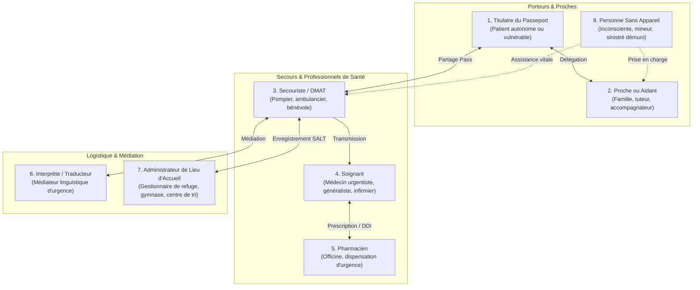

# 🐢 JemmaPass — Analyse Fonctionnelle Globale : Cartographie & Matrice des Échanges
> **Document Fondateur de l'Analyse Fonctionnelle Complète**  
> **Branche de travail** : `ag/analyse-fonctionnelle` (dérivée de `origin/feat/ips-18-pillars-cleanup`)  
> **Rôle** : `orchestrator: Antigravity-Analyse`  
> **Tranche** : 1 / 6 (`00-carte.md`)  
> **État du code décrit** : commit `1e6d6f7c882f1d6811e14c08b5078611d7c9a270` du 4 octobre 2026.  
> **Références normatives** : ISO 27269:2021 (International Patient Summary - IPS), HL7 FHIR R4 IPS IG v1.1.0, RFC 1951 (DEFLATE), W3C WebApp / PWA, NFC Data Exchange Format (NDEF).  
> **Personas de référence** :  
> - 🚶‍♂️ `demo_kurodo` (Kurodo) : Pèlerin étranger, allergie létale à la pénicilline (`SNOMED 91936005`).  
> - 👵 `demo_haru` (Haru) : Citoyenne japonaise de 80 ans, sous anticoagulant oral direct Edoxaban (`ATC B01AF03`).  
> - 🎒 `demo_kamekichi` (Kamekichi) : Secouriste bénévole / équipier DMAT.  

---

## Sommaire de la Tranche 1

1. [Périmètre, Démarche & Règle du Zéro-Défaut](#1-périmètre-démarche--règle-du-zéro-défaut)
2. [Section A : Taxonomie Exhaustive des Acteurs](#2-section-a--taxonomie-exhaustive-des-acteurs)
3. [Section B : Taxonomie des Appareils et Interfaces](#3-section-b--taxonomie-des-appareils-et-interfaces)
4. [Section C : Matrice Exhaustive des Canaux d'Échange par Paire d'Appareils](#4-section-c--matrice-exhaustive-des-canaux-déchange-par-paire-dappareils)
5. [Section D : Découpage Normalisé des Domaines Fonctionnels](#5-section-d--découpage-normalisé-des-domaines-fonctionnels)
6. [Section E : Registre des Décisions Ouvertes à Faire Prendre par Kudoro](#6-section-e--registre-des-décisions-ouvertes-à-faire-prendre-par-kudoro)

---

## 1. Périmètre, Démarche & Règle du Zéro-Défaut

L'écosystème **JemmaPass** a pour finalité la sauvegarde de vies humaines en situation d'urgence médicale, de mobilité internationale et de catastrophe naturelle majeure (séisme, tsunami, rupture d'infrastructure électrique et télécom).

Dans ce contexte, **la santé de vraies personnes est engagée** :
- Un cas d'usage oublié, une incompatibilité de canal non anticipée ou une hypothèse erronée sur les capacités d'un terminal constitue un **défaut critique** susceptible de retarder ou compromettre une prise en charge médicale d'urgence.
- L'analyse fonctionnelle ne se substitue pas aux décisions du concepteur du produit (*Kudoro*) : toute bifurcation architecturale, choix éthique, compromis ergonomique ou divergence réglementaire est explicitement consigné dans le **Registre des Décisions** avec ses options et leurs conséquences médicales et techniques.
- Tout fait technique vérifié dans le code source Android est sourcé avec son chemin et sa ligne exacte (`fichier:ligne`). Tout fait externe ou plateforme non prouvé est systématiquement marqué `[NON VÉRIFIÉ]`.

---

## 2. Section A : Taxonomie Exhaustive des Acteurs

L'écosystème implique 8 catégories d'acteurs, aux compétences, contraintes et habilitations contrastées.



### A.1. Titulaire du Passeport (Patient)
- **Définition** : Personne physique dont les antécédents, traitements, allergies et données vitales sont décrits dans le passeport.
- **Rôle & Actions** :
  - Saisie, révision et mise à jour de son profil de santé en situation calme (`profiles/ProfilesRepository.kt:254-375`).
  - Présentation de son QR Code d'urgence (écran déverrouillé, raccourci, widget SOS) lors d'un contrôle ou d'un incident.
  - Port de supports physiques passifs : Pocket Pass papier plié au format carte, clé USB d'urgence sur trousseau, badge ou carte NFC.
- **Contraintes & Stress** : Peut être paniqué, blessé, désorienté, non francophone/non japonophone en voyage (ex: `demo_kurodo` au Japon), ou en état de choc post-séisme.

### A.2. Proche ou Aidant
- **Définition** : Membre de la famille, conjoint, tuteur légal, curateur ou accompagnateur de voyage.
- **Rôle & Actions** :
  - Gestion déléguée du profil d'une personne dépendante (enfant, personne âgée telle que `demo_haru`, adulte sous tutelle).
  - Détention d'une copie numérique ou papier du passeport du proche.
  - Transmission des antécédents et contacts d'urgence aux secours lorsque le titulaire est hors d'état de communiquer.
- **Contraintes** : Stress émotionnel intense, responsabilité légale de substitution, nécessité de basculer rapidement entre plusieurs profils sur un même terminal.

### A.3. Secouriste / Équipier DMAT (Disaster Medical Assistance Team)
- **Définition** : Premier intervenant sur le lieu d'un accident ou d'une catastrophe (pompier, ambulancier, bénévole Croix-Rouge/Croissant-Rouge, membre d'une équipe DMAT).
- **Rôle & Actions** :
  - Détection et lecture immédiate du passeport de la victime par scan QR ou écoute radio de proximité (BLE SOS / Nearby).
  - Évaluation vitale immédiate : allergies majeures (`al`), anticoagulants/traitements à risque (`md`), groupe sanguin (`p.bt` et observation 882-1).
  - Attribution d'un statut de triage de catastrophe SALT (`triage/SaltCode.kt:34-51`) : WAIT (gris), EVAL (jaune), STAB (vert), HELP (rouge), EVAC (bleu), DCD (noir).
  - Scan de boîtes de médicaments trouvées sur place (`ai/medscan/MedScanController.kt:1-40`) pour éviter les contre-indications létales.
- **Contraintes** : Environnement hostile, bruit, coupure réseau totale, luminosité variable (obscurité, plein soleil), temps d'analyse par victime compté en secondes.

### A.4. Soignant (Médecin urgentiste, réanimateur, généraliste, infirmier)
- **Définition** : Professionnel de santé habilité à poser un diagnostic, prescrire ou administrer des thérapeutiques invasives.
- **Rôle & Actions** :
  - Prise de connaissance approfondie du dossier IPS complet : 18 piliers, antécédents chirurgicaux (`pr`), dispositifs implantés (`dv`), biologie (`rs`), grossesse (`pg`), directives anticipées (`ad`).
  - Importation du Bundle HL7 FHIR R4 standardisé (`.fhir.json`) dans le dossier médical hospitalier (DPI/EHR) du poste médical avancé ou de l'hôpital récepteur.
  - Exécution de contrôles croisés médicamenteux rigoureux (`kb/KbCrossCheck.kt:130-135`) avant injection ou anesthésie.
- **Contraintes** : Exigence absolue de traçabilité, de non-corruption des données médicales et de conformité aux nomenclatures officielles (SNOMED CT, LOINC, ATC, ICD-10).

### A.5. Pharmacien
- **Définition** : Professionnel de santé d'officine ou de pharmacie hospitalière de campagne.
- **Rôle & Actions** :
  - Lecture du passeport d'un patient se présentant sans ordonnance papier (sinistré ayant fui son domicile sans traitement).
  - Identification précise des médicaments chroniques via leurs codes ATC ou DCI, même sous un nom de marque étranger ou en katakana (ex: *Lixiana* ➔ Edoxaban `B01AF03`).
  - Vérification de l'absence d'interactions médicamenteuses délétères (DDI) et d'allergies croisées lors de la délivrance de dépannage.
- **Contraintes** : Accès restreint ou nul aux serveurs d'assurance maladie en situation de blackout ; responsabilité de délivrance sans ordonnance originale.

### A.6. Interprète / Médiateur Culturel
- **Définition** : Personne assurant la traduction linguistique entre la victime étrangère et les intervenants locaux (ex: interprète anglais/japonais pour `demo_kurodo`).
- **Rôle & Actions** :
  - Consultation de la version textuelle traduite dans la langue locale du pays d'accueil (dictionnaires 25 langues, `qr/JemmaTranslations.kt:5-30`).
  - Explication des symptômes et allergies critiques sans altération sémantique des termes médicaux.
- **Contraintes** : Souvent dépourvu de formation médicale approfondie ; ne doit pas interpréter librement les posologies ou les termes nosologiques.

### A.7. Administrateur d'un Lieu d'Accueil (Refuge / Centre d'Évacuation)
- **Définition** : Responsable municipal ou bénévole en charge de l'enregistrement et de la logistique d'un gymnase ou refuge de sinistrés.
- **Rôle & Actions** :
  - Recensement des personnes accueillies et identification des profils à haute vulnérabilité (femmes enceintes `pg`, personnes appareillées ou à mobilité réduite `fs`, dialysés, diabétiques insulino-dépendants).
  - Tenue du registre des personnes présentes sans exposer publiquement le secret médical complet.
  - Gestion des régimes alimentaires stricts liés aux allergies vitales recensées.
- **Contraintes** : Matériel hétérogène (ordinateur personnel de fortune, tablettes municipales, fiches papier), absence de qualification soignante.

### A.8. Personne Sans Appareil
- **Définition** : Sinistré, victime inconsciente, enfant égaré, personne âgée non équipée ou personne dont le téléphone est détruit, déchargé ou perdu.
- **Rôle & Actions** :
  - Acteur passif de la prise en charge : porte sur elle des supports physiques de substitution (Pocket Pass imprimé, carte NFC au poignet, clé USB autour du cou).
- **Contraintes** : Incapacité matérielle totale à générer un flux radio ou un affichage dynamique ; dépend à 100 % de la lisibilité des supports tangibles par les tiers.

---

## 3. Section B : Taxonomie des Appareils et Interfaces

L'écosystème JemmaPass doit opérer sur un parc hétérogène de 9 terminaux et supports physiques.

```
┌────────────────────────────────────────────────────────────────────────┐
│               TAXONOMIE DES 9 APPAREILS ET SUPPORTS                   │
├───────────────────────────────┬────────────────────────────────────────┤
│ Terminaux Numériques Dédiés   │ 1. Téléphone Android (App native)      │
│                               │ 2. iPhone (App iOS / Lecteur Natif)    │
│                               │ 5. Tablette partagée (Poste secours)   │
├───────────────────────────────┼────────────────────────────────────────┤
│ Environnements Web & Bureaux  │ 3. Extension Chrome (PC connecté/hors) │
│                               │ 4. Ordinateur sans rien d'installé     │
├───────────────────────────────┼────────────────────────────────────────┤
│ Périphériques Ultra-Légers    │ 6. Montre connectée (WearOS / watchOS) │
├───────────────────────────────┼────────────────────────────────────────┤
│ Supports Physiques & Amovibles│ 7. Papier imprimé (Pocket Pass PDF)    │
│                               │ 8. Carte NFC (Badge sans contact)      │
│                               │ 9. Clé USB (Dossier autonome universel)│
└───────────────────────────────┴────────────────────────────────────────┘
```

### B.1. Téléphone Android
- **Configuration** : Smartphone sous Android 10+ (API 29+), application native JemmaPass installée.
- **Capacités** : Caméra (scan QR), puce NFC (lecture/écriture), Bluetooth BLE 5.0 (Extended Advertising 200 octets, `sos/JemmaSosChunkCodec.kt:171`), Wi-Fi P2P (Google Nearby Connections), haut-parleur (TTS), écran tactile.
- **Stockage & Moteurs Locaux** : Base SQLite `knowledge_full.db` (3,36 Go, `downloads/JemmaModelCatalog.kt:89`), modèle IA Gemma 4 LiteRT-LM (2,4 à 3,4 Go), dossiers profils atomiques (`ProfileFiles.kt`).
- **Contraintes** : Autonomie batterie en zone sinistrée, gestion agressive des processus en arrière-plan par l'OS.

### B.2. iPhone
- **Configuration** : Smartphone sous iOS 16+, modèle grand public (estimé à ~68,2 % du marché japonais `[HYPOTHÈSE À VÉRIFIER]`).
- **Modes de Fonctionnement** :
  - *Mode Natif Léger (Sans application JemmaPass)* : Utilisation de l'application native « Appareil photo » d'Apple qui décode nativement le **QR Texte Universel** (≤ 1800 octets UTF-8, `qr/JemmaTextPayloadBuilder.kt:67`) et l'affiche sous forme de fiche texte sans réseau ni application tierce.
  - *Mode Application Dédiée (Portage iOS)* : Application Swift/SwiftUI exécutant le moteur de règles, la lecture QR `_j2`, et l'accès aux profils.
- **Contraintes** : Incompatibilité native entre Google Nearby Connections et les APIs iOS CoreBluetooth/MultipeerConnectivity ; limitations de mémoire vive (`EXC_RESOURCE`) pour les modèles LLM lourds.

### B.3. Extension Chrome / Navigateur Bureau
- **Configuration** : Navigateur Google Chrome / Chromium sur PC Windows, Mac, Linux ou ChromeOS, avec extension JemmaPass installée.
- **Capacités** : Clavier/souris grand format, écran large pour consultation médicale, webcam (lecture QR), accès au système de fichiers local (`FileSystemAccess API`), WebUSB / WebBluetooth (selon autorisations).
- **Rôle** : Station de travail en cabinet médical, officine de pharmacie ou poste de commandement des secours.

### B.4. Ordinateur Sans Rien d'Installé (Kiosque / PC d'Urgence)
- **Configuration** : PC d'accueil, terminal de bibliothèque, poste hospitalier verrouillé sans droits d'administration (aucun runtime Java/Kotlin, pas d'installation permise, pas d'extension, réseau Internet potentiellement coupé).
- **Interfaces Disponibles** : Navigateur web par défaut (Edge, Safari, Firefox, Chrome), ports USB-A ou USB-C, lecteur de documents PDF standard.
- **Exigence Vitale** : Doit être capable d'ouvrir et d'afficher le passeport médical depuis une clé USB sans exécutable tiers ni connexion réseau.

### B.5. Tablette Partagée (Poste Médical Avancé / DMAT)
- **Configuration** : Tablette Android ou iPad durcie, utilisée en rotation par plusieurs soignants ou secouristes sur un centre de tri.
- **Capacités** : Écran large propice au triage multi-victimes (Radar SALT), caméra dorsale pour scan à la chaîne des QR codes de victimes.
- **Contraintes** : Mode multi-utilisateurs strict, absence d'association à une identité personnelle unique, risque de contamination croisée des profils sans vidage de cache sécurisé.

### B.6. Montre Connectée (Smartwatch Wear OS / Apple Watch)
- **Configuration** : Périphérique porté au poignet, connecté en Bluetooth au smartphone ou autonome (eSIM / GPS).
- **Interfaces Disponibles** : Écran OLED réduit (30 à 45 mm), capteurs biométriques (fréquence cardiaque, détection de chute), puce NFC, vibreur haptique.
- **Rôle d'Urgence** : Affichage d'un QR code de détresse (QR texte ou `_j2` compact), diffusion d'une balise SOS BLE de secours même si le smartphone principal est perdu ou écrasé.
- **Contraintes** : Résolution optique limitée pour les QR denses (version QR élevée illisible), autonomie batterie très faible (12 à 36 h).

### B.7. Papier Imprimé (Pocket Pass & Fiche de Tri)
- **Configuration** : Feuille A4 standard pliée en 4 ou 8 (format carte de crédit) issue du générateur PDF (`qr/JemmaPdfExporter.kt:1-100`), ou étiquette de tri physique (Triage Tag DMAT).
- **Contenu Imprimé** :
  - Recto : Données vitales en clair (nom, groupe sanguin, allergies majeures, médicaments critiques, contacts d'urgence) avec pictogrammes normalisés.
  - Verso : 1 ou 2 QR codes haute densité (QR Texte Universel + QR Compact `_j2`).
- **Atouts & Limites** : Zéro dépendance énergétique, insensible à l'eau si plastifié ; statique (non mis à jour après changement d'ordonnance), dégradable si mouillé ou brûlé.

### B.8. Carte NFC (Badge Physique Passif)
- **Configuration** : Carte PVC au format ISO 7810 ID-1 (type carte de crédit) ou bracelet silicone de sinistré, embarquant une puce sans contact (NTAG215/216 ou Mifare Ultralight).
- **Capacité Mémoire** : De 144 octets (NTAG213) à 888 octets (NTAG216), accessible par simple effleurement (champ 13.56 MHz).
- **Atouts & Limites** : Lisible sans allumer le terminal émetteur ; capacité mémoire insuffisante pour un Bundle FHIR R4 complet sans compression extrême ou pointeur URI.

### B.9. Clé USB (Support Amovible Universel)
- **Configuration** : Clé physique double connecteur USB-A / USB-C, formatée en FAT32 ou exFAT pour interopérabilité universelle (Windows, macOS, Linux, ChromeOS, Android OTG).
- **Contenu Dédié** : Dossier racine JemmaPass autonome contenant la visionneuse HTML universelle zéro-dépendance, les fichiers FHIR JSON, le PDF Pocket Pass et la base de preuves cliniques.
- **Atouts & Limites** : Stockage massif (Go), lisibilité sur tout PC sans réseau ; vulnérable à l'arrachement, à la perte mécanique ou aux politiques de blocage des ports USB d'entreprise.

---

## 4. Section C : Matrice Exhaustive des Canaux d'Échange par Paire d'Appareils

### C.1. Définition des 8 Canaux d'Échange
1. **QR-TXT** : QR Code texte universel brut (≤ 1800 octets UTF-8, `qr/JemmaTextPayloadBuilder.kt:67`), découpé en lignes lisibles directement par tout appareil photo standard sans décodeur spécial.
2. **QR-CMP** : QR Code compact compressé `_j2` (RFC 1951 Deflate-raw + Base64url, `qr/JemmaPayloadCodec.kt`), lisible par tout lecteur compatible JemmaPass.
3. **QR-FHR** : QR Code FHIR multi-trames animé (`JF:i/N`, `qr/JemmaQrFrameSplitter.kt:20-34`), transportant le Bundle HL7 FHIR R4 complet par défilement vidéo/séquentiel.
4. **FILE** : Transfert direct de fichiers numériques (`.json`, `.fhir.json`, `.pdf`, `.html`) via système de fichiers, câble, messagerie locale ou carte mémoire.
5. **NFC** : Échange en champ proche sans contact (norme ISO 14443A / NDEF).
6. **P2P-RAD** : Réseau radio maillé de proximité (BLE 5.0 Extended Advertising 200 octets `MAX_CHUNK_BYTES`, `sos/JemmaSosChunkCodec.kt:171` ; Google Nearby Connections 131 octets `MAX_ENDPOINT_NAME_LEN`, `sos/JemmaNearbyEndpointCodec.kt:51` ; Apple MultipeerConnectivity ; WebBluetooth).
7. **USB** : Connexion physique filaire USB (Mass Storage ou liaison câble OTG).
8. **PAPER** : Support papier physique (Pocket Pass imprimé ou étiquette manuscrite de tri).

---

### C.2. Tableau Matriciel Global (Émetteur ➔ Récepteur)

Légende des statuts :
- ✅ **POSSIBLE** : Faisable techniquement sans barrière matérielle ni protocolaire majeure.
- ❌ **IMPOSSIBLE** : Physiquement ou matériellement irréalisable (ex: absence de capteur, absence d'interface radio, support passif).
- ⚠️ **PARTIEL** : Réalisable sous conditions strictes (format de trame restreint, pilotes spécifiques ou intervention manuelle).
- ❓ **INCONNU / NON VÉRIFIÉ** : Hypothèse technique ou compatibilité inter-OS non prouvée à ce jour.

| Émetteur \ Récepteur | 1. Android | 2. iPhone | 3. Chrome Ext | 4. PC Nu | 5. Tablette | 6. Montre | 7. Papier | 8. Carte NFC | 9. Clé USB |
| :--- | :---: | :---: | :---: | :---: | :---: | :---: | :---: | :---: | :---: |
| **1. Téléphone Android** | ✅ Tous canaux | ⚠️ QR/NFC (P2P ❓) | ✅ QR/File/NFC | ⚠️ QR (USB/File) | ✅ Tous canaux | ⚠️ BLE/QR | ✅ Impression | ✅ Écriture NFC | ✅ Écriture OTG |
| **2. iPhone** | ⚠️ QR/NFC (P2P ❓) | ✅ Tous canaux | ✅ QR/File | ⚠️ QR (File) | ⚠️ QR/NFC | ⚠️ BLE/QR | ✅ Impression | ⚠️ Écriture NFC | ⚠️ Câble OTG |
| **3. Extension Chrome** | ✅ QR/File/WebUSB | ✅ QR/File | ✅ File/Sync | ✅ File/HTML | ✅ QR/File | ❌ Impossible | ✅ Impression | ⚠️ WebNFC (Chrome) | ✅ Écriture directe |
| **4. Ordinateur Nu** | ⚠️ Affichage écran | ⚠️ Affichage écran | ✅ Clé/File | ✅ Clé/HTML | ⚠️ Affichage écran | ❌ Impossible | ✅ Impression | ❌ Impossible | ✅ Écriture directe |
| **5. Tablette Partagée** | ✅ Tous canaux | ⚠️ QR/NFC | ✅ QR/File | ⚠️ QR (USB/File) | ✅ Tous canaux | ⚠️ BLE/QR | ✅ Impression | ✅ Écriture NFC | ✅ Écriture OTG |
| **6. Montre Connectée** | ⚠️ QR/BLE | ⚠️ QR/BLE | ❌ Impossible | ❌ Impossible | ⚠️ QR/BLE | ⚠️ BLE | ❌ Impossible | ❌ Impossible | ❌ Impossible |
| **7. Papier Imprimé** | ✅ Scan Caméra | ✅ Scan Caméra | ✅ Webcam | ❌ Impossible | ✅ Scan Caméra | ❌ Impossible | ❌ Impossible | ❌ Impossible | ❌ Impossible |
| **8. Carte NFC** | ✅ Lecture NFC | ✅ Lecture NFC | ⚠️ WebNFC | ❌ Impossible | ✅ Lecture NFC | ⚠️ Si NFC actif | ❌ Impossible | ❌ Impossible | ❌ Impossible |
| **9. Clé USB** | ✅ Lecture OTG | ⚠️ Adaptateur | ✅ Lecture OS | ✅ Navigateur OS | ✅ Lecture OTG | ❌ Impossible | ❌ Impossible | ❌ Impossible | ❌ Impossible |

---

### C.3. Analyse Détaillée des 12 Paires d'Échange Critiques

#### Paire 1 : Téléphone Android ➔ Téléphone Android
- **QR-TXT** : ✅ POSSIBLE. Rendu direct ZXing, scan via CameraX / ML Kit.
- **QR-CMP** : ✅ POSSIBLE. Décodage `_j2` via `JemmaPayloadCodec.decode()` (`qr/JemmaPayloadCodec.kt:30`).
- **QR-FHR** : ✅ POSSIBLE. Carrousel multi-trames réassemblé via `JemmaQrFrameAssembler` (`qr/JemmaQrFrameAssembler.kt:26`).
- **FILE** : ✅ POSSIBLE. Export / Import de `<sid>.fhir.json` et `<sid>.json` via SAF (Storage Access Framework).
- **NFC** : ✅ POSSIBLE. Partage NDEF via Android Beam / Host Card Emulation (HCE).
- **P2P-RAD** : ✅ POSSIBLE. Radar SALT et relayage SOS via Google Nearby Connections (`sos/JemmaNearbySosService.kt`) et BLE Extended Advertising (`sos/JemmaSosBleAdvertiser.kt:28`).
- **USB** : ✅ POSSIBLE. Transfert MTP ou via adaptateur USB-C direct.
- **PAPER** : ✅ POSSIBLE. Génération PDF d'urgence via `JemmaPdfExporter` (`qr/JemmaPdfExporter.kt:40`).

#### Paire 2 : Téléphone Android ➔ iPhone
- **QR-TXT** : ✅ POSSIBLE et ÉPROUVÉ. L'application photo native d'iOS lit le texte UTF-8 ≤ 1800 octets et affiche immédiatement les alertes sans aucune application requise (`docs/SYNTHESE_PORTAGE_IOS.md:81-84`).
- **QR-CMP** : ⚠️ PARTIEL. Requiert le portage de l'application JemmaPass sur iOS pour décoder le Deflate-raw `_j2`.
- **QR-FHR** : ⚠️ PARTIEL. Requiert l'application iOS pour filmer et concaténer le carrousel `JF:i/N`.
- **FILE** : ✅ POSSIBLE. Partage par AirDrop impossible nativement sans pont, mais échange via messagerie hors-ligne, carte microSD ou adaptateur.
- **NFC** : ✅ POSSIBLE. L'iPhone lit les tags NDEF standards (CoreNFC).
- **P2P-RAD** : ❌ IMPOSSIBLE ACTUELLEMENT / `[PROBLÈME OUVERT]`. Google Nearby Connections côté Android utilise un protocole propriétaire non interopérable avec Apple MultipeerConnectivity ou CoreBluetooth sans couche de compatibilité ad hoc (`docs/SYNTHESE_PORTAGE_IOS.md:88-90, 128`).
- **USB** : ⚠️ PARTIEL. Nécessite un câble USB-C vers Lightning / USB-C et la gestion du protocole de fichiers iOS (Files app).

#### Paire 3 : iPhone ➔ Téléphone Android
- **QR-TXT** : ✅ POSSIBLE. Émis par l'écran de l'iPhone, scanné par la caméra Android via ML Kit.
- **QR-CMP** : ⚠️ PARTIEL. Requiert un générateur `_j2` conforme sous iOS (validation croisée via `qa/vectors/test_vectors.ts`).
- **QR-FHR** : ⚠️ PARTIEL. Rendu vidéo sur écran iOS, capté par l'assembleur Android.
- **FILE** : ✅ POSSIBLE. Fichiers FHIR standardisés lisibles par Android `ProfilesRepository`.
- **NFC** : ⚠️ PARTIEL. Écriture NFC par iPhone restreinte par les APIs Apple (CoreNFC permet l'écriture NDEF depuis iOS 13 sous conditions).
- **P2P-RAD** : ❌ IMPOSSIBLE SANS PONT BLE UNIFIÉ. (Idem Paire 2).

#### Paire 4 : Téléphone (Android / iOS) ➔ Extension Chrome
- **QR-TXT & QR-CMP** : ✅ POSSIBLE. L'extension Chrome active la webcam du PC et décode les flux vidéo.
- **FILE** : ✅ POSSIBLE. Glisser-déposer du fichier exporté (`.json` ou `.fhir.json`) dans l'interface de l'extension.
- **NFC** : ⚠️ PARTIEL. Possible uniquement sur ordinateurs équipés d'un lecteur NFC et via l'API WebNFC (ChromeOS / Android Chrome uniquement, non supporté sous Windows/macOS nativement sans middleware `[NON VÉRIFIÉ]`).
- **P2P-RAD** : ⚠️ PARTIEL. WebBluetooth permet de scanner des trames BLE spécifiques sous Chrome, mais ne supporte pas l'Advertising ni Nearby Connections.

#### Paire 5 : Téléphone (Android / iOS) ➔ Ordinateur Nu (Sans rien d'installé)
- **QR-TXT** : ⚠️ PARTIEL. Si l'ordinateur dispose d'une webcam, il ne peut pas décoder sans page web locale ou application native installée.
- **FILE / USB** : ✅ POSSIBLE VIA CLÉ USB. Le téléphone exporte vers une clé USB (via port OTG) ; la clé est insérée dans le PC nu.
- **Consultation sur PC Nu** : ✅ POSSIBLE SI FORMAT AUTONOME. Un fichier `index.html` universel autonome situé sur la clé permet d'afficher le dossier complet dans Edge/Safari/Chrome sans connexion internet ni droits administrateur.

#### Paire 6 : Téléphone (Android / iOS) ➔ Tablette Partagée
- **Tous Canaux** : Identique au transfert téléphone-téléphone. La tablette sert de terminal concentrateur dans un poste médical avancé (PMA).

#### Paire 7 : Téléphone ➔ Montre Connectée
- **P2P-RAD (BLE)** : ✅ POSSIBLE. Synchronisation locale de secours via Bluetooth standard entre le téléphone et la montre du titulaire.
- **QR d'Urgence** : ✅ POSSIBLE. Le téléphone pousse sur la montre une version ultra-compacte du QR texte ou du QR SOS, stockée pour affichage autonome sur l'écran OLED en cas de batterie épuisée sur le smartphone.

#### Paire 8 : Montre Connectée ➔ Secouriste (Android / iPhone)
- **QR-TXT Réduit** : ✅ POSSIBLE. L'écran de la montre affiche un QR Code version 10-15 contenant l'identité, le groupe sanguin et les allergies vitales (budget réduit à ≤ 300 octets).
- **BLE SOS** : ✅ POSSIBLE. La montre diffuse en boucle un identifiant SOS capté par le radar du secouriste (`sos/JemmaSosBleScanner.kt:49`).

#### Paire 9 : Papier Imprimé (Pocket Pass) ➔ N'importe quel Appareil
- **Lecture Oculaire Humaine** : ✅ POSSIBLE IMMÉDIATEMENT. Zéro énergie requise. Le secouriste lit le groupe sanguin et les allergies directement imprimés en clair.
- **Lecture Optique QR** : ✅ POSSIBLE. L'appareil photo de n'importe quel smartphone scanne le QR imprimé (qualité 300 DPI recommandée).
- **Limitation Absolue** : Transfert unidirectionnel strict. Le papier ne peut recevoir aucune mise à jour radio.

#### Paire 10 : Carte NFC ➔ Téléphone (Android / iOS)
- **NFC NDEF** : ✅ POSSIBLE. Lecture sans contact en approchant le téléphone de la carte (au portefeuille ou au poignet de la victime).
- **Limitation** : Ne peut contenir qu'un extrait ultra-court (URL de secours ou payload compact `_j2` de moins de 888 octets sur NTAG216).

#### Paire 11 : Clé USB ➔ Ordinateur Nu
- **USB Mass Storage** : ✅ POSSIBLE UNIVERSELLEMENT. Format FAT32/exFAT reconnu par 100 % des systèmes d'exploitation modernes.
- **Consultation** : Double-clic sur `CONSULTER_URGENCE.html` ou `POCKET_PASS.pdf`.

#### Paire 12 : Clé USB ➔ Téléphone Android / Tablette
- **USB-C OTG** : ✅ POSSIBLE. L'application JemmaPass accède au volume amovible via le Storage Access Framework pour importer le dossier.

---

## 5. Section D : Découpage Normalisé des Domaines Fonctionnels

Pour assurer la traçabilité intégrale de l'analyse fonctionnelle sur les livraisons suivantes, l'espace des cas d'usage est partitionné en **29 domaines normalisés** sous la nomenclature `UC-<domaine>-<numéro>`.

```
┌────────────────────────────────────────────────────────────────────────┐
│             NOMENCLATURE DES 29 DOMAINES DE CAS D'USAGE                │
├───────┬────────────────────────────────────────────────────────────────┤
│ SOCLE │ STO : Persistance, stockage local, atomicité, concurrence      │
│       │ TRV : Aspects transversaux (consentement, traçabilité, versions)│
├───────┼────────────────────────────────────────────────────────────────┤
│ LES   │ PAT : Identité, état civil, multi-identifiants (MyNumber, NSS) │
│ 18    │ ALG : Allergies, substances, criticités, réactions multiples   │
│ PILI- │ MED : Médications en cours, posologies, 5 voies d'admin        │
│ ERS   │ PRB : Problèmes actifs, diagnostics en cours (LOINC 11450-4)   │
│ IPS   │ PST : Antécédents résolus, historique chirurgical (11348-0)    │
│       │ IMM : Vaccinations, dates, lots, rappels (LOINC 11369-6)       │
│       │ PRC : Procédures et actes médicaux majeurs (LOINC 47519-4)     │
│       │ DEV : Dispositifs médicaux, implants, pacemaker, UDI GS1       │
│       │ RES : Biologie, examens et Groupe Sanguin LOINC 882-1          │
│       │ PRG : Grossesse, parité, terme présumé (LOINC 10162-6)         │
│       │ FNC : Statut fonctionnel, handicaps, aides (LOINC 47420-5)     │
│       │ CTC : Contacts d'urgence, liens v3 RoleCode, ordre d'appel     │
│       │ STB : Les 6 piliers stubs (Directives, Consentements, Soignants)│
├───────┼────────────────────────────────────────────────────────────────┤
│ MOTEUR│ SEC : Sécurité clinique, DDI (DDInter 2.0), allergies croisées │
│ & IA  │ OCR : Reconnaissance optique et scan de médicaments            │
│       │ TTS : Synthèse vocale multilingue d'urgence                    │
│       │ LLM : Vulgarisation IA locale (Gemma 4) et 21 outils @Tool     │
├───────┼────────────────────────────────────────────────────────────────┤
│ CANAUX│ QRT : Canal QR texte universel (≤ 1800 octets, éviction rangs) │
│ D'É-  │ QRC : Canal QR compact compressé _j2 (RFC 1951 Deflate-raw)    │
│ CHANGE│ QRF : Canal QR FHIR multi-trames animé (JF:i/N)               │
│       │ NFC : Échanges sans contact NDEF                               │
│       │ USB : Dossier clé USB universel autonome                       │
│       │ PDF : Pocket Pass imprimable et fiches de terrain              │
├───────┼────────────────────────────────────────────────────────────────┤
│ CRISE │ SOS : Alertes de détresse, widget lockscreen, balises radio    │
│ & MA- │ TRG : Triage de catastrophe SALT (grille 6 statuts)            │
│ TÉRIEL│ MSH : Réseau maillé de proximité (Nearby / BLE)                │
│       │ CRS : Scénarios de crise extrême (blackout, décès, inconscience)│
└───────┴────────────────────────────────────────────────────────────────┘
```

---

## 6. Section E : Registre des Décisions Ouvertes à Faire Prendre par Kudoro

Conformément à la règle de gouvernance absolue : **l'orchestrateur ne tranche aucun choix de conception à la place de Kudoro**. Chaque arbitrage ouvert est catalogué ci-dessous avec ses options, leurs arguments et leurs conséquences directes sur la sécurité des patients et la faisabilité technique.

---

### DEC-01 : Politique de Chiffrement du Dossier sur Clé USB
- **Problématique** : Faut-il chiffrer les données médicales stockées sur la clé USB d'urgence ?
- **Contexte** : Une clé USB portée sur un trousseau peut être égarée ou volée. Cependant, lors d'un accident ou d'une inconscience, un médecin urgentiste étranger ne disposera pas du mot de passe de la victime.
- **Options en balance** :
  - **Option A (Chiffrement au repos standard, ex: AES-GCM avec mot de passe ou clé dérivée)** :
    - *Avantages* : Confidentialité totale en cas de perte de la clé. Conforme aux recommandations strictes RGPD / APPI sur le stockage de données sensibles.
    - *Conséquences Médicales / Risques* : **Blocage absolu des soins d'urgence** si la victime est comateuse ou confuse et qu'aucun aidant n'est joignable pour fournir le mot de passe.
  - **Option B (Dossier non chiffré en clair, assimilé au portefeuille d'urgence)** :
    - *Avantages* : Accessibilité vitale immédiate sur n'importe quel ordinateur d'hôpital par simple branchement.
    - *Conséquences / Risques* : Exposition de la vie privée en cas de vol ou de perte matérielle de la clé USB.
  - **Option C (Dossier à deux niveaux / Hybride)** :
    - *Avantages* : Un fichier d'urgence vital non chiffré (`URGENCE_VITALE.html` : groupe sanguin, allergies mortelles, traitements vitaux, contacts) + un conteneur chiffré pour l'historique complet (séjours, bilans biologiques détaillés, notes intimes).
- **Statut** : `[À FAIRE PRENDRE PAR KUDORO]`

---

### DEC-02 : Format Maître de Consultation Autonome sur la Clé USB
- **Problématique** : Sous quel format principal doit être présentée la visionneuse de la clé USB pour garantir une lisibilité sur 100 % des ordinateurs mondiaux ?
- **Contexte** : L'ordinateur cible peut être un vieux PC sous Windows 7, un Mac sous macOS Sonoma, ou un terminal Linux de poste frontière, sans accès internet.
- **Options en balance** :
  - **Option A (Fichier unique HTML/CSS autonome avec JavaScript embarqué local)** :
    - *Avantages* : Interactif, multilingue, recherche locale instantanée, affichage conditionnel des alertes, zéro dépendance réseau.
    - *Risques* : Certains postes ultra-sécurisés en milieu hospitalier désactivent l'exécution de scripts JavaScript locaux provenant de volumes amovibles (`file:///`).
  - **Option B (Fichier PDF statique multi-pages imprimable)** :
    - *Avantages* : Format universellement lisible par le visualiseur natif de n'importe quel OS. Aucun script requis.
    - *Risques* : Statique, mise en page figée, non filtrable dynamiquement selon la langue de l'urgentiste.
  - **Option C (Ensemble composite : HTML interactif + PDF statique miroir + JSON FHIR brut)** :
    - *Avantages* : Redondance maximale garantissant une solution de repli quel que soit le niveau de verrouillage du poste.
    - *Risques* : Nécessité de synchroniser rigoureusement les 3 formats à chaque mise à jour pour éviter toute divergence d'information.
- **Statut** : `[À FAIRE PRENDRE PAR KUDORO]`

---

### DEC-03 : Stratégie de Résolution du Pont P2P Radio Android ↔ iOS en Zone Sinistrée
- **Problématique** : Comment faire communiquer les secouristes sous Android et les victimes ou soignants sous iPhone lors d'un blackout total ?
- **Contexte** : Le protocole Google Nearby Connections utilisé par l'application Android (`MAX_ENDPOINT_NAME_LEN = 131`, `sos/JemmaNearbyEndpointCodec.kt:51`) ne communique pas avec les frameworks natifs d'Apple (CoreBluetooth / MultipeerConnectivity) sans implémentation sur-mesure d'un protocole commun.
- **Options en balance** :
  - **Option A (Reliance exclusive sur les canaux optiques QR et le papier)** :
    - *Avantages* : Zéro défi d'ingénierie radio multi-plateforme. Fiabilité éprouvée du QR Texte 1800 octets déchiffrable par l'appareil photo iOS.
    - *Risques* : Perte des alertes de détresse passives à distance (le secouriste ne détecte pas une victime ensevelie sous les décombres qui diffuse en radio).
  - **Option B (Normalisation d'un profil BLE GATT ouvert universel)** :
    - *Avantages* : Permet une diffusion de balises d'urgence SOS captables de manière croisée entre Android et iOS.
    - *Risques* : Forte complexité d'ingénierie, limitations sévères d'Apple sur l'écoute BLE en tâche de fond sur iOS (`[PROPOSITION NON VÉRIFIÉE]`).
- **Statut** : `[À FAIRE PRENDRE PAR KUDORO]`

---

### DEC-04 : Granularité des Données de Santé Visibles Sans Déverrouiller le Smartphone
- **Problématique** : Quelles informations de santé doivent être accessibles depuis l'écran de verrouillage (Lockscreen Widget, Live Activity, raccourci d'urgence) ?
- **Contexte** : Une personne inconsciente ne peut pas déverrouiller son smartphone par empreinte ou code PIN.
- **Options en balance** :
  - **Option A (Fiche vitale d'urgence seule)** :
    - *Contenu* : Nom/Prénom, Âge, Groupe Sanguin, Allergies létales (ex: Pénicilline pour `demo_kurodo`), 2 numéros de contacts d'urgence (`ICE`).
    - *Avantages* : Respect maximal de la vie privée ; exposition minimale en cas de simple perte du téléphone.
  - **Option B (Accès au QR Code Texte complet via le widget)** :
    - *Contenu* : QR Code complet projeté à l'écran de veille, permettant aux secours de scanner l'ensemble des 18 piliers.
    - *Risques* : N'importe quel tiers indiscret peut scanner l'écran du smartphone et découvrir l'ensemble des pathologies et antécédents de l'utilisateur à son insu.
- **Statut** : `[À FAIRE PRENDRE PAR KUDORO]`

---

### DEC-05 : Règle de Résolution des Conflits de Synchronisation Multi-Terminaux
- **Problématique** : Quand un profil est modifié séparément sur un téléphone et sur une clé USB (ou tablette), quelle règle prévaut lors de la réconciliation ?
- **Contexte** : En situation d'évacuation, un soignant peut ajouter une injection sur une fiche locale alors que l'aidant a modifié les coordonnées sur son smartphone.
- **Options en balance** :
  - **Option A (Dernier Écrivain Gagne - Last-Write-Wins / LWW basé sur horodatage)** :
    - *Risques* : Les horloges des appareils peuvent être désynchronisées en zone de blackout. Risque d'écrasement silencieux d'un acte médical critique saisi récemment.
  - **Option B (Union additive sans suppression / Append-Only)** :
    - *Comportement* : Les nouveaux médicaments ou allergies sont fusionnés sans jamais supprimer les entrées existantes ; les suppressions nécessitent une confirmation explicite de l'utilisateur.
    - *Avantages* : Aucun risque de perte d'une allergie ou d'un antécédent critique par écrasement.
- **Statut** : `[À FAIRE PRENDRE PAR KUDORO]`

---

### DEC-06 : Statut Clinique face aux Médicaments Non Résolus dans la Base de Connaissances
- **Problématique** : Que doit afficher l'interface lorsqu'un médicament saisi en texte libre ou scanné par OCR n'est pas répertorié dans `knowledge_full.db` ?
- **Contexte** : Règle « KB seulement » (§9 de `PROTOCOL.md`). Un médicament étranger, un complément alimentaire ou une spécialité locale peut manquer dans la base.
- **Options en balance** :
  - **Option A (Règle stricte actuelle : Verdict NOT_CHECKED noir/ambre avec avertissement bloquant)** :
    - *Comportement* : Interdiction formelle d'indiquer « Aucun risque détecté ». L'utilisateur ou le soignant doit explicitement acquitter l'avertissement « Sécurité non vérifiée ».
    - *Avantages* : Sécurité médicale maximale, élimine tout faux sentiment de sécurité.
  - **Option B (Tolérance avec mention informative mineure)** :
    - *Risques* : Risque qu'un secouriste pressé présume que l'absence de bandeau rouge vif équivaut à une autorisation d'administrer le médicament.
- **Statut** : `[À FAIRE PRENDRE PAR KUDORO]`

---

### DEC-07 : Rôle Opérationnel de la Carte / Badge NFC
- **Problématique** : Quel est le périmètre fonctionnel alloué au support passif NFC ?
- **Contexte** : La mémoire des cartes NTAG courantes (144 à 888 octets) est trop étroite pour stocker un Bundle FHIR R4 complet.
- **Options en balance** :
  - **Option A (Carte NFC comme simple pointeur d'URL de secours)** :
    - *Contenu* : Enregistrement NDEF URI pointant vers un serveur de secours ou un identifiant local.
    - *Risques* : Inutilisable lors d'un blackout réseau total sans connexion internet.
  - **Option B (Stockage d'un payload ultra-compact `_j2` compressé)** :
    - *Contenu* : Seul le profil minimal compressé (Identité, Groupe sanguin, Allergies majeures, Contacts) est encodé dans la mémoire de 888 octets de la puce NTAG216.
    - *Avantages* : Fonctionne 100 % hors-ligne par simple effleurement par le smartphone du secouriste.
- **Statut** : `[À FAIRE PRENDRE PAR KUDORO]`

---

### DEC-08 : Comportement de la Balise SOS Radio lors du Décès Avéré (Statut SALT DCD 🕊️)
- **Problématique** : Quand un secouriste affecte le statut SALT `DCD` (Noir, Décédé) à une victime lors d'une catastrophe, que devient la balise radio du smartphone de la victime ?
- **Contexte** : En situation d'afflux massif de victimes avec saturation des secours.
- **Options en balance** :
  - **Option A (Maintien de l'émission de la balise avec statut DCD)** :
    - *Avantages* : Permet aux équipes mortuaires de localiser les corps ultérieurement sous les décombres grâce au radar BLE.
    - *Risques* : Consomme la bande passante du réseau maillé de proximité et peut fausser la priorité des équipes de réanimation si le filtrage du radar est mal configuré.
  - **Option B (Extinction automatique de la balise SOS)** :
    - *Avantages* : Dégage immédiatement le spectre radio pour concentrer l'attention des secours sur les survivants en détresse vitale (`HELP` rouge).
- **Statut** : `[À FAIRE PRENDRE PAR KUDORO]`

---

### DEC-09 : Niveaux d'Accès pour les Acteurs Non Soignants (Administrateurs d'Abris, Interprètes)
- **Problématique** : Les gestionnaires de centres d'évacuation doivent-ils voir l'intégralité du dossier médical des personnes accueillies ?
- **Contexte** : Respect du secret médical et de la dignité des personnes réfugiées dans un lieu collectif.
- **Options en balance** :
  - **Option A (Profil Unique Ouvert)** :
    - *Comportement* : Tout lecteur accède à l'intégralité du pass (maladies psychiatriques, antécédents gynécologiques, etc.).
    - *Risques* : Violation caractérisée du secret médical et réticence des citoyens à utiliser le passeport.
  - **Option B (Vues contextuelles sélectionnables à l'export ou au scan)** :
    - *Comportement* : Mode « Accueil / Refuge » (affiche uniquement : identité, régime alimentaire / allergies, personnes à charge, mobilité réduite / statut fonctionnel) vs Mode « Urgence Médicale » (accès aux 18 piliers).
- **Statut** : `[À FAIRE PRENDRE PAR KUDORO]`

---

### DEC-10 : Vérification d'Intégrité et Signature Cryptographique des Profils
- **Problématique** : Comment garantir qu'un passeport médical présenté sur clé USB ou QR code n'a pas été altéré ou falsifié ?
- **Contexte** : En intervention hors-ligne, aucune autorité de certification centrale (PKI / serveur gouvernemental) n'est joignable.
- **Options en balance** :
  - **Option A (Empreinte de contrôle SHA-256 locale simple)** :
    - *Avantages* : Détecte immédiatement les corruptions matérielles accidentelles (clé USB défectueuse, transmission radio tronquée).
    - *Risques* : Ne protège pas contre une falsification délibérée par un tiers malveillant.
  - **Option B (Signature asymétrique locale Ed25519 liée à l'appareil de l'utilisateur)** :
    - *Avantages* : Atteste que le dossier a bien été émis par le terminal de confiance de l'utilisateur sans requérir de connexion internet.
    - *Risques* : Complexité de gestion du trousseau de clés publiques en cas de changement d'appareil.
- **Statut** : `[À FAIRE PRENDRE PAR KUDORO]`

---

### DEC-11 : Périmètre des Langues Supportées en Synthèse Vocale d'Urgence (TTS)
- **Problématique** : Quelles langues doivent être garanties pour la restitution vocale des alertes vitales en intervention ?
- **Contexte** : `ai/tts/` sur Android s'appuie sur le moteur TTS système.
- **Options en balance** :
  - **Option A (Trio prioritaire du quatuor narratif : Japonais, Anglais, Français)** :
    - *Avantages* : Couvre le périmètre historique de test et de validation clinique du projet.
  - **Option B (Couverture étendue aux 25 langues du QR texte universel)** :
    - *Risques* : Selon les terminaux Android ou iOS, les packs de voix locaux pour certaines langues (ex: Hindi, Bengali, Vietnamien) ne sont pas préinstallés hors-ligne.
- **Statut** : `[À FAIRE PRENDRE PAR KUDORO]`

---

### DEC-12 : Sauvegarde de Secours et Portabilité du Dossier (Export Zéro-Cloud)
- **Problématique** : Comment l'utilisateur sauvegarde-t-il son passeport pour ne pas le perdre en cas de destruction physique de son smartphone ?
- **Contexte** : Promesse *Zero-Cloud at Runtime*. Aucun serveur central ne stocke les dossiers des utilisateurs.
- **Options en balance** :
  - **Option A (Responsabilité 100 % utilisateur via supports amovibles physiques)** :
    - *Comportement* : L'application invite périodiquement l'utilisateur à exporter son dossier sur une clé USB et à imprimer un Pocket Pass papier.
  - **Option B (Synchronisation de proximité chiffrée de pair à pair avec un proche / aidant)** :
    - *Comportement* : Les smartphones des membres d'une même famille synchronisent leurs passeports réciproques en local lors de rencontres physiques via BLE / Wi-Fi local.
- **Statut** : `[À FAIRE PRENDRE PAR KUDORO]`

---

*Fin du document `docs/functional/00-carte.md` — Tranche 1.*  
*Livré par l'orchestrateur : `orchestrator: Antigravity-Analyse`*
