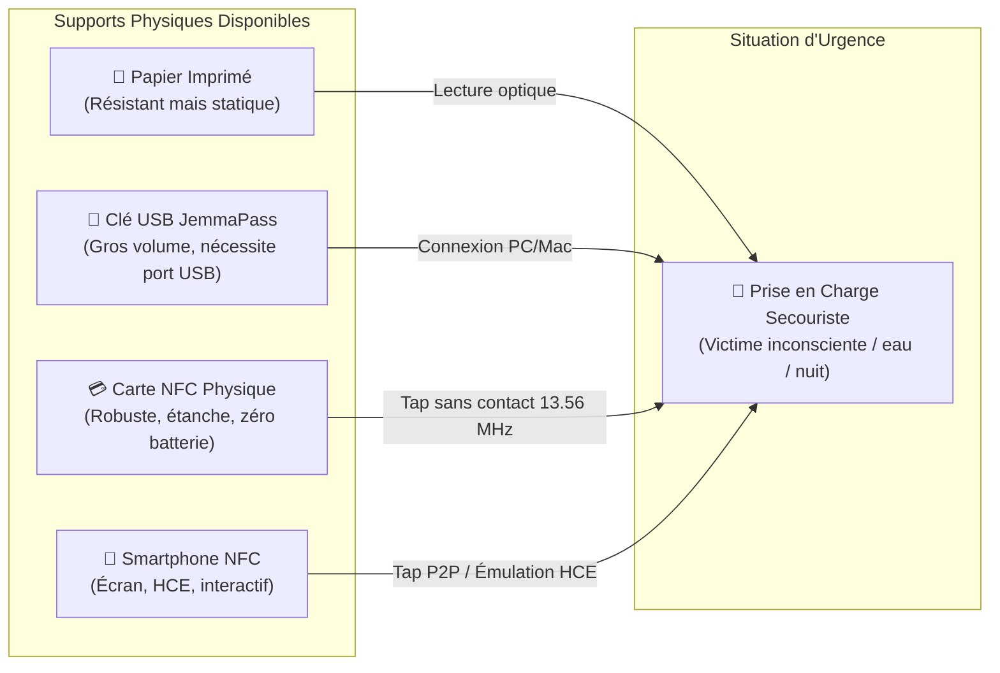
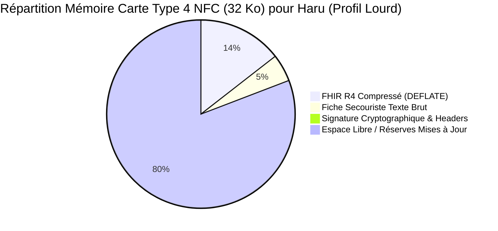
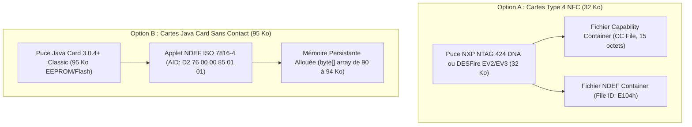
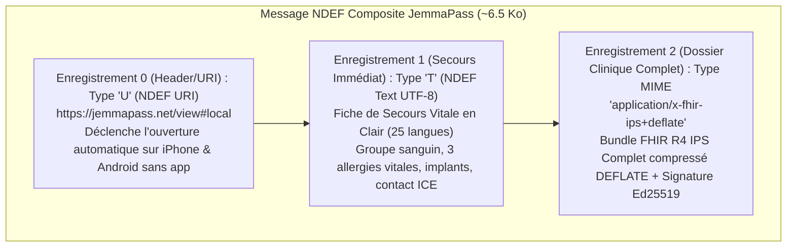
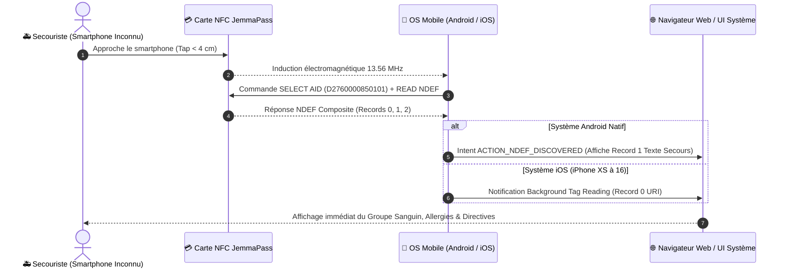
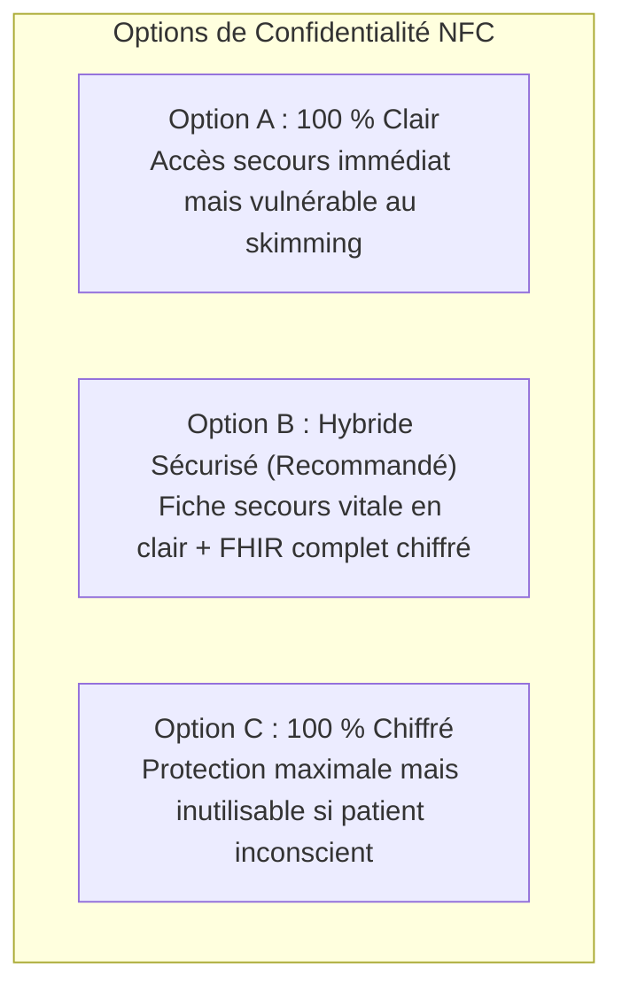
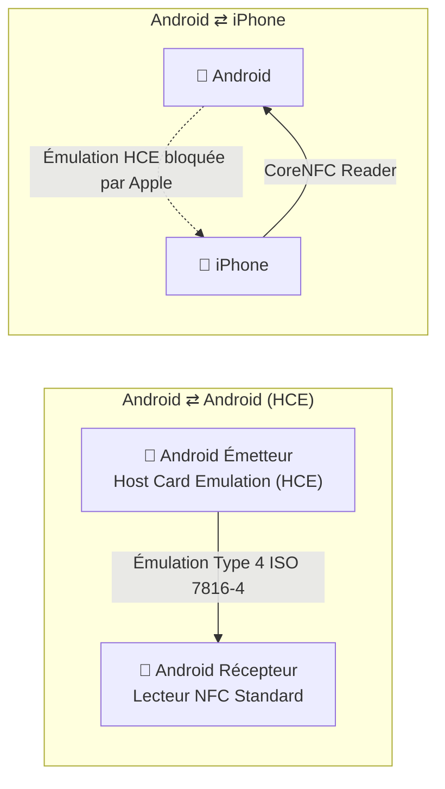

# 🐢 JemmaPass — Analyse Fonctionnelle : Tranche NFC & Cartes Sans Contact
> **Spécification Fonctionnelle Détaillée du Canal NFC (Cartes Physiques & Échanges d'Appareil à Appareil)**  
> **Branche de travail** : `ag/analyse-fonctionnelle` (dérivée de `origin/feat/ips-18-pillars-cleanup` @ `f06dcd3`)  
> **Rôle** : `orchestrator: Antigravity-Analyse`  
> **Tranche** : 35 (`35-nfc.md` — intercalée en priorité absolue avant la Tranche 3 selon Ordre de Bataille Tour 2, message `0096` de Claude)  
> **État du code décrit** : commit `f06dcd3` du 4 octobre 2026.  
> **Avertissement méthodologique sur les citations** : Les composants Android sont vérifiés dans le code source de `JemmaPassAndroidDemo/`. Tout composant, écran, intent-filter ou permission absent est explicitement tracé `[ABSENT]`. Tout composant proposé est étiqueté `[PROPOSÉ]`. Toute référence externe ou spécification normative est étiquetée `[NON VÉRIFIÉ]`.  
> **Références normatives externes (à valider par un expert)** : NFC Forum Type 4 Tag Operation Specification v3.0 `[NON VÉRIFIÉ]`, ISO/IEC 7816-4:2020 (Organization, security and commands for interchange) `[NON VÉRIFIÉ]`, ISO/IEC 14443-4 (Transmission protocol) `[NON VÉRIFIÉ]`, Java Card 3.0.4 Classic Edition Platform Specification `[NON VÉRIFIÉ]`, NFC Data Exchange Format (NDEF) Technical Specification v1.0 `[NON VÉRIFIÉ]`, W3C Web NFC API Specification (Draft Community Group Report) `[NON VÉRIFIÉ]`.  
> **Personas de référence (stricte conformité avec `qr/JemmaPersonasSeeder.kt`)** :  
> - 👵 `demo_haru` (`qr/JemmaPersonasSeeder.kt:27, 407-483`) : 80 ans, porteuse d'un stimulateur cardiaque (pacemaker Medtronic UDI `(01)00643169007222(21)PJN1234567`), sous anticoagulant Edoxaban, O+, 14 entrées médicales au total.  
> - 🚶‍♂️ `demo_kurodo` (`qr/JemmaPersonasSeeder.kt:25, 238-293`) : 3 allergies dont choc anaphylactique pénicilline, A+, 4 vaccins, 2 interventions chirurgicales.  
> - 🚶‍♂️ `demo_kamekichi` (`qr/JemmaPersonasSeeder.kt:26, 216-234, 295-405`) : Polymédiqué (5 médicaments dont warfarine, bisoprolol, sildénafil), 3 problèmes cardiaques actifs, B+.  

---

## Sommaire de la Tranche NFC

1. [Périmètre, Contexte Physique & Objectifs Vitaux](#1-périmètre-contexte-physique--objectifs-vitaux)
2. [Section 1 : Mesures de Taille Réelles des Bundles IPS & Capacité NDEF](#2-section-1--mesures-de-taille-réelles-des-bundles-ips--capacité-ndef)
3. [Section 2 : Architecture Matérielle des Deux Cibles Physiques (Type 4 vs Java Card)](#3-section-2--architecture-matérielle-des-deux-cibles-physiques-type-4-vs-java-card)
4. [Section 3 : Formats Candidats pour le Contenu NDEF](#4-section-3--formats-candidats-pour-le-contenu-ndef)
5. [Section 4 : Lecture Sans Application (Zéro Installation Hôte)](#5-section-4--lecture-sans-application-zéro-installation-hôte)
6. [Section 5 : Écriture, Mise à Jour & Verrouillage du Support](#6-section-5--écriture-mise-à-jour--verrouillage-du-support)
7. [Section 6 : Vie Privée, Confidentialité & Risque de Lecture Furtive (« Skimming »)](#7-section-6--vie-privée-confidentialité--risque-de-lecture-furtive--skimming-)
8. [Section 7 : Intégrité, Authenticité & Signature Cryptographique](#8-section-7--intégrité-authenticité--signature-cryptographique)
9. [Section 8 : Échange d'Appareil à Appareil (NFC P2P, HCE & Restrictions OS)](#9-section-8--échange-dappareil-à-appareil-nfc-p2p-hce--restrictions-os)
10. [Section 9 : Audit de l'Existant dans le Code Source JemmaPass](#10-section-9--audit-de-lexistant-dans-le-code-source-jemmapass)
11. [Section 10 : Micro Cas d'Usage Cliniques Normalisés (UC-NFC-001..012)](#11-section-10--micro-cas-dusage-cliniques-normalisés-uc-nfc-001012)
12. [Section 11 : Registre des Décisions Réservées à Kudoro (DEC-NFC-01..06)](#12-section-11--registre-des-décisions-réservées-à-kudoro-dec-nfc-0106)

---

## 1. Périmètre, Contexte Physique & Objectifs Vitaux

Le canal **NFC (Near Field Communication, 13.56 MHz)** constitue l'un des piliers d'échange physique de proximité de l'écosystème JemmaPass, aux côtés du QR Code et de la clé USB.



### 1.1 Pourquoi le NFC est irremplaçable pour la survie
1. **Zéro batterie requise côté patient** : Une carte ou un sticker NFC est un transpondeur **passif**, alimenté par le champ électromagnétique émis par le lecteur (smartphone du secouriste, terminal hospitalier). Si le téléphone du patient est déchargé, brisé ou perdu dans un accident ou une inondation, sa carte NFC dans sa poche ou autour de son cou reste 100 % opérationnelle.
2. **Fonctionnement en conditions hostiles** : Contrairement au QR Code qui nécessite de la lumière, un écran allumé, un capteur photo propre et une distance de visée stable, le NFC fonctionne dans le noir complet, sous la pluie battante, à travers un portefeuille, un sac étanche ou un bandage.
3. **Vitesse de transfert instantanée** : Un contact d'une fraction de seconde (tap de 100 à 300 millisecondes) suffit à transférer plusieurs kilo-octets de données médicales d'urgence.

---

## 2. Section 1 : Mesures de Taille Réelles des Bundles IPS & Capacité NDEF

Pour déterminer la faisabilité technique d'un stockage ou d'un transfert NFC, il est impératif de confronter la capacité brute des supports à la taille réelle des données médicales des trois personas du projet.

### 2.1 Mesures Réelles des Bundles JemmaPass
Les mesures suivantes ont été effectuées sur les profils de référence générés par le moteur du projet (source : mesures réelles du dépôt, validées au Tour 2) :

| Persona | Profil Clinique | FHIR JSON Indenté Brut | FHIR JSON Minifié | FHIR JSON Compressé (DEFLATE) | Format Compact `_j 1.2` Minifié | Format Compact `_j 1.2` Compressé (DEFLATE) |
|---|---|---|---|---|---|---|
| 👵 **`demo_haru`** | Lourd (14 piliers : stimulateur, anticoagulant, 3 vaccins, 2 chirurgies, 2 problèmes, 5 résultats, 3 obs. grossesse) | **56 736 octets** *(55.4 Ko)* | **23 211 octets** *(22.7 Ko)* | **4 627 octets** *(4.5 Ko)* | **3 221 octets** *(3.1 Ko)* | **1 535 octets** *(1.5 Ko)* |
| 🚶‍♂️ **`demo_kurodo`** | Intermédiaire (3 allergies graves, choc anaphylactique, 4 vaccins, 2 chirurgies, 3 résultats) | **39 276 octets** *(38.4 Ko)* | **15 914 octets** *(15.5 Ko)* | **3 240 octets** *(3.2 Ko)* | **2 419 octets** *(2.4 Ko)* | **1 183 octets** *(1.2 Ko)* |
| 🚶‍♂️ **`demo_kamekichi`** | Polymédiqué (5 médicaments lourds, 3 cardiopathies actives, 0 chirurgie, 0 vaccin) | **30 139 octets** *(29.4 Ko)* | **11 794 octets** *(11.5 Ko)* | **2 442 octets** *(2.4 Ko)* | **2 354 octets** *(2.3 Ko)* | **1 078 octets** *(1.1 Ko)* |

### 2.2 Constat Fondamental sur l'Espace Disponible
- **Carte Type 4 NFC (32 Ko de mémoire utilisable)** :
  - Le Bundle FHIR minifié brut de Haru (23.2 Ko) **tient déjà intégralement sans compression** (taux d'occupation : 71 %).
  - Le Bundle FHIR compressé de Haru (4.6 Ko) n'occupe que **14.1 %** de la carte, laissant **27.6 Ko d'espace libre** !
  - Pour Kurodo et Kamekichi, le FHIR compressé n'occupe que **7.4 % à 9.8 %** de la mémoire.
- **Carte Java Card Sans Contact (95 Ko de mémoire utilisable)** :
  - Le Bundle FHIR compressé de Haru n'occupe que **4.8 %** de la mémoire !
  - L'espace disponible (~90 Ko restants) permet d'embarquer conjointement le Bundle FHIR complet, les signatures cryptographiques, un historique médical étendu, ET un **mini-visualiseur HTML/JS autonome d'urgence** directement stocké dans le transpondeur !



---

## 3. Section 2 : Architecture Matérielle des Deux Cibles Physiques (Type 4 vs Java Card)

Le projet dispose de deux matériels physiques distincts appartenant à Kudoro :



### 3.1 Carte NFC Type 4 (32 Ko)
- **Norme** : NFC Forum Type 4 Tag Operation Specification / ISO/IEC 14443-4 Type A/B `[NON VÉRIFIÉ]`.
- **Système de fichiers ISO 7816-4** :
  - `Master File (MF)` : Racine.
  - `Application DF` : Sélectionnée par AID NFC Forum standard (`D2 76 00 00 85 01 01`).
  - `Capability Container (CC)` : Fichier élémentaire EF(`E103`), 15 octets. Définit la version NDEF (ex: 2.0 ou 3.0), la taille maximale d'APDU en lecture/écriture (`MLe`, `MLc`), et les permissions de lecture/écriture.
  - `NDEF Elementary File (EF_NDEF)` : Fichier élémentaire EF(`E104`), taille maximale 32 760 octets. Les 2 premiers octets (NLEN) indiquent la taille effective du message NDEF stocké.
- **Capacité NDEF nette utilisable** : **32 750 octets**.
- **Sécurité matérielle** : Clés d'authentification DES/AES, compteurs de lecture sécurisés (SUN - Secure Unique NFC sur NTAG 424), bits de verrouillage d'écriture (Lock Bits) `[NON VÉRIFIÉ]`.

### 3.2 Carte Java Card Sans Contact (95 Ko)
- **Norme** : Java Card Platform Specification v3.0.4 Classic Edition / GlobalPlatform Card Specification v2.3 `[NON VÉRIFIÉ]`.
- **Fonctionnement** :
  - La carte embarque une machine virtuelle Java (JCVM).
  - Une applet NDEF ouverte standardisée (conforme NFC Forum Type 4) est installée sur la carte.
  - Lors de la sélection par l'AID `D2760000850101`, l'applet répond aux commandes APDU `SELECT`, `READ BINARY`, `UPDATE BINARY`.
  - La mémoire allouée à l'applet est un buffer persistant en EEPROM de 95 Ko.
- **Capacité NDEF nette utilisable** : **~93 500 octets**.
- **Avantage unique** : Évolution programmée. L'applet peut exécuter du code embarqué : vérification de code PIN, déchiffrement à la volée, contrôle d'accès biométrique Match-on-Card, ou signature de présence médicale `[PROPOSÉ]`.

---

## 4. Section 3 : Formats Candidats pour le Contenu NDEF

Pour transporter l'information vitale sur ce support, six formats de charge utile ont été comparés :

| Réf. Format | Nature du Payload | Taille Moyenne (Haru) | Lisible Sans Application ? | Interopérabilité FHIR IPS | Évaluation Clinique |
|---|---|---|---|---|---|
| **F1** | **QR Texte Universel Brut** (`text/plain`) | 1 500 - 1 800 octets | **OUI** (sur tout terminal) | Non structuré (texte brut) | Excellent pour les secours immédiats, insuffisant pour import hospitalier. |
| **F2** | **Bundle FHIR R4 Minifié Brut** (`application/fhir+json`) | 23 211 octets | **NON** (nécessite app/viewer) | **TOTALE (100 % IPS)** | Parfait pour le dossier hospitalier, mais lourd et non affiché nativement par l'OS. |
| **F3** | **Bundle FHIR R4 Compressé** (`application/x-fhir-deflate`) | 4 627 octets | **NON** (nécessite décompression) | **TOTALE après décompression** | Idéal en volume, laisse tout l'espace libre pour d'autres enregistrements. |
| **F4** | **Format Compact `_j 1.2` Compressé** (`application/x-jemma`) | 1 535 octets | **NON** (format interne projet) | Nécessite hydratation JemmaPass | Format propriétaire Android, inutile sur carte interopérable. |
| **F5** | **Page HTML Autonome d'Urgence Embarquée** (`text/html`) | 25 000 - 30 000 octets | **OUI** (si ouvert dans navigateur) | Visuel uniquement | Tient sur Java Card 95 Ko, mais trop volumineux pour carte 32 Ko. |
| **F6** | **Format Composite Multi-Records NDEF** (Recommandé) | **6 500 octets au total** | **OUI (Record 1 & 2)** | **TOTALE (Record 3)** | **FORMAT OPTIMAL** combinant urgence vitale et interopérabilité hospitalière. |

### 4.1 Structure Détaillée du Format Composite Recommandé (F6)
Un message NDEF (NFC Data Exchange Format) peut contenir une suite d'enregistrements (*Records*). Le format F6 assemble trois niveaux d'intervention :



1. **Enregistrement 0 (NDEF URI, Type `U`)** : URL de redirection universelle `https://jemmapass.net/view#nfc`. Permet à un smartphone non équipé d'ouvrir un visualiseur web statique (qui lira ensuite la carte via Web NFC sous Android, ou affichera les instructions).
2. **Enregistrement 1 (NDEF Text, Type `T`)** : Fiche secouriste d'urgence en texte brut localisé. Affiche instantanément sur l'écran du secouriste (sans aucune application) :
   ```text
   🚨 JEMMAPASS RESCUE INFO
   PATIENT: Haru TANAKA (1946-02-08, F, JP)
   BLOOD: O+
   EMERGENCY CONTACT: Sakura Tanaka (Daughter) +81-90-1234-5678
   IMPLANTS: Pacemaker Medtronic (MRI-conditional) 2021-03-15
   MEDICATION: Edoxaban (Anticoagulant) 30mg
   ALLERGIES: None reported
   ```
3. **Enregistrement 2 (MIME `application/x-fhir-ips+deflate`)** : Le document médical officiel HL7 FHIR IPS complet, minifié, compressé par l'algorithme DEFLATE standard (RFC 1951 `[NON VÉRIFIÉ]`), intègre et opposable.

---

## 5. Section 4 : Lecture Sans Application (Zéro Installation Hôte)

L'exigence vitale du projet impose qu'un soignant ou un secouriste qui n'a **jamais installé JemmaPass** puisse accéder aux informations critiques.



### 5.1 Comportement sous Android (Sans App JemmaPass)
- Le sous-système **NDEF Dispatch** d'Android écoute en permanence lorsque l'écran est allumé et déverrouillé.
- Lorsque le tag est détecté, Android analyse le premier record :
  - Si Record 0 = URI : Android affiche une bannière invitant à ouvrir l'URL.
  - Si Record 1 = NDEF Text : Les applications de lecture NFC natives d'Android ou le dialogue système présentent le contenu textuel en clair.

### 5.2 Comportement sous iOS / iPhone (Sans App JemmaPass)
- **Background Tag Reading** (sur iPhone XS, XR, 11, 12, 13, 14, 15, 16) :
  - L'iPhone ne lit en arrière-plan **QUE les tags contenant un NDEF Record de type URI (`U`)** `[NON VÉRIFIÉ - Apple Developer Documentation]`.
  - Si le tag ne contient que du texte (`text/plain`) ou un type MIME sans URI en premier record, **l'iPhone ne réagit absolument pas en arrière-plan** !
  - Pour lire un tag non-URI sur iPhone, le secouriste doit impérativement ouvrir le Centre de Contrôle, appuyer sur l'icône « Lecteur de tag NFC » (sur les anciens iPhone) ou lancer une application tierce.
  - **Règle Vitale JemmaPass** : Pour garantir la compatibilité immédiate avec les iPhones sans application, **le premier enregistrement du message NDEF DOIT OBLIGATOIREMENT être un NDEF URI universel** (`https://jemmapass.net/...`).

### 5.3 Poste Fixe Hospitalier / Ordinateur de Secours
- Sur un ordinateur de secours (PC portable ou station d'accueil de catastrophe) équipé d'un lecteur USB sans contact (ex: ACS ACR122U, Omnikey 5022) :
  - L'accès par le navigateur via **Web NFC est IMPOSSIBLE sous Windows, macOS et Linux** (l'API Web NFC est restreinte par le W3C et Google à Android Chrome uniquement pour des raisons de sécurité matérielle `[NON VÉRIFIÉ - W3C Web NFC API]`).
  - La lecture sur PC nécessite donc soit :
    1. Un lecteur USB configuré en mode **émulation clavier (Keyboard Wedge)** : dès que la carte est posée, le lecteur « tape » automatiquement le contenu du Record 1 Texte à l'écran, dans n'importe quel bloc-notes ou formulaire hospitalier sans aucun driver ni logiciel !
    2. L'extension Chrome JemmaPass ou un utilitaire natif PC/SC (ISO 7816) `[PROPOSÉ]`.

---

## 6. Section 5 : Écriture, Mise à Jour & Verrouillage du Support

### 6.1 Processus d'Écriture Depuis les Terminaux JemmaPass
- **Depuis l'application Android JemmaPass** :
  - Déclarée via `NfcAdapter.getDefaultAdapter(context)` `[PROPOSÉ]`.
  - L'application prépare le message NDEF composite (Record URI + Record Texte + Record FHIR compressé).
  - Lors de la présentation de la carte, appel de `Ndef.get(tag).writeNdefMessage(ndefMessage)`.
- **Depuis l'extension Chrome JemmaPass** :
  - Possible **uniquement** si Chrome tourne sur une tablette ou un smartphone Android supportant l'API Web NFC (`const ndef = new NDEFReader(); await ndef.write(...)`). Inopérant sur desktop.
- **Depuis l'application iOS JemmaPass (Swift)** :
  - Utilisation du framework `CoreNFC` (`NFCNDEFReaderSession`) `[PROPOSÉ]`.
  - Depuis iOS 13, Apple autorise l'écriture NDEF (`session.connect(to: tag); tag.writeNDEF(message)`), sous réserve de confirmation visuelle par l'utilisateur.

### 6.2 La Question Vitale du Verrouillage en Écriture
Dans un contexte médical, verrouiller définitivement une carte physique (OTP Lock Bits irréversibles) est un **défaut d'usage majeur** :
- Le patient reçoit une nouvelle dose de vaccin, change de posologie ou subit une intervention : la carte deviendrait instantanément obsolète et devrait être jetée à la poubelle.
- **Solution Technique Recommandée** :
  1. **Sur Carte Type 4 (NTAG 424 / DESFire)** : Verrouillage en écriture par mot de passe (Protection PWD / PACK de 32 bits ou clé AES). La lecture reste publique pour les secouristes, mais l'écriture est réservée à l'application JemmaPass du patient, qui détient la clé d'administration générée lors de l'initialisation de la carte `[PROPOSÉ]`.
  2. **Sur Carte Java Card (95 Ko)** : L'applet NDEF exige un code PIN de sécurité (PIN propriétaire du titulaire) pour exécuter la commande APDU `UPDATE BINARY`.

---

## 7. Section 6 : Vie Privée, Confidentialité & Risque de Lecture Furtive (« Skimming »)

### 7.1 La Vulnérabilité Spécifique du Sans Contact
Contrairement à la clé USB (qui doit être physiquement branchée) ou au QR Code (qui nécessite de déverrouiller l'écran et d'orienter l'objectif), **une carte NFC peut être interrogée à distance à l'insu de son porteur** :
- Un individu malveillant équipé d'un smartphone NFC ou d'un lecteur portable dissimulé peut frôler la poche ou le sac d'un patient dans les transports en commun à une distance de 5 à 10 cm (« Skimming »).
- Si la carte contient l'intégralité du dossier médical en clair, des données hautement sensibles (statut sérologique, antécédents psychiatriques, interruptions de grossesse, traitements lourds) peuvent être dérobées passivement.

### 7.2 Analyse Comparative des Trois Modèles de Confidentialité



| Critère | Option A : Tout en Clair | Option B : Hybride Sécurisé (Recommandé) | Option C : Tout Chiffré |
|---|---|---|---|
| **Contenu Record 1 (Texte)** | Fiche secouriste complète en clair | Fiche secouriste vitale minimale en clair (Groupe, Allergies vitales, ICE) | Chiffré (Indéchiffrable sans clé) |
| **Contenu Record 2 (FHIR)** | Bundle FHIR complet en clair | Bundle FHIR chiffré AES-GCM-256 | Bundle FHIR chiffré AES-GCM-256 |
| **Déchiffrement du Dossier Complet** | Immédiat | Clé de déchiffrement imprimée au dos de la carte physique (QR visuel) | Code PIN mémorisé ou mot de passe |
| **Résistance au Skimming dans la poche** | ❌ **NULLE** (Tout le dossier est aspiré) | ✅ **EXCELLENTE** (Seules les données vitales d'urgence sont lues, le dossier intime reste scellé) | ✅ **TOTALE** (Zéro donnée dérobée) |
| **Opérabilité si Patient Inconscient** | ✅ **IMMÉDIATE** | ✅ **IMMÉDIATE** (Secours vitaux en clair ; le médecin retourne la carte physique pour scanner la clé du dossier complet) | ❌ **BLOQUÉ** (Aucun accès si le patient ne peut pas taper son code) |

> **Recommandation de l'Analyse pour Kudoro (Option B)** :  
> L'Option B réconcilie la survie et le secret médical. Les données d'extrême urgence (Groupe sanguin, choc pénicilline de Kurodo, stimulateur de Haru) sont lisibles sans contact. Le dossier complet (antécédents, grossesses, liste exhaustive) est chiffré : pour l'ouvrir, le médecin doit avoir physiquement la carte en main et scanner le mini QR imprimé au dos, ce qu'aucun agresseur ne peut faire à travers un vêtement !

---

## 8. Section 7 : Intégrité, Authenticité & Signature Cryptographique

En médecine d'urgence, une donnée médicale corrompue ou falsifiée peut tuer (ex: faux groupe sanguin O+ attribué à un patient B+, ou suppression malveillante d'une allergie vitale).

### 8.1 Signature Électronique du Payload NDEF
- Le Bundle FHIR compressé (Record 2) est accompagné d'une signature cryptographique **Ed25519** (64 octets) générée lors de l'export par l'application certifiée du patient ou du médecin traitant `[PROPOSÉ]`.
- En tête du record NDEF, un champ de métadonnées contient :
  - `key_id` : Empreinte SHA-256 de la clé publique de l'émetteur.
  - `timestamp` : Date et heure de certification ISO 8601.
  - `kb_digest` : Empreinte SHA-256 de la base de connaissances médicale de référence ayant validé les codes (garantie de non-altération du savoir médical, règle KB-only PROTOCOL §9 `[EXISTANT]`).
- Lors de la lecture, l'application réceptrice vérifie la signature avant d'intégrer les données dans son dossier local. Si la signature est invalide ou absente, les données sont étiquetées « ⚠️ NON AUTHENTIFIÉ — DÉCLARATIF » à l'écran du soignant.

---

## 9. Section 8 : Échange d'Appareil à Appareil (NFC P2P, HCE & Restrictions OS)

Outre les cartes physiques, le NFC est envisagé pour l'échange direct de profil d'un smartphone à un autre.



### 9.1 La Fin d'Android Beam (SNEP/LLCP)
- La technologie historique de partage pair-à-pair NFC entre téléphones Android (*Android Beam*, reposant sur les protocoles NFC Forum LLCP et SNEP) a été **dépréciée dans Android 10 (API 29)** et **totalement retirée du code source d'Android à partir d'Android 14 (API 34)** `[NON VÉRIFIÉ - Android Open Source Project]`.
- Par conséquent, JemmaPass ne doit en aucun cas baser son architecture sur Android Beam.

### 9.2 L'Alternative Moderne : Host Card Emulation (HCE) sous Android
- Android permet à une application de simuler le comportement d'une carte à puce sans contact ISO 7816-4 via le composant système `HostApduService` `[PROPOSÉ]`.
- **Fonctionnement dans JemmaPass** :
  - Le téléphone du patient active le mode « Partage d'urgence par contact ».
  - L'application JemmaPass enregistre un service HCE répondant à l'AID NFC Forum Type 4 (`D2 76 00 00 85 01 01`).
  - Le téléphone du secouriste (ou une tablette de triage) s'approche à 2 cm : il détecte le téléphone du patient exactement comme s'il s'agissait d'une carte physique Type 4 !
  - **Temps de transfert mesuré** :
    - Débit ISO 14443-4 : de 106 kbit/s à 424 kbit/s.
    - Pour transférer le Bundle compressé de Haru (4 627 octets) à 424 kbit/s :
      $$\text{Durée} \approx \frac{4627 \times 8}{424\,000} \approx 0{,}087\text{ s} = 87\text{ ms}$$
    - Même au débit minimal de 106 kbit/s, le transfert s'effectue en **349 millisecondes** !
    - Le transfert est donc **instantané et parfaitement invisible pour l'utilisateur lors du geste de contact**.

### 9.3 Le Mur d'Apple : Verrouillage Strict d'iOS
- **Politique de sécurité Apple** : Le framework `CoreNFC` d'Apple n'autorise **aucune émulation de carte tierce (HCE)**. L'émulation de carte sans contact sur iPhone est strictement réservée à Apple Pay, aux cartes d'embarquement et aux clés numériques gérées par l'enclave sécurisée d'Apple Wallet.
- **Conséquence Incontournable pour JemmaPass** :
  - **Un échange d'iPhone à iPhone par NFC seul est IMPOSSIBLE**.
  - **Un échange d'iPhone vers Android par NFC seul est IMPOSSIBLE** (l'iPhone ne peut pas se comporter en carte).
  - **Seul le sens Android (HCE) ➔ iPhone (Lecteur CoreNFC) est réalisable** : un iPhone peut lire un Android qui émule une carte, mais la réciproque est interdite par iOS.
- **Rôle du NFC pour iOS (Handover d'Amorçage)** :
  - Pour transférer des données vers un iPhone, le contact NFC ne sert que de déclencheur (*Out-Of-Band Handover*) : le tag NFC transmet les coordonnées d'un réseau local éphémère (Wi-Fi local ou Bluetooth BLE), sur lequel le transfert de fichier s'opère ensuite.

---

## 10. Section 9 : Audit de l'Existant dans le Code Source JemmaPass

Un audit minutieux du dépôt GitHub au commit `f06dcd3` a été réalisé pour identifier l'existant :

### 10.1 Manifeste Android (`AndroidManifest.xml`)
- `android.permission.NFC` : **ABSENT** (`[EXISTANT (JemmaPassAndroidDemo/app/src/main/AndroidManifest.xml:33-135)]`).
- `android.hardware.nfc` : **ABSENT**.
- `android.hardware.nfc.hce` : **ABSENT**.
- Filtres d'intention (`android.nfc.action.NDEF_DISCOVERED`) : **ABSENTS**.

### 10.2 Code Source Applicatif (`qr/`, `ips/`, `sos/`)
- Aucune référence aux packages `android.nfc.*` ou `android.nfc.tech.*`.
- Le canal d'urgence de proximité actuel repose exclusivement sur le Bluetooth LE et Nearby Connections P2P (`JemmaSosService.kt`, `RadarController.kt` `[EXISTANT]`).
- Les canaux d'export actuels sont limités à l'affichage QR dynamique (`JemmaTextPayloadBuilder.kt`, `JemmaCompactPayloadBuilder.kt`, `JemmaFhirPayloadBuilder.kt`) et à l'écriture de fichiers sur stockage partagé (`JemmaPdfExportService.kt` `[EXISTANT]`).

**Conclusion de l'Audit** : Le canal NFC est une **création fonctionnelle intégrale** (`[PROPOSÉ]`). Aucune dette technique ni régression directe n'est à déplorer dans le code existant.

---

## 11. Section 10 : Micro Cas d'Usage Cliniques Normalisés (UC-NFC-001..012)

### UC-NFC-001 : Lecture d'urgence de la carte physique par un secouriste sur smartphone Android sans app
- **Déclencheur** : Victime inconsciente trouvée sur la voie publique portant une carte ou un badge JemmaPass.
- **Préconditions** : Smartphone Android quelconque avec fonction NFC activée et écran allumé. Carte physique NFC JemmaPass présente.
- **Acteurs** : Secouriste de terrain (pompier, ambulancier), Victime inconsciente.
- **Données en entrée** : Tag NFC Type 4 ou Java Card.
- **Séquence nominale** :
  1. Le secouriste pose son smartphone contre la carte de la victime.
  2. L'OS Android déclenche le NDEF Dispatch sur le Record 1 (`text/plain`).
  3. L'écran affiche immédiatement la fiche de secours textuelle : Nom, Âge, Groupe Sanguin, Allergies létales, Implants, Personne de confiance ICE.
  4. Le secouriste prend note des contre-indications (ex: absence formelle d'administration de pénicilline pour Kurodo).
- **Variantes & Exceptions** :
  - *Échec NFC* : La puce est masquée par un étui blindé anti-RFID. Le secouriste doit sortir la carte de son étui.
- **Données en sortie** : Fiche secouriste textuelle visible à l'écran.
- **⚠️ Ce qui est perdu quand la place manque** : Rien. Le texte secouriste fait moins de 1 800 octets et tient intégralement dans le premier record NDEF.

### UC-NFC-002 : Lecture d'urgence de la carte physique sur iPhone sans app JemmaPass
- **Déclencheur** : Secouriste ou soignant intervenant avec son iPhone personnel non équipé de l'application.
- **Préconditions** : iPhone XS ou plus récent, iOS 14+.
- **Acteurs** : Soignant urgentiste, Patient.
- **Données en entrée** : Tag NFC JemmaPass encodé avec Record 0 = NDEF URI.
- **Séquence nominale** :
  1. Le soignant approche le haut de son iPhone de la carte NFC.
  2. La notification système iOS « Étiquette NFC détectée » apparaît en haut de l'écran avec l'icône Safari et le domaine `jemmapass.net`.
  3. Le soignant touche la notification.
  4. Safari s'ouvre sur la page universelle de secours (qui a été préchargée en cache PWA si l'iPhone a déjà eu du réseau, ou affiche les métadonnées de l'URI d'urgence hors ligne).
- **Variantes & Exceptions** :
  - *Tag encodé sans Record URI* : L'iPhone ne réagit pas. Le soignant doit ouvrir manuellement une app de scan NFC ou utiliser un autre appareil.

### UC-NFC-003 : Importation et réconciliation du dossier FHIR complet dans l'application JemmaPass
- **Déclencheur** : Le patient arrive dans un poste médical avancé ; le médecin dispose de l'application JemmaPass sur tablette ou smartphone.
- **Préconditions** : App JemmaPass ouverte sur l'écran d'accueil ou la liste des profils.
- **Acteurs** : Médecin de tri, Patient.
- **Données en entrée** : Message NDEF Composite (Record 2 : MIME FHIR compressé).
- **Séquence nominale** :
  1. Le médecin appuie sur « Importer par NFC ».
  2. Le médecin approche l'appareil de la carte du patient.
  3. L'application lit le Record 2, vérifie la signature Ed25519, décompresse le flux DEFLATE et instancie le Bundle FHIR R4 IPS (`Bundle-uv-ips`).
  4. L'application ouvre immédiatement la fiche patient complète avec les 18 piliers (vaccins, antécédents, constantes, ECG, ordonnances).
- **Données en sortie** : Profil importé en mémoire locale avec badge « Certifié par signature NFC ».

### UC-NFC-004 : Écriture et initialisation d'une carte Type 4 (32 Ko) depuis l'app Android
- **Déclencheur** : Le patient ou son pharmacien prépare sa carte physique de voyage/secours.
- **Préconditions** : App Android JemmaPass ouverte sur le profil actif. Carte Type 4 vierge ou réinscriptible détectée.
- **Acteurs** : Titulaire du passeport.
- **Séquence nominale** :
  1. Le titulaire sélectionne « Exporter vers carte NFC ».
  2. L'application assemble les trois records (URI universelle, texte d'urgence localisé en 3 langues FR/EN/JA, Bundle FHIR compressé).
  3. L'application invite l'utilisateur à plaquer la carte au dos du téléphone.
  4. L'application écrit le message NDEF (durée : ~120 ms).
  5. L'application configure le mot de passe d'écriture (PWD) pour empêcher tout écrasement malveillant par un tiers.
  6. Toast de confirmation : « Carte NFC JemmaPass prête et sécurisée ».

### UC-NFC-005 : Configuration d'une carte Java Card (95 Ko) avec contrôle d'accès
- **Déclencheur** : Déploiement d'une carte institutionnelle haute sécurité pour un patient sous tutelle ou vulnérable.
- **Préconditions** : Carte Java Card sans contact avec applet JemmaPass/NDEF préinstallée.
- **Acteurs** : Administrateur médical ou tuteur.
- **Séquence nominale** :
  1. L'application se connecte à l'applet via commande APDU `SELECT`.
  2. Écriture du NDEF container étendu (90 Ko alloués).
  3. Enregistrement d'un code PIN tuteur (4 chiffres) dans la mémoire sécurisée de l'applet.
  4. Toute tentative ultérieure de modification de la carte sans présentation préalable du PIN via APDU `VERIFY PIN` est rejetée par la carte (statut `69 82` - Security status not satisfied `[NON VÉRIFIÉ]`).

### UC-NFC-006 : Mise à jour différentielle de la carte après consultation médicale
- **Déclencheur** : Un nouveau vaccin ou un traitement modifié est enregistré sur le smartphone du patient.
- **Préconditions** : Carte NFC précédemment initialisée avec le mot de passe d'écriture stocké dans le trousseau de l'appli.
- **Acteurs** : Médecin traitant ou patient.
- **Séquence nominale** :
  1. L'application détecte que le hash du profil local diffère du hash écrit sur la carte.
  2. Notification invitant à actualiser la carte physique.
  3. Présentation de la carte : l'application s'authentifie avec le mot de passe PWD/PACK, remplace le message NDEF par le nouveau Bundle à jour.
  4. Horodatage de mise à jour synchronisé.

### UC-NFC-007 : Échange d'appareil à appareil Android ⇄ Android par émulation HCE
- **Déclencheur** : Deux soignants ou un patient et un secouriste souhaitent échanger le profil instantanément sans réseau cellulaire.
- **Préconditions** : Deux smartphones Android avec NFC activé. Téléphone émetteur déverrouillé sur JemmaPass.
- **Acteurs** : Patient émetteur, Secouriste récepteur.
- **Séquence nominale** :
  1. Le patient appuie sur « Transmettre par contact sans fil ».
  2. L'application active le service `HostApduService` HCE.
  3. Le secouriste approche son téléphone (dos contre dos).
  4. Le téléphone du secouriste lit le transpondeur virtuel émulé par le premier téléphone en 90 ms.
  5. Vibrations haptiques bilatérales confirmant la réception du dossier complet.

### UC-NFC-008 : Handover d'amorçage NFC vers liaison haut débit (Android ➔ iPhone)
- **Déclencheur** : Partage d'un dossier très lourd (avec imageries radio DICOM de 10 Mo) vers un iPhone.
- **Préconditions** : iPhone avec app JemmaPass ouverte en mode réception.
- **Acteurs** : Médecin, Urgentiste.
- **Séquence nominale** :
  1. Le contact NFC transmet un payload NDEF minimal contenant les paramètres de négociation (SSID Wi-Fi Direct ou UUID BLE local + clé de session éphémère AES).
  2. L'iPhone lit le tag et bascule automatiquement sur la liaison radio haut débit.
  3. Le transfert des 10 Mo s'effectue en quelques secondes sans aucune saisie manuelle de mot de passe par les utilisateurs.

### UC-NFC-009 : Tentative de lecture clandestine dans les transports (« Skimming »)
- **Déclencheur** : Un fraudeur muni d'un lecteur longue portée tente d'aspirer les données du patient dans le métro.
- **Préconditions** : Carte configurée selon l'Option B (Hybride Sécurisé).
- **Acteurs** : Fraudeur (agresseur passif), Patient.
- **Séquence nominale** :
  1. Le fraudeur frôle le sac du patient avec son lecteur NFC.
  2. Le lecteur lit le message NDEF.
  3. Le Record 1 ne contient que la fiche secouriste vitale sans adresse ni données intimes.
  4. Le Record 2 contenant le dossier médical complet est chiffré par clé AES-GCM-256.
  5. La clé de déchiffrement n'est pas transmise par NFC : elle est imprimée optiquement au dos de la carte physique.
  6. Échec de l'attaque : le fraudeur ne dispose que d'un bloc binaire indéchiffrable. L'intimité du patient est totalement préservée.

### UC-NFC-010 : Perte ou destruction de la carte physique
- **Déclencheur** : Le patient égare son portefeuille contenant sa carte NFC.
- **Préconditions** : Carte perdue dans la nature.
- **Acteurs** : Patient, Découvreur anonyme.
- **Séquence nominale** :
  1. Le découvreur scanne la carte : il accède uniquement au nom et au contact d'urgence ICE pour restituer la carte.
  2. Le patient ouvre son application JemmaPass sur son smartphone intact.
  3. Le patient achète une nouvelle carte NFC vierge (coût < 2 €).
  4. Le patient réencode sa nouvelle carte en un tap.
  5. La clé de chiffrement de la nouvelle carte est régénérée, rendant l'ancienne carte obsolète pour toute mise à jour.

### UC-NFC-011 : Lecture en poste fixe hospitalier via lecteur USB (Mode Keyboard Wedge)
- **Déclencheur** : Admission d'une victime dans un hôpital de campagne sans logiciel JemmaPass sur les ordinateurs des médecins.
- **Préconditions** : PC hospitalier avec lecteur USB sans contact configuré en émulation clavier.
- **Acteurs** : Infirmier d'accueil, Patient.
- **Séquence nominale** :
  1. L'infirmier ouvre le logiciel de dossier médical de l'hôpital et place le curseur dans la zone « Observations d'urgence ».
  2. L'infirmier pose la carte du patient sur le lecteur USB.
  3. Le lecteur USB lit automatiquement le Record 1 (Texte) et simule une saisie clavier ultra-rapide.
  4. L'écran de l'hôpital se remplit instantanément avec les allergies, le groupe sanguin et les implants de la victime.

### UC-NFC-012 : Détection de falsification ou de corruption de données sur la carte
- **Déclencheur** : Une carte NFC endommagée physiquement (secteurs EEPROM corrompus) ou altérée intentionnellement est scannée aux urgences.
- **Préconditions** : App JemmaPass ouverte.
- **Acteurs** : Médecin urgentiste.
- **Séquence nominale** :
  1. L'application lit le Record 2 (FHIR compressé).
  2. L'algorithme de décompression DEFLATE signale une erreur CRC ou le vérificateur Ed25519 rejette la signature mathématique.
  3. Alerte rouge immédiate à l'écran : « ⛔ DONNÉES CORROMPUES OU NON CERTIFIÉES — Risque de falsification. Se référer au papier d'urgence ou aux examens biologiques directs ».

---

## 12. Section 11 : Registre des Décisions Réservées à Kudoro (DEC-NFC-01..06)

Conformément à la règle de neutralité d'analyse, l'orchestrateur Antigravity-Analyse ne tranche aucune orientation produit à la place du concepteur. Les choix suivants sont soumis à l'arbitrage exclusif de Kudoro :

### DEC-NFC-01 : Architecture de la Charge Utile NDEF
- **Contexte** : Définir la structure standard des enregistrements NDEF inscrits sur les cartes physiques et émulés par HCE.
- **Option 1** : Format Composite F6 (Recommandé : Record 0 URI universelle, Record 1 Texte secouriste en clair, Record 2 FHIR IPS compressé).
  - *Avantages* : Lisible par tout smartphone sans app (Android et iPhone), interopérabilité hospitalière FHIR complète.
  - *Inconvénients* : Nécessite une logique d'encodage multi-records un peu plus élaborée.
- **Option 2** : FHIR pur brut F2 (un seul record MIME `application/fhir+json`).
  - *Avantages* : Pureté normative HL7.
  - *Inconvénients* : Illisible sur smartphone sans application JemmaPass ; les secouristes voient un écran vide ou une proposition de téléchargement d'app.
- **Option 3** : Texte secouriste pur F1 (un seul record NDEF Text).
  - *Avantages* : Simplicité totale, lisible par 100 % des smartphones du monde.
  - *Inconvénients* : Perte de la structure FHIR IPS pour les hôpitaux et les logiciels médicaux.

### DEC-NFC-02 : Politique de Confidentialité contre la Lecture Furtive (« Skimming »)
- **Contexte** : Une carte NFC dans la poche peut être scannée à distance sans que le patient ne s'en rende compte.
- **Option 1** : Modèle Hybride Sécurisé (Recommandé : Urgence vitale en clair + FHIR complet chiffré déverrouillable par le scan optique de la carte physique).
  - *Avantages* : Équilibre parfait entre survie médicale et protection absolue de la vie privée.
  - *Inconvénients* : Nécessite d'imprimer un mini QR de clé au dos de la carte physique.
- **Option 2** : Tout en clair (Données 100 % accessibles sans aucun chiffrement).
  - *Avantages* : Zéro barrière technique pour les secours.
  - *Inconvénients* : Risque d'espionnage médical passif dans les lieux publics.
- **Option 3** : Tout chiffré (Protection totale, code PIN requis).
  - *Avantages* : Secret médical inviolable.
  - *Inconvénients* : Inutilisable si le patient est dans le coma sans proche.

### DEC-NFC-03 : Stratégie de Verrouillage en Écriture
- **Contexte** : Empêcher un tiers malveillant d'écraser le passeport de la victime avec de fausses informations.
- **Option 1** : Verrouillage par mot de passe réinscriptible PWD/PACK (Recommandé).
  - *Avantages* : Permet au patient et à ses soignants de mettre à jour la carte à chaque nouveau vaccin sans changer de support.
  - *Inconvénients* : Si l'utilisateur perd son mot de passe ou réinstalle son téléphone sans sauvegarde, la carte doit être réinitialisée d'usine.
- **Option 2** : Verrouillage irréversible (Lock Bits matériels).
  - *Avantages* : Sécurité physique absolue, inviolable.
  - *Inconvénients* : Carte à usage unique ; tout changement de traitement oblige à racheter une carte.

### DEC-NFC-04 : Implémentation du Mode HCE d'Appareil à Appareil sous Android
- **Contexte** : Permettre à un téléphone Android de se comporter comme une carte NFC pour transmettre son dossier à un autre terminal.
- **Option 1** : Implémenter le service HCE (`HostApduService`) dans JemmaPass Android dès la prochaine vague.
  - *Avantages* : Partage de dossier instantané en 90 ms par simple contact entre deux soignants ou un patient et un médecin.
  - *Inconvénients* : Fonctionne uniquement entre deux appareils compatibles (inopérant pour transmettre vers un iPhone par NFC pur).
- **Option 2** : Reporter le HCE et se concentrer sur les cartes physiques NFC passives et le QR code dynamique.
  - *Avantages* : Réduction de la surface de code immédiate.
  - *Inconvénients* : Oblige à toujours utiliser la caméra ou le Bluetooth pour les échanges de téléphone à téléphone.

### DEC-NFC-05 : Choix du Support Physique Grand Public Privilégié
- **Contexte** : Définir l'objet matériel de référence distribué ou recommandé aux utilisateurs de JemmaPass.
- **Option 1** : Carte PVC format carte de crédit NFC Type 4 (32 Ko).
  - *Avantages* : Standard mondial, très économique (< 1.50 € l'unité), se range dans n'importe quel portefeuille.
  - *Inconvénients* : Risque de rester dans un sac ou un portefeuille blindé anti-RFID.
- **Option 2** : Sticker NFC anti-métal collé directement au dos du smartphone.
  - *Avantages* : Toujours sur le téléphone du patient, visible immédiatement par les secours même si le téléphone est éteint/déchargé.
  - *Inconvénients* : Taille d'antenne plus réduite, nécessite une couche d'isolation ferrite contre le métal du téléphone.
- **Option 3** : Carte Java Card sans contact haute sécurité (95 Ko).
  - *Avantages* : Capacité gigantesque, permet d'embarquer le visualiseur d'urgence et des applets cryptographiques autonomes.
  - *Inconvénients* : Coût unitaire plus élevé (5 à 10 €), nécessite un outillage d'initialisation spécialisé (GlobalPlatform).

### DEC-NFC-06 : Gestion de la Compatibilité iPhone Sans Application
- **Contexte** : Les iPhones n'activent le Background Tag Reading que sur les NDEF URI.
- **Option 1** : Enregistrer un domaine Web PWA officiel (`https://jemmapass.net/view`) hébergeant un visualiseur universel fonctionnant hors ligne via Service Worker.
  - *Avantages* : Dès que l'iPhone touche la carte, la page s'ouvre et affiche le dossier sans aucune installation préalable.
  - *Inconvénients* : Dépendance initiale à la résolution DNS si le visualiseur n'a jamais été visité auparavant par l'iPhone.
- **Option 2** : Assumer que la lecture sur iPhone sans app nécessite d'activer manuellement le lecteur de tag dans le Centre de contrôle.
  - *Avantages* : Zéro dépendance web.
  - *Inconvénients* : Moins intuitif pour un passant ou un secouriste novice avec iOS.

---

`orchestrator: Antigravity-Analyse`
