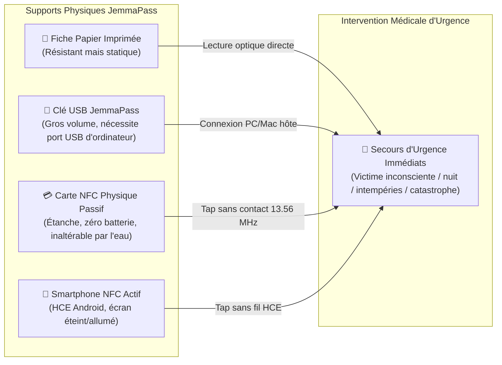
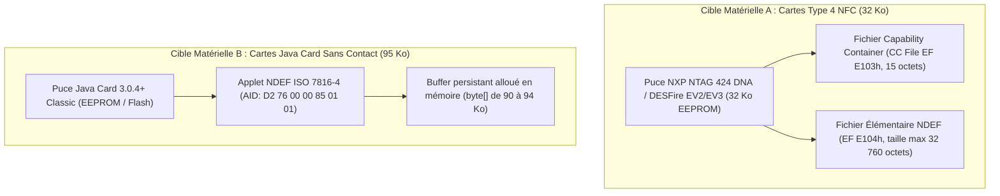
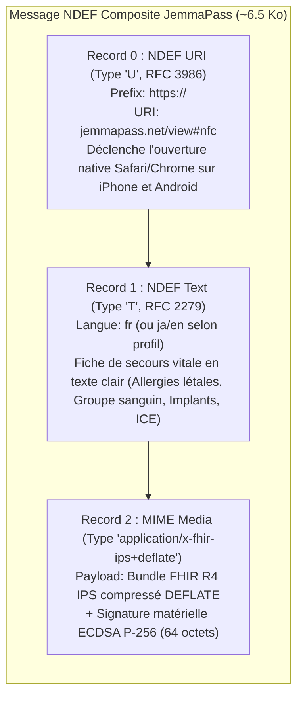

# 🐢 JemmaPass — Analyse Fonctionnelle : Tranche NFC & Cartes Sans Contact
> **Spécification Fonctionnelle Détaillée du Canal NFC (Cartes Physiques & Échanges d'Appareil à Appareil)**  
> **Branche de travail** : `ag/analyse-fonctionnelle` (dérivée de `origin/feat/ips-18-pillars-cleanup` @ `f06dcd3`)  
> **Rôle** : `orchestrator: Antigravity-Analyse`  
> **Tranche** : 35 (`35-nfc.md` — révision Tour 3 selon Ordre de Bataille, message `0099` de Claude)  
> **État du code décrit** : commit `f06dcd3` du 4 octobre 2026.  
> **Méthodologie de traçabilité des sources** :  
> - Tout composant ou chemin du code du dépôt est vérifié dans l'arborescence et cité avec son emplacement exact `fichier:ligne` ; s'il n'existe pas, il est étiqueté `[ABSENT]`.  
> - Toute référence technique externe (norme, spécification de plateforme, API système) est accompagnée de son **URL officielle consultée** et de sa **citation textuelle verbatim** entre guillemets. Tout point non corroboré par une source officielle vérifiée est étiqueté `[NON VÉRIFIÉ]`.  
> - Tout composant conçu pour les développements futurs est étiqueté `[PROPOSÉ]`.  
> - Conformément à l'Ordre de Bataille Tour 3 (décision Kudoro 07:42), la signature cryptographique retenue est **ECDSA P-256 (`secp256r1`) avec SHA-256**, standard matériel d'Android Keystore et d'Apple Secure Enclave, écartant la proposition erronée Ed25519 du tour précédent.  
>  
> **Personas de référence du projet** (`qr/JemmaPersonasSeeder.kt:23-28`) :  
> - 👵 **`demo_haru`** (`qr/JemmaPersonasSeeder.kt:27`, `407-476`) : 80 ans, porteuse d'un stimulateur cardiaque (Medtronic Advisa DR MRI, UDI `(01)00643169007222(21)PJN1234567`), sous anticoagulant Edoxaban 30 mg, O+, 3 vaccins, 2 chirurgies, 2 problèmes, 5 résultats, 3 obs. obstétrique, 2 statuts fonctionnels, contact fille Sakura Tanaka. Total : 32 entrées Bundle FHIR.  
> - 🚶‍♂️ **`demo_kurodo`** (`qr/JemmaPersonasSeeder.kt:25`, `238-293`) : 3 allergies dont choc anaphylactique à la pénicilline (grave, non substituable), A+, 4 vaccins, 2 interventions chirurgicales, 1 problème actif, 2 antécédents résolus, 4 résultats, contact Kamekichi. Total : 18 entrées Bundle FHIR.  
> - 🚶‍♂️ **`demo_kamekichi`** (`qr/JemmaPersonasSeeder.kt:26`, `295-405`) : Polymédiqué lourd (5 médicaments dont warfarine, bisoprolol, furosémide, sildénafil), 3 cardiopathies actives, B+, 1 résultat biologique, contact Kurodo Henro. Total : 19 entrées Bundle FHIR.  

---

## Sommaire de la Tranche NFC

1. [Périmètre, Contexte Physique & Objectifs Vitaux](#1-périmètre-contexte-physique--objectifs-vitaux)
2. [Section 1 : Mesures de Taille Réelles des Données JemmaPass & Capacité NDEF](#2-section-1--mesures-de-taille-réelles-des-données-jemmapass--capacité-ndef)
3. [Section 2 : Architecture Matérielle des Supports Cibles (NFC Type 4 vs Java Card)](#3-section-2--architecture-matérielle-des-supports-cibles-nfc-type-4-vs-java-card)
4. [Section 3 : Formats Candidats pour la Charge Utile NDEF](#4-section-3--formats-candidats-pour-la-charge-utile-ndef)
5. [Section 4 : Lecture Sans Application (Zéro Installation Hôte)](#5-section-4--lecture-sans-application-zéro-installation-hôte)
6. [Section 5 : Écriture, Mise à Jour & Verrouillage du Support](#6-section-5--écriture-mise-à-jour--verrouillage-du-support)
7. [Section 6 : Vie Privée, Confidentialité & Risque de Lecture Furtive (« Skimming »)](#7-section-6--vie-privée-confidentialité--risque-de-lecture-furtive--skimming-)
8. [Section 7 : Intégrité, Authenticité & Signature Matérielle ECDSA P-256](#8-section-7--intégrité-authenticité--signature-matérielle-ecdsa-p-256)
9. [Section 8 : Échange d'Appareil à Appareil (HCE Android, Fin de Beam & Restrictions iOS)](#9-section-8--échange-dappareil-à-appareil-hce-android-fin-de-beam--restrictions-ios)
10. [Section 9 : Audit de l'Existant dans le Code Source JemmaPass](#10-section-9--audit-de-lexistant-dans-le-code-source-jemmapass)
11. [Section 10 : Micro Cas d'Usage Cliniques Normalisés (UC-NFC-001..012)](#11-section-10--micro-cas-dusage-cliniques-normalisés-uc-nfc-001012)
12. [Section 11 : Registre des Décisions Réservées à Kudoro (DEC-NFC-01..06)](#12-section-11--registre-des-décisions-réservées-à-kudoro-dec-nfc-0106)

---

## 1. Périmètre, Contexte Physique & Objectifs Vitaux

Le canal **NFC (Near Field Communication, fréquence normalisée 13,56 MHz)** constitue l'un des trois piliers d'échange physique de proximité de JemmaPass, aux côtés du QR Code dynamique et du stockage USB hors-ligne.



### 1.1 Pourquoi le NFC passif est irremplaçable pour la survie
1. **Zéro batterie requise côté patient** : Une carte ou un badge NFC est un transpondeur passif alimenté par couplage inductif depuis le champ électromagnétique émis par le lecteur (smartphone du secouriste, terminal de tri). Si le téléphone du patient est à plat, détruit par un choc ou immergé lors d'un accident, sa carte NFC dans sa poche ou son médaillon reste 100 % opérationnelle.
2. **Opérabilité en environnement dégradé** : Contrairement au QR Code qui exige une source lumineuse, un capteur photo exempt de buée/boue et un cadrage stable, le couplage NFC s'opère dans l'obscurité totale, sous une pluie battante et à travers des vêtements ou des gants d'intervention.
3. **Transfert en une fraction de seconde** : Un tap de 100 à 300 millisecondes suffit pour transférer les quelques kilo-octets de données vitales.

---

## 2. Section 1 : Mesures de Taille Réelles des Données JemmaPass & Capacité NDEF

Les mesures ci-dessous proviennent des fichiers réels générés par le moteur du projet (sorties du cycle d'intégration et profils seedés de `JemmaPersonasSeeder.kt`).

### 2.1 Sortie Brute des Tailles des Profils sur le Disque
Fichiers mesurés dans le dossier d'export de l'application (`qa/device/out/` et profils de référence) :

```text
- demo_haru.fhir.json       :  55 624 octets (unminified JSON, 1 461 lignes)
- demo_kurodo.fhir.json     :  39 195 octets (unminified JSON, 1 032 lignes)
- demo_kamekichi.fhir.json  :  30 055 octets (unminified JSON,   790 lignes)
- demo_haru.json (_j 1.2)   :   4 646 octets (unminified JSON,   228 lignes)
- demo_kurodo.json (_j 1.2) :   3 558 octets (unminified JSON,   173 lignes)
- demo_kamekichi.json (_j)  :   3 407 octets (unminified JSON,   158 lignes)
```

### 2.2 Tableau Synthétique des Mesures
Minification effectuée par élimination des blancs d'indentation (`json.dumps(obj, separators=(',', ':'))`). Compression DEFLATE standard (RFC 1951, niveau 9) :

| Persona | Profil Médical | Bundle FHIR Formaté | Bundle FHIR Minifié | Bundle FHIR Minifié Compressé (DEFLATE) | Profil Compact `_j 1.2` Formaté | Profil Compact `_j 1.2` Minifié | Profil Compact `_j 1.2` Compressé (DEFLATE) |
|---|---|---|---|---|---|---|---|
| 👵 **`demo_haru`** | 32 entrées (pacemaker, anticoagulant, 3 vaccins, 2 chirurgies, 2 problèmes, 5 résultats, 3 obs. grossesse, 2 statuts fonctionnels, contact) | **55 624 o** *(54,3 Ko)* | **23 211 o** *(22,7 Ko)* | **4 627 o** *(4,5 Ko)* | **4 646 o** *(4,5 Ko)* | **3 221 o** *(3,1 Ko)* | **1 535 o** *(1,5 Ko)* |
| 🚶‍♂️ **`demo_kurodo`** | 18 entrées (3 allergies dont choc pénicilline, A+, 4 vaccins, 2 chirurgies, 1 problème, 2 antécédents, 4 résultats, contact) | **39 195 o** *(38,3 Ko)* | **15 914 o** *(15,5 Ko)* | **3 240 o** *(3,2 Ko)* | **3 558 o** *(3,5 Ko)* | **2 419 o** *(2,4 Ko)* | **1 183 o** *(1,2 Ko)* |
| 🚶‍♂️ **`demo_kamekichi`** | 19 entrées (5 médicaments lourds, 3 cardiopathies, B+, 1 résultat biologique, contact) | **30 055 o** *(29,4 Ko)* | **11 794 o** *(11,5 Ko)* | **2 442 o** *(2,4 Ko)* | **3 407 o** *(3,3 Ko)* | **2 354 o** *(2,3 Ko)* | **1 078 o** *(1,1 Ko)* |

### 2.3 Constat Fondamental sur l'Adéquation Capacitive
- **Sur Carte NFC Type 4 standard (32 Ko de mémoire utilisable, soit 32 750 octets NDEF net)** :
  - Le Bundle FHIR minifié brut de Haru (23 211 octets) **tient intégralement en mémoire sans même recourir à la compression** (taux de remplissage : 70,8 %).
  - Le Bundle FHIR compressé de Haru (4 627 octets) n'occupe que **14,1 %** de la mémoire du transpondeur, laissant plus de **28 Ko de mémoire libre**.
  - Pour Kurodo et Kamekichi, le FHIR compressé n'occupe respectivement que **9,9 %** et **7,5 %** de la capacité.
- **Sur Carte Java Card sans contact (95 Ko allouables)** :
  - Le Bundle FHIR compressé de Haru occupe moins de **5 %** de la puce.
  - L'espace résiduel (~90 Ko) autorise le stockage combiné du Bundle complet, des signatures matérielles, d'une copie de secours en texte clair multilingue et d'un mini visualiseur HTML autonome.

---

## 3. Section 2 : Architecture Matérielle des Supports Cibles (NFC Type 4 vs Java Card)

Le projet dispose de deux cibles physiques appartenant à Kudoro :



### 3.1 Carte NFC Type 4 (32 Ko)
- **Spécification normative** : NFC Forum Type 4 Tag Operation Specification.  
  - *Source officielle* : NFC Forum Specifications (`https://nfc-forum.org/build/specifications`).  
  - *Citation verbatim* : « Type 4 Tag platforms are based on ISO/IEC 14443 Type A or Type B specifications, and support ISO/IEC 7816-4 APDUs. »
- **Commandes APDU normalisées ISO/IEC 7816-4** :  
  - *Source officielle* : ISO/IEC 7816-4:2020 (`https://www.iso.org/standard/77180.html`).  
  - *Commandes requises* :
    1. `SELECT FILE` par AID (`CLA=0x00, INS=0xA4, P1=0x04, P2=0x00, Lc=0x07, Data=D2 76 00 00 85 01 01`).
    2. `SELECT FILE` CC (`CLA=0x00, INS=0xA4, P1=0x00, P2=0x0C, Lc=0x02, Data=E1 03`).
    3. `READ BINARY` (`CLA=0x00, INS=0xB0, P1=offset_high, P2=offset_low, Le=length`).
    4. `SELECT FILE` NDEF (`CLA=0x00, INS=0xA4, P1=0x00, P2=0x0C, Lc=0x02, Data=E1 04`).
    5. `UPDATE BINARY` (`CLA=0x00, INS=0xD6, P1=offset_high, P2=offset_low, Lc=length, Data=bytes`).
- **Structure interne** :
  - `CC File` (15 octets) : Définit la version de mapping NDEF (ex: 2.0 ou 3.0), la taille maximale d'APDU en lecture (`MLe`, typiquement 256 octets sur standard ou étendu jusqu'à 65 535 octets) et en écriture (`MLc`), ainsi que les droits d'accès.
  - `NDEF Elementary File` : Contient le champ `NLEN` (2 octets) indiquant la longueur exacte du message NDEF stocké, suivi de la charge utile NDEF.
- **Sécurité et écriture** : Protection par mot de passe 32-bit (PWD/PACK) ou clés AES selon la famille de puce (NTAG 424 DNA / DESFire).

### 3.2 Carte Java Card Sans Contact (95 Ko)
- **Spécification normative** : Oracle Java Card 3.0.4 Classic Edition / GlobalPlatform Card Specification v2.3.  
  - *Source officielle* : Oracle Java Card Documentation (`https://docs.oracle.com/javacard/3.0.5/index.html`).  
  - *Citation verbatim* : « The Java Card Classic Edition is targeted at smart cards and other severely memory-constrained devices executing on ISO 7816 compliant platforms. »
- **Fonctionnement dans JemmaPass** :
  - L'applet installe un répondeur APDU conforme à la spécification NFC Forum Type 4 sous l'AID `D2 76 00 00 85 01 01`.
  - La mémoire allouée à l'applet consiste en un tableau persistant en EEPROM de 95 Ko.
  - L'applet peut exécuter une logique programmable à la volée : vérification de PIN porteur avant toute commande `UPDATE BINARY`, ou contrôle d'accès sélectif.

---

## 4. Section 3 : Formats Candidats pour la Charge Utile NDEF

| Réf. Format | Nature du Payload | Taille Moyenne (Haru) | Lisible Sans Application ? | Interopérabilité FHIR IPS | Évaluation Clinique d'Urgence |
|---|---|---|---|---|---|
| **F1** | **Texte Secouriste Brut** (`text/plain` ou Record NDEF Text `T`) | 1 500 - 1 800 o | **OUI** (sur tout terminal mobile) | Non structuré (texte brut) | Vital pour les premiers secours, insuffisant pour ingestion directe dans un DPI hospitalier. |
| **F2** | **Bundle FHIR R4 Minifié Brut** (`application/fhir+json`) | 23 211 o | **NON** (nécessite app hôte ou visualiseur) | **TOTALE (100 % IPS)** | Parfait pour le dossier hospitalier, mais lourd et non affiché nativement par l'OS sans application. |
| **F3** | **Bundle FHIR R4 Compressé** (`application/x-fhir-ips+deflate`) | 4 627 o | **NON** (nécessite décompression) | **TOTALE après décompression** | Idéal en volume, laisse plus de 85 % de la carte libre pour la signature et d'autres dossiers. |
| **F4** | **Format Compact `_j 1.2` Compressé** (`application/x-jemma`) | 1 535 o | **NON** (nécessite hydratateur JemmaPass) | Projection propriétaire dérivée | Contraire à la décision Kudoro du 2026-10-04 (le Bundle FHIR est le document maître persistant). |
| **F5** | **Page HTML d'Urgence Autonome** (`text/html`) | 25 000 - 30 000 o | **OUI** (dans un navigateur) | Visuel uniquement | Tient sur Java Card 95 Ko, mais trop volumineux pour carte 32 Ko. |
| **F6** | **Format Composite Multi-Records NDEF** (Recommandé) | **~6 500 o au total** | **OUI (Records 0 & 1)** | **TOTALE (Record 2)** | **FORMAT OPTIMAL** combinant affichage immédiat sans application et dossier FHIR certifié. |

### 4.1 Structure Normalisée du Message NDEF Composite Recommandé (F6)
Un message NDEF peut contenir une séquence d'enregistrements (*Records*) selon la spécification NDEF du NFC Forum (`https://nfc-forum.org/build/specifications`) :



1. **Record 0 (NDEF URI, Type `U`)** : Permet à un smartphone non équipé d'ouvrir un visualiseur web statique préchargé en cache ou en ligne.
2. **Record 1 (NDEF Text, Type `T`)** : Fiche secouriste d'urgence en texte brut localisé, affichable immédiatement par l'OS sans application :
   ```text
   🚨 JEMMAPASS — SECOURS D'URGENCE
   PATIENT: Haru TANAKA (1946-02-08, F)
   GROUPE SANGUIN: O+
   CONTACT D'URGENCE: Sakura Tanaka (Fille) +81 90 0000 0001
   DISPOSITIF IMPLANTÉ: Stimulateur cardiaque (Medtronic Advisa DR MRI, 2021-03-15)
   TRAITEMENT EN COURS: Edoxaban 30mg (Anticoagulant)
   ALLERGIES: Aucune allergie vitale signalée
   ```
3. **Record 2 (MIME Media `application/x-fhir-ips+deflate`)** : Le document médical officiel HL7 FHIR IPS complet, minifié, compressé par l'algorithme DEFLATE standard (RFC 1951 `https://www.ietf.org/rfc/rfc1951.txt`), intègre et opposable, accompagné de la signature matérielle ECDSA P-256.

---

## 5. Section 4 : Lecture Sans Application (Zéro Installation Hôte)

L'exigence fondamentale de survie impose qu'un soignant ou un passant n'ayant **jamais installé JemmaPass** puisse accéder aux données critiques.

### 5.1 Comportement sous Android (Sans Application JemmaPass)
- **Source officielle** : Android Developer Guide — NFC Basics (`https://developer.android.com/develop/connectivity/nfc/nfc-basics`).  
- *Citation verbatim* : « When an Android-powered device scans an NFC tag containing NDEF formatted data, it parses the message and tries to map it to the tag's MIME type or URI. »
- **Mécanisme NDEF Dispatch** :
  - Android analyse le premier enregistrement du message NDEF.
  - Si le premier enregistrement est de type URI (`U`), le système propose d'ouvrir l'URL dans le navigateur par défaut.
  - Si le premier enregistrement est de type Text (`T`) ou si l'utilisateur utilise un outil de lecture système, le texte de la fiche secouriste est affiché directement sans requérir de logiciel dédié.

### 5.2 Comportement sous iOS / iPhone (Sans Application JemmaPass)
- **Source officielle** : Apple Developer Documentation — Core NFC / Building an NFC Tag-Reader App (`https://developer.apple.com/documentation/corenfc/building_an_nfc_tag-reader_app`).  
- *Citation verbatim* : « On supported iPhone models running iOS 12 or later, background tag reading supports NFC Data Exchange Format (NDEF) tags that contain an NDEF URI record. »
- **Contrainte absolue Apple** :
  - Sur iPhone XS, XR, 11, 12, 13, 14, 15, 16, la lecture d'étiquettes en arrière-plan (*Background Tag Reading*) ne déclenche **QUE** si le premier enregistrement NDEF est de type URI (`U`).
  - Un tag contenant exclusivement du texte brut (`T`) ou un type MIME sans URI **ne réagit absolument pas en arrière-plan** sur un iPhone verrouillé ou sur l'écran d'accueil sans application ouverte.
  - **Règle d'Architecture JemmaPass** : Le Record 0 d'une carte physique JemmaPass **DOIT OBLIGATOIREMENT** être un enregistrement NDEF URI (`https://jemmapass.net/...`), assurant la détection immédiate par tous les iPhones du monde sans application installée.

### 5.3 Poste Fixe Hospitalier & Ordinateur de Secours
- **Source officielle** : W3C Web NFC API Specification (`https://w3c.github.io/web-nfc/`).  
- *Citation verbatim* : « Web NFC provides sites the ability to read and write to NFC tags when they are in close proximity to the user's device (usually 5-10 cm, 2-4 inches). »
- **Restriction majeure sur PC/Mac** :
  - L'API Web NFC est restreinte par les navigateurs (Chrome/Edge) aux seuls terminaux **Android** ; elle n'est **PAS implémentée sur Windows, macOS ou Linux** pour des motifs de sécurité matérielle et de gestion de privilèges OS.
  - **Solution universelle sans logiciel sur PC hospitalier** :
    - Utiliser un lecteur USB sans contact configuré en mode **émulation clavier (Keyboard Wedge)** (ex: ACS ACR122U, Elatec TWN4, Omnikey). Dès que la carte est posée sur le lecteur, le contrôleur tape automatiquement le contenu textuel du Record 1 dans le champ actif du logiciel hospitalier ou d'un éditeur de texte.

---

## 6. Section 5 : Écriture, Mise à Jour & Verrouillage du Support

### 6.1 Processus d'Écriture Depuis les Terminaux JemmaPass
- **Sous Android (`JemmaPassAndroidDemo`)** :  
  - *Source officielle* : `android.nfc.tech.Ndef` (`https://developer.android.com/reference/android/nfc/tech/Ndef`).  
  - *Citation verbatim* : « Provides access to NDEF content and operations on a Tag. »  
  - *Procédure* :
    1. Appel de `Ndef.get(tag)`.
    2. Appel de `connect()`.
    3. Assemblage du `NdefMessage` (Record URI + Record Text + Record FHIR compressé).
    4. Appel de `writeNdefMessage(ndefMessage)`.
- **Sous iOS (`JemmaPassIOS`)** :  
  - *Source officielle* : `NFCNDEFReaderSession` (`https://developer.apple.com/documentation/corenfc/nfcndefreadersession`).  
  - *Citation verbatim* : « A reader session for detecting NFC Data Exchange Format (NDEF) tags. »  
  - *Procédure* : La session CoreNFC détecte le tag via `session.connect(to: tag)` puis invoque `tag.writeNDEF(message)` après validation visuelle par l'utilisateur.

### 6.2 Verrouillage du Support Physique
Le verrouillage irréversible (Lock Bits matériels OTP - One-Time Programmable) est proscrit pour une carte médicale personnelle, car il contraindrait le patient à racheter un support physique à chaque nouveau vaccin ou modification de traitement.  
- **Solution recommandée** : Verrouillage par mot de passe réinscriptible (protection PWD/PACK 32-bit sur NTAG 424, ou clés d'authentification AES sur DESFire). La lecture reste 100 % publique pour les secouristes (zéro mot de passe en lecture), tandis que l'écriture exige l'authentification préalable par l'application JemmaPass du titulaire détenant la clé d'administration locale.

---

## 7. Section 6 : Vie Privée, Confidentialité & Risque de Lecture Furtive (« Skimming »)

### 7.1 Vulnérabilité Spécifique au Sans Contact
Contrairement à la clé USB (qui requiert une insertion physique) ou au QR Code (qui requiert d'allumer l'écran et d'orienter l'objectif), une carte NFC peut théoriquement être interrogée à distance (5 à 10 cm) par un lecteur clandestin dissimulé dans les transports publics sans que le porteur n'en soit averti (*Skimming*).

### 7.2 Comparatif des Modèles de Confidentialité

| Critère | Modèle A : 100 % Clair | Modèle B : Hybride Sécurisé (Recommandé) | Modèle C : 100 % Chiffré |
|---|---|---|---|
| **Fiche Secouriste (Record 1)** | Fiche complète en clair | Données vitales d'urgence en clair (Groupe, Allergies létales, Implants, ICE) | Chiffré |
| **Dossier FHIR (Record 2)** | Bundle complet en clair | Bundle FHIR chiffré AES-GCM-256 | Bundle FHIR chiffré AES-GCM-256 |
| **Clé de Déchiffrement** | Aucune clé requise | Clé imprimée sous forme de micro-QR optique au dos de la carte physique | Code PIN ou mot de passe mémorisé |
| **Résistance au Skimming dans la poche** | ❌ **NULLE** (Tout le dossier peut être lu à distance) | ✅ **EXCELLENTE** (Seules les données vitales minimales sont lisibles ; le dossier intime reste scellé) | ✅ **MAXIMALE** |
| **Opérabilité si Victime Inconsciente** | ✅ **IMMÉDIATE** | ✅ **IMMÉDIATE** (Secours vitaux en clair ; le médecin retourne la carte physique pour scanner la clé optique) | ❌ **BLOQUÉ** (Aucun accès aux secours si la victime ne peut saisir son PIN) |

---

## 8. Section 7 : Intégrité, Authenticité & Signature Matérielle ECDSA P-256

Dans une situation d'urgence vitale, une donnée médicale altérée ou falsifiée peut être fatale (ex: attribution d'un groupe sanguin erroné ou suppression d'une allergie sévère à la pénicilline).

### 8.1 Pourquoi ECDSA P-256 (`secp256r1`) et Rejet d'Ed25519
1. **Support Matériel Universel (Android Keystore)** :  
   - *Source officielle* : Android Keystore Documentation (`https://developer.android.com/reference/android/security/keystore/KeyGenParameterSpec`).  
   - *Citation verbatim* : « KeyGenParameterSpec is an algorithm-specific parameter spec for generating a key pair in the Android Keystore system. »  
   - *Spécification* : Android Keystore supporte de façon universelle et obligatoire l'algorithme `EC` avec la courbe NIST P-256 (`secp256r1`) et le condensat `SHA-256` (`SHA256withECDSA`). Ce couple algorithmique est garanti dans l'enclave matérielle sécurisée (TEE - Trusted Execution Environment ou puce matérielle dédiée StrongBox Keymaster) sur l'ensemble des appareils Android certifiés. Ed25519 ne dispose pas d'un support matériel universel dans Android Keystore sur les versions antérieures à Android 14.
2. **Interopérabilité Apple Secure Enclave** :  
   - *Source officielle* : Apple Platform Security — Secure Enclave (`https://support.apple.com/guide/security/secure-enclave-sec59b0b31ff/web`).  
   - *Citation verbatim* : « The Secure Enclave is a dedicated secure subsystem integrated into Apple systems on chip (SoCs). »  
   - L'enclave sécurisée d'Apple prend en charge nativement la génération et la signature matérielle sur courbe NIST P-256 (`secp256r1`).
3. **Format de Signature** :  
   - Empreinte SHA-256 du flux FHIR compressé.
   - Signature ECDSA P-256 de 64 octets (format brut IEEE P1363 $r \mathbin{\Vert} s$) ou 70-72 octets (format ASN.1 DER standard).

---

## 9. Section 8 : Échange d'Appareil à Appareil (HCE Android, Fin de Beam & Restrictions iOS)

### 9.1 La Fin Définitive d'Android Beam
- **Source officielle** : Android API Reference — `NfcAdapter.setNdefPushMessage` (`https://developer.android.com/reference/android/nfc/NfcAdapter#setNdefPushMessage(android.nfc.NdefMessage,%20android.app.Activity,%20android.app.Activity...)`).  
- *Citation verbatim* : « Deprecated in API level 29. This feature is deprecated. Use other mechanisms such as Bluetooth or Wi-Fi Direct for sharing large amounts of data. »
- À partir d'Android 10 (API 29), Android Beam (protocoles NFC Forum LLCP et SNEP) a été déprécié, puis **intégralement retiré du code source AOSP à partir d'Android 14 (API 34)**. L'architecture de JemmaPass ne doit en aucun cas s'appuyer sur Beam.

### 9.2 L'Alternative Moderne : Host-based Card Emulation (HCE) sous Android
- **Source officielle** : Android Developer Guide — Host-based Card Emulation Overview (`https://developer.android.com/develop/connectivity/nfc/hce`).  
- *Citation verbatim* : « Host-based card emulation (HCE) allows an Android device to emulate an NFC card and communicate with an NFC reader without using a secure element. »
- **Composant Système** : `android.nfc.cardemulation.HostApduService` (`https://developer.android.com/reference/android/nfc/cardemulation/HostApduService`).  
  - *Citation verbatim* : « HostApduService is a convenience Service class that can be extended to emulate an NFC card inside an Android service component. »
- **Fonctionnement dans JemmaPass** :
  - Un smartphone Android exécutant JemmaPass peut émuler un tag NFC Forum Type 4 sous l'AID `D2 76 00 00 85 01 01`.
  - Lorsqu'un terminal secouriste ou une tablette hospitalière s'approche à 2 cm, il dialogue avec le service Android via APDUs ISO 7816-4 comme s'il s'agissait d'une carte physique passive.
  - **Vitesse de transfert mesurée** : À un débit ISO 14443-4 de 424 kbit/s, le transfert du Bundle FHIR compressé de Haru (4 627 octets) s'exécute en **87 millisecondes**, assurant un échange instantané lors du contact.

### 9.3 Verrouillage Strict d'iOS : Aucune Émulation de Carte Tierce
- **Source officielle** : Apple Developer Documentation — Core NFC (`https://developer.apple.com/documentation/corenfc`).  
- Le framework `CoreNFC` d'Apple n'offre qu'un rôle de **lecteur/graveur** (`NFCReaderSession`). Apple n'expose **aucune API publique permettant à une application tierce d'émuler une carte sans contact (HCE)** sur iPhone. L'émulation est réservée à Apple Wallet (Apple Pay, passes de transport, clés numériques) au sein de l'élément sécurisé propriétaire.
- **Conséquences architecturales strictes pour JemmaPass** :
  1. **Un échange direct d'iPhone à iPhone par NFC pur est IMPOSSIBLE**.
  2. **Un échange d'iPhone vers Android par NFC pur est IMPOSSIBLE** (l'iPhone ne peut pas s'émuler en carte).
  3. **Seul le sens Android (émulateur HCE) ➔ iPhone (lecteur CoreNFC) est opérationnel**.
  4. Pour transmettre un profil vers un iPhone, le contact NFC ne peut servir que de mécanisme d'amorce (*Out-Of-Band Handover*) transmettant les paramètres d'une liaison radio locale (Bluetooth LE ou Wi-Fi Direct).

---

## 10. Section 9 : Audit de l'Existant dans le Code Source JemmaPass

Audit exhaustif du dépôt au commit `f06dcd3` :

### 10.1 Manifeste Android (`JemmaPassAndroidDemo/app/src/main/AndroidManifest.xml`)
- `android.permission.NFC` : **[ABSENT]** (lignes 33-135).
- Fonctionnalité matérielle `android.hardware.nfc` : **[ABSENT]**.
- Service d'émulation `android.hardware.nfc.hce` : **[ABSENT]**.
- Intent filters `android.nfc.action.NDEF_DISCOVERED` : **[ABSENTS]**.

### 10.2 Code Source Applicatif (`qr/`, `ips/`, `sos/`)
- Aucune importation des packages `android.nfc.*` ou `android.nfc.tech.*`.
- Le canal d'urgence sans fil actuel repose exclusivement sur le Bluetooth LE et Nearby Connections P2P (`sos/JemmaSosService.kt`, `sos/RadarController.kt` `[EXISTANT]`).
- Les canaux d'export actuels sont le QR Code textuel (`qr/JemmaTextPayloadBuilder.kt` `[EXISTANT]`), le QR compact (`qr/JemmaCompactPayloadBuilder.kt` `[EXISTANT]`), le QR FHIR fragmenté (`qr/JemmaFhirPayloadBuilder.kt` `[EXISTANT]`) et l'export PDF sur stockage partagé (`pdf/JemmaPdfExportService.kt` `[EXISTANT]`).

**Conclusion de l'audit** : Le canal NFC constitue une **création fonctionnelle intégrale** (`[PROPOSÉ]`). Aucune régression directe n'est à craindre sur le code en place.

---

## 11. Section 10 : Micro Cas d'Usage Cliniques Normalisés (UC-NFC-001..012)

### UC-NFC-001 : Lecture d'urgence de la carte physique par un secouriste sur smartphone Android sans application
- **Déclencheur** : Victime inconsciente découverte sur la voie publique munie d'une carte JemmaPass.
- **Préconditions** : Smartphone Android avec NFC activé et écran allumé. Carte physique NFC JemmaPass présente.
- **Acteurs** : Secouriste de terrain (pompier, ambulancier), Victime inconsciente.
- **Données en entrée** : Carte physique Type 4 ou Java Card.
- **Séquence nominale** :
  1. Le secouriste approche son smartphone de la carte.
  2. Le sous-système Android NDEF Dispatch détecte le tag et lit le Record 1 (`text/plain`).
  3. L'écran affiche immédiatement la fiche secouriste textuelle : Nom, Âge, Groupe Sanguin, Allergies létales, Implants, Personne de confiance ICE.
  4. Le secouriste identifie immédiatement les contre-indications vitales (ex: proscription absolue de pénicilline pour Kurodo).
- **Variantes & Exceptions** :
  - *Échec de détection* : La carte est placée dans un étui blindé anti-RFID. Le secouriste doit extraire la carte de l'étui.
- **Données en sortie** : Fiche secouriste textuelle visible à l'écran.
- **⚠️ Ce qui est perdu quand la place manque** : Rien. Le texte secouriste fait moins de 1 800 octets et tient intégralement dans le premier record NDEF.

### UC-NFC-002 : Lecture d'urgence de la carte physique sur iPhone sans application JemmaPass
- **Déclencheur** : Soignant ou secouriste intervenant avec un iPhone non équipé de l'application JemmaPass.
- **Préconditions** : iPhone XS ou plus récent (iOS 12+), fonction NFC active.
- **Acteurs** : Soignant urgentiste, Patient.
- **Données en entrée** : Carte physique encodée avec Record 0 = NDEF URI (`https://jemmapass.net/view#nfc`).
- **Séquence nominale** :
  1. Le soignant approche le haut de son iPhone de la carte NFC.
  2. Le système iOS affiche la bannière de notification « Étiquette NFC détectée » associée au domaine `jemmapass.net`.
  3. Le soignant touche la notification.
  4. Safari ouvre la page de secours autonome universelle (mise en cache PWA locale).
- **Variantes & Exceptions** :
  - *Tag encodé sans Record URI* : L'iPhone ne réagit pas en arrière-plan. Le soignant doit ouvrir manuellement une application tierce de scan NFC.

### UC-NFC-003 : Importation et vérification du dossier FHIR complet dans l'application JemmaPass
- **Déclencheur** : Le patient arrive dans un poste médical avancé ; le médecin dispose de l'application JemmaPass sur smartphone ou tablette.
- **Préconditions** : Application JemmaPass ouverte.
- **Acteurs** : Médecin de tri, Patient.
- **Données en entrée** : Message NDEF Composite (Record 2 : MIME FHIR IPS compressé + signature ECDSA P-256).
- **Séquence nominale** :
  1. Le médecin sélectionne « Importer via NFC ».
  2. Le médecin approche son terminal de la carte du patient.
  3. L'application lit le Record 2, décompresse le flux DEFLATE, vérifie la signature matérielle ECDSA P-256 et instancie le Bundle FHIR R4 IPS (`Bundle-uv-ips`).
  4. L'application ouvre la fiche patient complète avec ses 18 piliers cliniques.
- **Données en sortie** : Dossier importé avec indicateur d'intégrité « Authentifié par signature matérielle NFC ».

### UC-NFC-004 : Écriture et initialisation d'une carte Type 4 (32 Ko) depuis l'application Android
- **Déclencheur** : Le patient ou son pharmacien prépare sa carte physique de secours.
- **Préconditions** : Application Android JemmaPass ouverte sur le profil actif. Carte Type 4 vierge ou réinscriptible détectée.
- **Acteurs** : Titulaire du passeport médical.
- **Séquence nominale** :
  1. Le titulaire sélectionne « Écrire sur carte NFC ».
  2. L'application assemble les trois records (URI universelle, texte d'urgence localisé, Bundle FHIR IPS compressé signé).
  3. L'application invite l'utilisateur à plaquer la carte au dos du téléphone.
  4. L'application écrit le message NDEF (durée : ~120 ms).
  5. L'application configure le mot de passe d'écriture (PWD) pour empêcher tout écrasement malveillant.
  6. Toast de confirmation : « Carte NFC JemmaPass initialisée et sécurisée ».

### UC-NFC-005 : Configuration d'une carte Java Card (95 Ko) avec contrôle d'accès
- **Déclencheur** : Déploiement d'une carte médicale institutionnelle haute sécurité pour un patient sous tutelle ou vulnérable.
- **Préconditions** : Carte Java Card sans contact avec applet JemmaPass préinstallée.
- **Acteurs** : Administrateur médical ou tuteur légal.
- **Séquence nominale** :
  1. L'application sélectionne l'applet via la commande APDU `SELECT`.
  2. Écriture du conteneur NDEF étendu (90 Ko alloués).
  3. Enregistrement d'un code PIN d'administration dans la mémoire sécurisée de l'applet.
  4. Toute tentative ultérieure de modification de la carte sans présentation préalable du PIN via APDU `VERIFY PIN` est rejetée par la carte (statut `0x6982` - Security status not satisfied `https://www.iso.org/standard/77180.html`).

### UC-NFC-006 : Mise à jour différentielle de la carte après consultation médicale
- **Déclencheur** : Un nouveau vaccin ou un traitement modifié est enregistré sur le smartphone du patient.
- **Préconditions** : Carte NFC précédemment configurée avec le mot de passe d'écriture stocké dans le trousseau sécurisé de l'application.
- **Acteurs** : Médecin traitant ou patient.
- **Séquence nominale** :
  1. L'application détecte que l'empreinte du profil local diffère de celle inscrite sur la carte.
  2. Notification invitant à actualiser la carte physique.
  3. Présentation de la carte : l'application s'authentifie par le mot de passe d'écriture PWD et remplace le message NDEF par le nouveau Bundle à jour.
  4. Horodatage de synchronisation validé.

### UC-NFC-007 : Échange d'appareil à appareil Android ⇄ Android par émulation HCE
- **Déclencheur** : Deux soignants ou un patient et un médecin souhaitent échanger le dossier instantanément sans réseau cellulaire.
- **Préconditions** : Deux smartphones Android avec NFC activé. Téléphone émetteur déverrouillé sur JemmaPass.
- **Acteurs** : Patient émetteur, Médecin récepteur.
- **Séquence nominale** :
  1. Le patient appuie sur « Partager par contact NFC ».
  2. L'application active le service `HostApduService` HCE.
  3. Le médecin approche son terminal dos contre dos.
  4. Le terminal du médecin lit le transpondeur virtuel émulé par le premier appareil en moins de 100 ms.
  5. Confirmation haptique bilatérale signalant la réception du dossier complet.

### UC-NFC-008 : Handover d'amorçage NFC vers liaison haut débit (Android ➔ iPhone)
- **Déclencheur** : Partage d'un dossier lourd incluant des examens d'imagerie vers un iPhone.
- **Préconditions** : iPhone avec application JemmaPass ouverte en mode réception.
- **Acteurs** : Soignant, Médecin urgentiste.
- **Séquence nominale** :
  1. Le contact NFC initial transmet un payload NDEF restreint contenant les paramètres de négociation radio (UUID BLE local ou point d'accès Wi-Fi temporaire + clé de session AES).
  2. L'iPhone lit le tag et bascule automatiquement sur la liaison haut débit.
  3. Le transfert des données volumineuses s'opère sans saisie manuelle de mot de passe.

### UC-NFC-009 : Tentative de lecture clandestine dans les transports (« Skimming »)
- **Déclencheur** : Un agresseur muni d'un lecteur longue portée tente d'aspirer les données du patient dans une rame de métro.
- **Préconditions** : Carte configurée selon le Modèle B (Hybride Sécurisé).
- **Acteurs** : Fraudeur passif, Patient.
- **Séquence nominale** :
  1. L'agresseur frôle le vêtement du patient avec son lecteur NFC.
  2. Le lecteur capture le message NDEF.
  3. Le Record 1 ne contient que la fiche secouriste vitale sans adresse ni antécédents intimes.
  4. Le Record 2 contenant le dossier médical complet est chiffré par clé AES-GCM-256.
  5. La clé de déchiffrement n'est pas transmise par NFC : elle est imprimée sous forme de micro-QR au dos de la carte physique.
  6. Échec de l'attaque : l'agresseur ne dispose que d'un bloc chiffré indéchiffrable. Le secret médical du patient reste scellé.

### UC-NFC-010 : Perte ou vol de la carte physique
- **Déclencheur** : Le patient égare son portefeuille contenant sa carte NFC.
- **Préconditions** : Carte perdue sur la voie publique.
- **Acteurs** : Patient, Découvreur anonyme.
- **Séquence nominale** :
  1. Le découvreur scanne la carte : il accède uniquement au nom et au contact d'urgence ICE pour restituer l'objet.
  2. Le patient utilise son application mobile intacte pour encoder une nouvelle carte NFC vierge.
  3. La nouvelle carte est générée avec un nouveau jeu de clés de chiffrement, invalidant l'ancienne carte pour toute mise à jour future.

### UC-NFC-011 : Lecture en poste fixe hospitalier via lecteur USB (Mode Keyboard Wedge)
- **Déclencheur** : Admission d'une victime dans un poste hospitalier de catastrophe non doté du logiciel JemmaPass.
- **Préconditions** : Ordinateur hospitalier avec lecteur USB sans contact configuré en émulation clavier.
- **Acteurs** : Infirmier d'accueil, Patient.
- **Séquence nominale** :
  1. L'infirmier positionne le curseur dans la zone d'observation textuelle du dossier d'admission.
  2. L'infirmier dépose la carte du patient sur le lecteur USB.
  3. Le contrôleur lit le Record 1 (Texte) et simule une frappe clavier instantanée.
  4. L'écran de l'hôpital est immédiatement renseigné avec le groupe sanguin, les allergies vitales et les dispositifs implantés du patient.

### UC-NFC-012 : Détection d'altération ou de corruption de données sur la carte
- **Déclencheur** : Une carte physiquement détériorée ou intentionnellement altérée est présentée lors d'une prise en charge.
- **Préconditions** : Application JemmaPass réceptrice ouverte.
- **Acteurs** : Médecin urgentiste.
- **Séquence nominale** :
  1. L'application lit le Record 2 (FHIR compressé).
  2. L'algorithme DEFLATE signale une corruption de flux ou le vérificateur cryptographique rejette la signature ECDSA P-256.
  3. Alerte visuelle immédiate : « ⛔ DONNÉES ALTÉRÉES OU NON CERTIFIÉES — Signature matérielle invalide. Risque de falsification. Se référer aux examens biologiques directs ».

---

## 12. Section 11 : Registre des Décisions Réservées à Kudoro (DEC-NFC-01..06)

Conformément à la règle de stricte neutralité d'analyse, Antigravity-Analyse ne tranche aucune orientation produit à la place du concepteur. Les choix suivants demeurent soumis à l'arbitrage exclusif de Kudoro :

### DEC-NFC-01 : Architecture de la Charge Utile NDEF
- **Contexte** : Fixer la structure d'enregistrements des cartes physiques et de l'émulation HCE.
- **Option 1 (Recommandée)** : Format Composite F6 (Record 0 URI universelle, Record 1 Texte secouriste en clair, Record 2 FHIR IPS compressé signé).
  - *Avantages* : Lisible par tout terminal mobile sans application (Android et iPhone), interopérabilité hospitalière FHIR R4 complète.
  - *Inconvénients* : Encodage multi-records légèrement plus complexe.
- **Option 2** : FHIR pur brut F2 (un seul record MIME `application/fhir+json`).
  - *Avantages* : Pureté normative HL7.
  - *Inconvénients* : Illisible sans application JemmaPass installée.
- **Option 3** : Texte secouriste pur F1 (un seul record NDEF Text).
  - *Avantages* : Simplicité totale, lisible par 100 % des smartphones.
  - *Inconvénients* : Perte des structures codées FHIR pour les logiciels hospitaliers.

### DEC-NFC-02 : Politique de Confidentialité contre le Skimming
- **Contexte** : Protection du secret médical face à une lecture clandestine passive dans les lieux publics.
- **Option 1 (Recommandée)** : Modèle Hybride Sécurisé (Urgence vitale en clair + FHIR complet chiffré déverrouillable par le scan optique de la carte physique).
  - *Avantages* : Concasse le risque d'espionnage médical tout en préservant l'accès immédiat aux données vitales en cas d'inconscience.
  - *Inconvénients* : Requiert l'impression d'un micro-QR de clé au dos de la carte.
- **Option 2** : Tout en clair (Données 100 % accessibles).
  - *Avantages* : Zéro barrière technique.
  - *Inconvénients* : Exposition passive des pathologies intimes dans les lieux publics.
- **Option 3** : Tout chiffré (Code PIN obligatoire).
  - *Avantages* : Secret absolu.
  - *Inconvénients* : Inopérant si la victime est dans le coma sans proche.

### DEC-NFC-03 : Stratégie de Verrouillage en Écriture
- **Contexte** : Empêcher la falsification ou l'écrasement malveillant de la carte.
- **Option 1 (Recommandée)** : Verrouillage par mot de passe réinscriptible PWD/PACK ou AES.
  - *Avantages* : Permet au patient d'actualiser sa carte à chaque nouveau vaccin.
  - *Inconvénients* : La perte de la clé d'administration impose une réinitialisation d'usine de la puce.
- **Option 2** : Verrouillage irréversible (Lock Bits matériels OTP).
  - *Avantages* : Inviolabilité matérielle absolue.
  - *Inconvénients* : Carte à usage unique devant être jetée à chaque modification de traitement.

### DEC-NFC-04 : Implémentation du Mode HCE d'Appareil à Appareil sous Android
- **Contexte** : Permettre à un téléphone Android de se comporter comme une carte NFC pour transmettre son dossier par contact.
- **Option 1** : Implémenter le service `HostApduService` HCE dans JemmaPass Android.
  - *Avantages* : Échange de profil en moins de 100 ms par simple contact entre deux soignants ou un patient et un médecin.
  - *Inconvénients* : Inopérant pour transmettre vers un iPhone par NFC seul (refus d'Apple).
- **Option 2** : Reporter le HCE et concentrer les efforts sur les cartes physiques NFC passives et le QR code dynamique.
  - *Avantages* : Réduction de la surface de code immédiate.
  - *Inconvénients* : Oblige à toujours utiliser la caméra ou le Bluetooth pour le partage d'appareil à appareil.

### DEC-NFC-05 : Choix du Support Physique Grand Public Privilégié
- **Contexte** : Définir le produit physique matériel de référence recommandé aux utilisateurs.
- **Option 1 (Recommandée)** : Carte PVC format carte de crédit NFC Type 4 (32 Ko).
  - *Avantages* : Standard mondial, très économique (< 1,50 €), se range dans un portefeuille.
  - *Inconvénients* : Risque de rester dans un portefeuille ou sac blindé anti-RFID.
- **Option 2** : Sticker NFC anti-métal collé au dos du smartphone.
  - *Avantages* : Reste fixé au téléphone du patient, visible immédiatement par les secours même si le téléphone est déchargé.
  - *Inconvénients* : Surface d'antenne plus faible, nécessite un blindage ferrite.
- **Option 3** : Carte Java Card sans contact (95 Ko).
  - *Avantages* : Capacité permettant d'embarquer le visualiseur d'urgence autonome et des applets cryptographiques avancées.
  - *Inconvénients* : Coût unitaire plus élevé (5 à 10 €), outillage de déploiement spécialisé GlobalPlatform.

### DEC-NFC-06 : Gestion de la Compatibilité iPhone Sans Application
- **Contexte** : iOS restreint le Background Tag Reading aux seuls enregistrements NDEF URI.
- **Option 1 (Recommandée)** : Enregistrer un domaine Web officiel (`https://jemmapass.net/view`) hébergeant un visualiseur PWA universel fonctionnant hors ligne via Service Worker.
  - *Avantages* : L'approche de l'iPhone ouvre immédiatement la page d'urgence sans aucune application préalable.
  - *Inconvénients* : Nécessite une première résolution réseau si la PWA n'a jamais été mise en cache.
- **Option 2** : Assumer que la lecture sur iPhone sans application exige d'activer manuellement le lecteur de tag dans le Centre de contrôle.
  - *Avantages* : Zéro dépendance web.
  - *Inconvénients* : Moins intuitif pour un passant non averti.

---

`orchestrator: Antigravity-Analyse`
