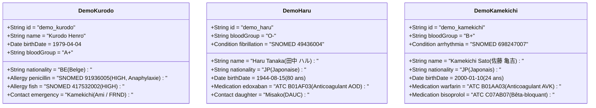
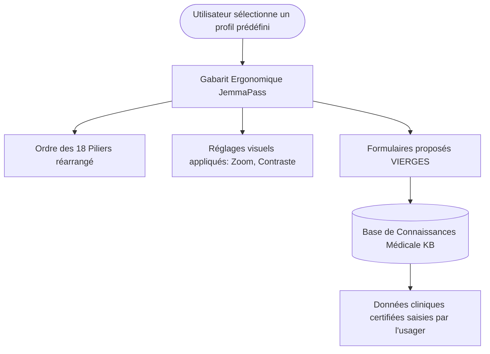

# 🐢 JemmaPass — Bibliothèque de Personas de Conception & Matrice d'Accessibilité Universelle

> **Document Fondateur UX Tranche 2 : Personas, Handicaps, Convictions & Profils Santé**  
> **Branche de travail** : `ag/ux-main`  
> **Rôle** : `orchestrator: Antigravity-UX`  
> **Tranche** : 2 / 6 (`docs/ux/10-personas.md`)  
> **État de référence** : feat `f06dcd3`, Tranche 1 (`docs/ux/00-audit.md` @ `1abca30` / `37dae16`)  
> **Conformité normative** :  
> - W3C Web Content Accessibility Guidelines (WCAG) 2.1 & 2.2 (Niveaux AA & AAA — Critères 1.3.1, 1.4.1, 1.4.3, 1.4.12, 2.1.1, 2.5.5, 2.5.8, 3.1.2, 3.3.2, 4.1.2).  
> - ISO 27269:2021 (International Patient Summary - IPS).  
> - RGPD (Règlement UE 2016/679) — Article 9 (Traitement des catégories particulières de données : santé, convictions, données génétiques).  
> - Règle architecturale « KB seulement » (PROTOCOL.md §9 & §9.1).  
> - Charte des Droits Fondamentaux de l'Union Européenne (Articles 1, 3, 10, 21, 26).

---

## Sommaire

1. [Introduction & Principes Directeurs de Conception Inclusive](#1-introduction--principes-directeurs-de-conception-inclusive)
2. [Les Trois Personas Démonstrateurs Officiels (Base de Référence)](#2-les-trois-personas-démonstrateurs-officiels-base-de-référence)
   - 2.1. 🚶‍♂️ `demo_kurodo` (Kurodo) — Pèlerin voyageur étranger, allergie létale
   - 2.2. 👵 `demo_haru` (Haru) — Citoyenne japonaise âgée (80 ans), anticoagulée
   - 2.3. 🎒 `demo_kamekichi` (Kamekichi) — Patient jeune (né en 2000), polymédiqué cardiovasculaire
3. [Bibliothèque des Personas par Capacités, Handicaps & Situations Dégradées](#3-bibliothèque-des-personas-par-capacités-handicaps--situations-dégradées)
   - 3.1. Handicaps Sensoriels (Basse vision, cécité, daltonisme, surdité)
   - 3.2. Handicaps Moteurs & Neurologiques (Tremblements, motricité fine, contacteur)
   - 3.3. Troubles Cognitifs, Neuroatypies & Littératie (Mémoire, dyslexie, illettrisme)
   - 3.4. Âges Extrêmes & Barrières Linguistiques (Grand âge, pédiatrie, allophonie)
   - 3.5. Handicaps de Situation (Panique, une seule main, soleil, gants, écran fissuré)
4. [Bibliothèque des Personas par Convictions Éthiques, Philosophiques & Religieuses](#4-bibliothèque-des-personas-par-convictions-éthiques-philosophiques--religieuses)
   - 4.1. Cadre Déontologique : Neutralité, Dignité et Respect de la Volonté
   - 4.2. P-CONV-01 : Refus formel de transfusions sanguines et dérivés labiles
   - 4.3. P-CONV-02 : Exigences d'alimentation rituelle ou philosophique stricte en milieu hospitalier
   - 4.4. P-CONV-03 : Volonté expresse de soignant du même sexe pour les soins corporels
   - 4.5. P-CONV-04 : Directives anticipées de fin de vie, Non-réanimation & Refus d'acharnement
   - 4.6. P-CONV-05 : Volonté relative au don d'organes et de tissus post-mortem
5. [Spécification des Profils de Santé Prédéfinis (Modèles d'Organisation Ergonomique)](#5-spécification-des-profils-de-santé-prédéfinis-modèles-dorganisation-ergonomique)
   - 5.1. Règle d'or « KB seulement » : Structure d'accueil, zéro savoir médical pré-codé
   - 5.2. Spécification détaillée des 7 modèles prédéfinis
6. [Les Profils des Lecteurs du Passeport de Santé (Scénarios d'Intervention)](#6-les-profils-des-lecteurs-du-passeport-de-santé-scénarios-dintervention)
   - 6.1. L-SEC-01 : Secouriste de terrain pressé (Règle d'or des 10 secondes)
   - 6.2. L-MED-01 : Médecin urgentiste en salle de déchocage / Trauma Center
   - 6.3. L-EXT-01 : Soignant étranger en pays d'accueil (Barrière de langue et de système)
   - 6.4. L-AID-01 : Proche, aidant naturel ou témoin civil
7. [Matrice Croisée d'Impact : Personas × Piliers JemmaPass × Composants d'Interface](#7-matrice-croisée-dimpact--personas--piliers-jemmapass--composants-dinterface)
8. [Résolution Ergonomique : Traitement des Contacts sans Relation (« Dr Smith »)](#8-résolution-ergonomique--traitement-des-contacts-sans-relation--dr-smith-)
9. [Conclusion & Feuille de Route pour la Tranche 3 (20-principes.md)](#9-conclusion--feuille-de-route-pour-la-tranche-3-20-principesmd)

---

## 1. Introduction & Principes Directeurs de Conception Inclusive

### 1.1. L'accessibilité comme impératif vital (Santé de personnes réelles)
Dans une application grand public standard, un défaut d'accessibilité (contraste insuffisant, bouton trop étroit, ordre de tabulation brisé) cause de la frustration ou un abandon de service. Dans **JemmaPass**, un défaut d'accessibilité en situation d'urgence vitale (malaise sur la voie publique, tremblement de terre, accident ferroviaire, choc anaphylactique) peut se traduire par l'injection d'un médicament contre-indiqué, un délai fatal de transfusion ou la mort d'une personne réelle.

L'accessibilité n'est donc pas une « surcouche cosmétique optionnelle » : **c'est la condition sine qua non de la sécurité clinique du passeport de santé**. Chaque composant d'interface sur chaque plateforme (Android, iOS, Extension Chrome, Clé USB universelle, Pocket Pass papier) doit pouvoir être utilisé, perçu et compris sans faille par n'importe quel être humain, quelles que soient ses capacités physiques, sensorielles, cognitives ou ses circonstances matérielles immédiates.

### 1.2. La stricte séparation entre ergonomie de présentation et savoir médical (Règle « KB seulement »)
Conformément au protocole architectural JemmaPass (PROTOCOL.md §9 et décision de Kudoro du 2026-10-02) :
- **Aucune règle médicale, aucun code clinique (SNOMED CT, LOINC, ATC, ICD-10), aucune posologie, aucune conduite à tenir thérapeutique n'est codée en dur dans les profils, les personas ou l'interface**.
- Tout le savoir médical réside exclusivement dans la base de connaissances médicale certifiée (`knowledge_full.db`).
- Le rôle d'un persona ou d'un profil prédéfini est **strictement organisationnel et perceptif** : il définit *l'ordre des piliers affichés en premier*, *le niveau de contraste et de zoom typographique*, *la mise en évidence visuelle de certains avertissements saisis par l'utilisateur*, et *l'état déplié ou replié de conteneurs de saisie proposés vierges*.

### 1.3. La protection des données hautement sensibles (Santé, convictions, handicap)
Le passeport de santé agrège des données relevant des catégories les plus sensibles au sens du droit international (RGPD Art. 9) :
1. Les convictions religieuses ou philosophiques (ex: refus de transfusion, alimentation rituelle, refus d'acharnement),
2. L'identité des contacts intimes ou aidants,
3. La mention d'antécédents stigmatisants ou de handicaps cognitifs,
4. L'état d'obstétrique et de grossesse.

L'interface doit assurer un principe fondamental d'**occultation par défaut et de souveraineté d'exposition** : l'utilisateur décide explicitement quelles informations sont projetées en clair sur l'écran verrouillé (widget SOS, fiche secouriste 10 secondes) et lesquelles demeurent protégées derrière le déverrouillage biométrique ou le chiffrement local du terminal.

---

## 2. Les Trois Personas Démonstrateurs Officiels (Base de Référence)

Ces trois personas constituent les profils canoniques du projet JemmaPass, encodés dans le générateur de données de démonstration Android ([`qr/JemmaPersonasSeeder.kt:216-401`](https://github.com/kurodohenroonsen/JemmaPass/blob/feat/ips-18-pillars-cleanup/JemmaPassAndroidDemo/app/src/main/java/be/heyman/android/jemmapassdemo/qr/JemmaPersonasSeeder.kt#L216-L401)) et répliqués sur iOS, Chrome et USB.



### 2.1. 🚶‍♂️ `demo_kurodo` (Kurodo) — Pèlerin voyageur étranger, allergie létale
- **Identité** : Kurodo Henro, citoyen belge voyageant au Japon (Shikoku 88). 45 ans (né le 1979-04-04). Groupe sanguin **A+**.
- **Profil clinique critique** :
  - Allergie létale à la pénicilline (`SNOMED 91936005`, sévérité `s = "H"` / `criticality = "high"`, antécédent de choc anaphylactique avec bronchospasme et œdème).
  - Allergie alimentaire sévère au poisson (`SNOMED 417532002`, `s = "H"`).
  - Pollinose légère (`SNOMED 419263009`, `s = "L"`).
  - Contact ICE : Kamekichi Sato (`relation = "FRND"` / Ami).
- **Enjeux d'Interface & Ergonomie** :
  - **Barrière de la langue** : Kurodo ne lit pas le japonais (kanji). L'interface doit être disponible en anglais et français, mais pouvoir projeter instantanément sa fiche d'urgence en japonais (`ja`) pour les soignants locaux.
  - **Visibilité d'urgence absolue** : L'anaphylaxie à la pénicilline ne doit sous aucun prétexte être reléguée derrière un défilement ou masquée dans un accordéon replié. Elle doit surgir en rouge vif contrasté ($\ge 4.5:1$, glyphé ⚠️) en tête de tout écran d'urgence.

### 2.2. 👵 `demo_haru` (Haru) — Citoyenne japonaise âgée (80 ans), anticoagulée
- **Identité** : Haru Tanaka (田中 ハル), citoyenne japonaise résidente. 80 ans (née le 1944-08-15). Groupe sanguin rare **O-** (donneur universel, receveur O- strict).
- **Profil clinique critique** :
  - Fibrillation auriculaire chronique (`SNOMED 49436004`).
  - Traitement anticoagulant oral direct (AOD) majeur : **Edoxaban 30 mg** (`ATC B01AF03`).
  - Risque hémorragique létale immédiat en cas de traumatisme crânien, chute ou plaie pénétrante.
  - Contact d'urgence : Sa fille Misako (`relation = "DAUC"`).
- **Enjeux d'Interface & Ergonomie** :
  - **Accessibilité visuelle du grand âge** : Presbytie avancée, baisse d'acuité visuelle et de sensibilité aux contrastes. Typographie minimale à **14sp/16sp**, boutons larges ($\ge 48 \times 48\text{ dp}$), textes d'alerte sans surcharge.
  - **Affichage bilingue kanji/furigana** : Les libellés d'interface en japonais doivent être parfaitement composés sans coupures de mots inappropriées.
  - **Alerte Hémorragie** : Le statut de patient sous anticoagulant doit être immédiatement identifiable par un médecin urgentiste en moins de 5 secondes.

### 2.3. 🎒 `demo_kamekichi` (Kamekichi) — Patient jeune (né en 2000), polymédiqué cardiovasculaire
- **Identité** : Kamekichi Sato (佐藤 亀吉), étudiant / citoyen japonais né en 2000 (24 ans). Groupe sanguin **B+**.
- **Rectification formelle du rôle** (suite message 0091) : Kamekichi est un **patient à antécédents cardiovasculaires lourds**, et non un secouriste. Les secouristes et soignants qui consultent son passeport sont anonymes.
- **Profil clinique critique** :
  - Antécédent d'arythmie cardiaque sévère (`SNOMED 698247007`) et angine de poitrine.
  - Polymédication active : **Warfarine** (`ATC B01AA03`, antivitamine K exigeant un suivi d'INR régulier) et **Bisoprolol** (`ATC C07AB07`, bêta-bloquant bradycardisant).
  - Risque majeur d'interactions médicamenteuses (contre-indication stricte aux AINS comme l'ibuprofène).
- **Enjeux d'Interface & Ergonomie** :
  - **Gestion de la polymédication** : Présentation claire et structurée des prises quotidiennes (matin / soir), sans ambiguïté sur les dosages.
  - **Avertisseur de conflits d'interactions** : En cas de saisie ou de consultation par un médecin d'urgence, signalement visuel des molécules incompatibles avec son traitement AVK.

---

## 3. Bibliothèque des Personas par Capacités, Handicaps & Situations Dégradées

Chaque profil ci-dessous décrit une personne en situation d'interaction avec le passeport de santé JemmaPass, ses besoins ergonomiques précis et les critères techniques d'acceptabilité d'interface.

```
┌─────────────────────────────────────────────────────────────────────────────┐
│                       SPECTRE DES SITUATIONS D'USAGE                        │
├──────────────────────────┬──────────────────────────┬───────────────────────┤
│    HANDICAPS PERMANENTS  │   TROUBLES TEMPORAIRES   │ HANDICAPS DE SITUATION│
│  • Cécité totale         │  • Dilatation pupillaire │  • Plein soleil       │
│  • Malvoyance sévère     │  • Bras plâtré / attelle │  • Mains gantées      │
│  • Tremblements chroniq. │  • Commotion cérébrale   │  • Écran fissuré      │
│  • Surdité totale        │  • Panique post-séisme   │  • Panique / Stress   │
└──────────────────────────┴──────────────────────────┴───────────────────────┘
```

### 3.1. Handicaps Sensoriels

#### P-SENS-01 : Malvoyance sévère / Basse vision (DMLA, Glaucome, Rétinopathie)
- **Profil** : Michèle, 74 ans. Acuité visuelle corrigée inférieure à 1/10e, scotome central ou vision tubulaire périphérique.
- **Besoins d'Interface** :
  - Prise en charge sans faille du grossissement dynamique du système (Android Font Scale $\ge 200\%$, iOS Dynamic Type jusqu'au mode Accessibility Large).
  - Aucune troncature de texte lorsque la police est agrandie : les conteneurs doivent s'adapter en hauteur (`wrap_content`), le texte doit passer à la ligne sans ellipse bloquante (`maxLines` interdit sur les données vitales).
  - Ratios de contraste renforcés : conformité **WCAG 2.1 Niveau AAA** ($\ge 7.0:1$ pour le texte normal, $\ge 4.5:1$ pour les grands titres). Fond sombre profond (`#0F172A`) avec typographie blanc pur (`#FFFFFF`) ou jaune haute lisibilité (`#FDE047`).
  - Évitement des polices ultra-légères (*thin* ou *light* bannies au profit de graisses *medium* et *bold*).

#### P-SENS-02 : Cécité totale (Usager exclusif de lecteur d'écran TalkBack / VoiceOver)
- **Profil** : Lucas, 32 ans, non-voyant de naissance, ingénieur du son. Utilise quotidiennement son smartphone avec les gestes de balayage TalkBack (Android) et VoiceOver (iOS), écran visuel souvent éteint (rideau d'écran).
- **Besoins d'Interface** :
  - Ordre de navigation logique et séquentiel dans l'arborescence d'accessibilité (`AccessibilityNodeInfo`). Aucun élément cliquable ne doit être orphelin ou isolé.
  - Absence de pollution vocale décorative : masquage systématique des glyphes esthétiques, chevrons visuels (`›`, `▾`), et emojis d'ambiance via `importantForAccessibility="no"` / `accessibilityElementsHidden`.
  - Annonces vocales contextualisées et traduites dans la langue du terminal (aucun mot codé en dur en anglais ou français dans un composant partagé).
  - Les boutons d'action doivent annoncer leur état (`stateDescription` : « coché », « déplié », « actif ») et leur rôle (`Role.Button`, `Role.Switch`).

#### P-SENS-03 : Daltonisme & Déficiences de vision chromatique
- **Profil** : Thomas, 28 ans, daltonien protanope (insensibilité au spectre rouge, confusion rouge/vert/brun/gris foncé).
- **Besoins d'Interface** :
  - **Principe d'indépendance stricte à la couleur (WCAG SC 1.4.1)** : Aucune information clinique ou d'état ne doit reposer exclusivement sur un code couleur (ex: rouge pour alerte, vert pour validé, noir pour décédé).
  - Tout statut doit associer une triple redondance : **Couleur + Glyphe/Pictogramme explicite + Libellé textuel en clair** (ex: `⚠️ [SÉVÈRE]`, `✅ [VALIDE]`, `🕊️ [DÉCÉDÉ]`).
  - Dans la grille de triage SALT (Vert, Jaune, Rouge, Bleu, Noir), les badges doivent inclure l'acronyme et la mention en clair pour éviter toute confusion entre STAB (vert) et HELP (rouge).

#### P-SENS-04 : Surdité & Déficience auditive sévère
- **Profil** : Sarah, 41 ans, sourde profonde. Ne perçoit aucun signal sonore, communique en Langue des Signes Française (LSF).
- **Besoins d'Interface** :
  - Toutes les alertes critiques (conflit de prise, alerte d'urgence, minuterie d'évacuation) doivent être accompagnées d'un signal visuel éclatant (flash d'écran, bannière persistante) et d'un retour haptique vibrant distinct (`VibrationEffect`).
  - Aucun guidage ou confirmation ne doit être exclusivement vocal.

---

### 3.2. Handicaps Moteurs & Neurologiques

#### P-MOT-01 : Tremblements & Spasticité (Maladie de Parkinson, Tremblement essentiel)
- **Profil** : Bernard, 68 ans, atteint de la maladie de Parkinson. Présente un tremblement de repos et d'action des deux mains, accentué par le stress.
- **Besoins d'Interface** :
  - Cibles tactiles ultra-sécurisées : respect strict de la norme **$\ge 48 \times 48\text{ dp}$** (voire recommandation à $56 \times 56\text{ dp}$ pour les actions primaires d'urgence).
  - Espacement généreux entre les zones interactives (marge inter-cibles $\ge 12\text{ dp}$) pour interdire les pressions accidentelles sur un bouton voisin destructeur (ex: espacement entre « Valider » et « Supprimer »).
  - Tolérance aux glissements involontaires : déclenchement des actions sur `onClick` franc, immunisé contre les micro-mouvements de contact.

#### P-MOT-02 : Motricité fine réduite / Quadriplégie / Contacteur externe
- **Profil** : Julien, 22 ans, tétraplégique suite à un accident. Pilote son terminal mobile via un contacteur au souffle ou par balayage séquentiel d'accessibilité (Switch Access).
- **Besoins d'Interface** :
  - Prise en charge intégrale de la navigation au clavier physique et au focus matériel (`isFocusable="true"`, mise en exergue du cadre de focus avec bordure contrastée de 3dp).
  - Pas d'actions requérant des gestes multi-touch complexes (pincement pour zoomer, balayages multidirectionnels obligatoires sans alternative par boutons simples).

---

### 3.3. Troubles Cognitifs, Neuroatypies & Littératie

#### P-COG-01 : Troubles de la mémoire & Désorientation (Alzheimer débutant, Amnésie)
- **Profil** : Colette, 79 ans, vit à domicile avec des troubles cognitifs légers (MCI). Oublie fréquemment le nom de ses médicaments ou la raison de ses ordonnances.
- **Besoins d'Interface** :
  - Clarté conceptuelle immédiate : suppression absolue du jargon technique, administratif ou informatique (aucun code brut affiché tel que `SNOMED 49436004`, `HL7`, `Payload Base64`, `OID`, `FHIR Bundle`).
  - Libellés en langage naturel courant et rassurant : « Mon traitement pour le cœur » plutôt que « Traitement de la fibrillation atriale ».
  - Structure linéaire épurée : fil d'ariane clair, réduction des embranchements de navigation (pas plus de 2 niveaux de profondeur).

#### P-COG-02 : Dyslexie sévère & Troubles visuo-spatiaux
- **Profil** : Maxime, 19 ans, apprenti, dyslexique et dysorthographique sévère. La lecture de pavés de texte denses en majuscules ou italique provoque confusion de lettres et fatigue cognitive rapide.
- **Besoins d'Interface** :
  - Typographie sans empattements (sans-serif) à espacement équilibré (Roboto, Inter, San Francisco), interlettrage ouvert, hauteur de ligne généreuse ($\ge 1.4$).
  - Proscription du texte justifié (source de « rivières blanches » déstabilisantes) au profit d'un fer à gauche strict.
  - Association systématique d'icônes sémantiques universelles et de textes courts.

#### P-COG-03 : Illettrisme / Illectronisme / Analphabétisme
- **Profil** : Bakary, 52 ans, travailleur dans le bâtiment, ne maîtrise pas la lecture de la langue écrite.
- **Besoins d'Interface** :
  - Navigation assistée par pictogrammes standardisés sans équivoque (Goutte de sang pour le groupe sanguin, Cœur pour le système cardiaque, Pilule pour les médicaments, Croix de secours pour les urgences).
  - Fonctionnalité de synthèse vocale locale intégrée : possibilité d'écouter le contenu d'un pilier ou d'une alerte sur un simple appui long.

---

### 3.4. Âges Extrêmes & Barrières Linguistiques

#### P-AGE-01 : Grand âge & Poly-fragilité
- **Profil** : Haru Tanaka (décrite au §2.2). Cumul de plusieurs diminutions physiologiques : baisse d'acuité, réduction du champ visuel, perte de dextérité manuelle et ralentissement du temps de réaction cognitive.
- **Besoins d'Interface** :
  - Interface prévisible et stable : pas d'animations distrayantes, de fenêtres surgissantes intempestives ou de défilements automatiques non sollicités.
  - Confirmations explicites à deux étapes pour toute suppression irréversible de données médicales, avec formulation limpide en japonais ou français courant.

#### P-AGE-02 : Enfant en bas âge / Pédiatrie
- **Profil** : Kenji, 6 ans, asthmatique sévère et allergique aux arachides, dont le passeport est consulté par l'institutrice ou l'infirmière scolaire.
- **Besoins d'Interface** :
  - Fiche de secours simplifiée « Pédiatrie » affichant directement le contact des parents en gros caractères cliquables (numéro d'appel immédiat) et la conduite d'urgence (localisation de la trousse de secours / stylo auto-injecteur).

#### P-LNG-01 : Voyageur ou réfugié allophone (Barrière de langue absolue)
- **Profil** : Kurodo Henro (décrit au §2.1) ou un touriste hispanophone en détresse au Japon.
- **Besoins d'Interface** :
  - **Bascule linguistique d'urgence 1-clic** : Capacité de projeter la fiche vitale d'urgence dans la langue locale du pays de séjour (ex: bascule instantanée FR/EN ➔ JA) sans modifier la langue globale du smartphone du patient.
  - Cartographie normalisée IPS (ISO 27269) assurant que les concepts cliniques soient traduits à l'écran via les vocabulaires internationaux unifiés.

---

### 3.5. Handicaps de Situation (Conditions Réelles de Terrain Dégradé)

Un handicap de situation frappe une personne valide dès lors que l'environnement physique ou psychologique dégrade brutalement ses capacités. En situation de secours, **tout utilisateur valide devient temporairement handicapé**.

```
┌─────────────────────────────────────────────────────────────────────────────┐
│                       HANDICAPS DE SITUATION EN CRISE                       │
├───────────────────────┬─────────────────────────────┬───────────────────────┤
│  P-SIT-01 : PANIQUE   │   P-SIT-03 : PLEIN SOLEIL   │  P-SIT-04 : GANTS     │
│  Tunnel cognitif,     │   10 000 à 100 000 lux,     │  Secouriste avec      │
│  tremblement,         │   éblouissement, écran bas  │  gants en nitrile ou  │
│  perte de mémoire     │   contraste illisible       │  cuir de déblaiement  │
├───────────────────────┼─────────────────────────────┼───────────────────────┤
│  P-SIT-02 : BLESSURE  │   P-SIT-05 : ÉCRAN CASSÉ    │  P-SIT-06 : PLUIE     │
│  Une seule main libre,│   Vitre brisée, rayures,    │  Gouttes d'eau sur la │
│  bras immobilisé      │   zones d'affichage noires  │  dalle capacitive     │
└───────────────────────┴─────────────────────────────┴───────────────────────┘
```

#### P-SIT-01 : Panique, Douleur aiguë & État de choc (Tunnel cognitif)
- **Situation** : Victime coincée dans un véhicule accidenté ou témoin d'une catastrophe naturelle. Le rythme cardiaque s'emballe, la vision se rétrécit en tunnel, la capacité d'analyse textuelle s'effondre de 80%.
- **Exigence d'Interface** : Fiche d'urgence « 10 secondes ». Zéro menu, zéro distraction. L'écran doit présenter les trois données vitales capitales en géant : **Groupe sanguin / Allergie mortelle / Traitement vital**, avec un bouton d'appel direct aux secours d'urgence locaux.

#### P-SIT-02 : Victime blessée / Utilisation à une seule main
- **Situation** : Patient ayant un membre supérieur fracturé ou perfusé, manipulant son smartphone de la seule main gauche en marchant.
- **Exigence d'Interface** : Tous les éléments d'action critiques (SOS, appel d'urgence, bascule de profil) doivent se situer dans la **zone du pouce inférieur** (moitié basse de l'écran, $y > 50\%$). Aucun bouton critique en coin supérieur opposé.

#### P-SIT-03 : Plein soleil & Luminosité extérieure extrême (> 50 000 lux)
- **Situation** : Intervention en montagne, sur une route en plein été ou sur une plage. La dalle du smartphone réfléchit la lumière du jour, la perception des teintes sombres s'effondre.
- **Exigence d'Interface** : Mode « Plein Soleil / Haute Visibilité » commutable instantanément : inversion vidéo automatique, fond blanc pur (`#FFFFFF`) avec typographie noir pur (`#000000`) assurant un ratio de contraste maximal de **21.0:1**, suppression des dégradés subtils.

#### P-SIT-04 : Port de gants d'intervention / Mains mouillées ou souillées
- **Situation** : Secouriste pompier ou urgentiste intervenant sous la pluie avec des gants épais en nitrile ou cuir. La précision tactile est dégradée de plusieurs centimètres.
- **Exigence d'Interface** : Cibles géantes d'au moins **$56 \times 56\text{ dp}$**, confirmation haptique et sonore de prise en compte du contact, pas de saisie textuelle au clavier virtuel requise pour la consultation des secours.

#### P-SIT-05 : Écran de smartphone fissuré ou dalle partiellement endommagée
- **Situation** : Smartphone tombé lors de l'accident, vitre avant étoilée, lignes d'affichage détruites.
- **Exigence d'Interface** : Disposition aérée et centrée évitant les bords d'écran extrêmes, taille typographique robuste ne devenant pas illisible si une fissure traverse la ligne.

---

## 4. Bibliothèque des Personas par Convictions Éthiques, Philosophiques & Religieuses

### 4.1. Cadre Déontologique : Neutralité, Dignité et Respect de la Volonté
Dans la conception de JemmaPass, les convictions touchant aux soins médicaux relèvent de la dignité inaliénable de la personne humaine.  
**Règle déontologique absolue** : L'interface se borne à recueillir et restituer fidèlement la volonté libre et éclairée de la personne. **Elle ne porte aucun jugement de valeur, ne formule aucune recommandation médicale, n'émet aucun avertissement culpabilisant, et ne se substitue jamais au dialogue soignant-patient**.

```
┌─────────────────────────────────────────────────────────────────────────────┐
│                    CADRE D'AFFICHAGE DES CONVICTIONS                        │
├─────────────────────────────────────────────────────────────────────────────┤
│  1. Restitution neutre, digne et solennelle (police sobre, cartouche neutre)│
│  2. Distanciation clinique : mention explicite « Volonté exprimée par le    │
│     patient » pour distinguer la conviction d'un antécédent biologique      │
│  3. Traçabilité : date de saisie et mention de document officiel joint      │
│  4. Choix de confidentialité : commutateur d'exposition en urgence vitale  │
└─────────────────────────────────────────────────────────────────────────────┘
```

### 4.2. P-CONV-01 : Refus formel de transfusions sanguines et dérivés labiles
- **Profil** : David, 45 ans, Témoin de Jéhovah, porteur d'une directive médicale de refus d'administration de sang total, globules rouges, globules blancs ou plaquettes, avec acceptation de techniques alternatives d'épargne sanguine (récupération peropératoire, érythropoïétine).
- **Besoins d'Interface** :
  - **Présentation sur la fiche d'urgence** : Emplacement distinct et solennel sous le groupe sanguin : « Volonté exprimée : Refus de transfusion sanguine totale / dérivés labiles ».
  - **Lien vers directive légale** : Indication de la présence d'un document écrit officiel (carte de refus de transfusion datée et signée) ou d'une personne de confiance désignée pour faire valoir cette volonté.
  - **Neutralité d'affichage** : Affichage dans un cartouche d'information sobre (fond neutre ardoise avec bordure claire), évitant tout voyeurisme ou stigmatisation.

### 4.3. P-CONV-02 : Exigences d'alimentation rituelle ou philosophique stricte en milieu hospitalier
- **Profil** : Myriam, 38 ans, pratiquante juive (exigence de cacherout stricte) ou végétalienne médicale stricte (refus absolu de tout excipient ou capsule d'origine porcine ou animale dans les médicaments prescrits).
- **Besoins d'Interface** :
  - Rubrique « Préférences et contraintes alimentaires hospitalières » dans le pilier données personnelles/directives : proposition de cases à cocher neutres (« Sans porc », « Végétalien », « Casher », « Halal »).
  - Dans la vue soignant, ces mentions s'affichent sous forme de pastilles informatives pour la diététique et la pharmacie hospitalière.

### 4.4. P-CONV-03 : Volonté expresse de soignant du même sexe pour les soins corporels
- **Profil** : Fatima, 29 ans, conviction religieuse et pudeur personnelle motivant la demande explicite d'un soignant féminin pour les examens gynécologiques, obstétricaux et la toilette intime, sauf situation d'extrême urgence engageant le pronostic vital immédiat.
- **Besoins d'Interface** :
  - Mention informative sobre formulée avec bienveillance : « Souhait exprimé : prise en charge des soins intimes par une soignante du même sexe, sous réserve des contraintes d'urgence médicale ».

### 4.5. P-CONV-04 : Directives anticipées de fin de vie, Non-réanimation & Refus d'acharnement
- **Profil** : Jean, 82 ans, atteint d'une pathologie neurodégénérative incurable, ayant rédigé des directives anticipées enregistrées auprès de son médecin traitant. Refuse formellement toute intubation prolongée, réanimation cardiopulmonaire lourde ou acharnement thérapeutique déraisonnable (DNR / Ne Pas Réanimer).
- **Besoins d'Interface** :
  - **Affichage sur l'écran d'urgence** : Badge haute visibilité mais digne « Directives anticipées rédigées : Non-réanimation / Soins de confort prioritaires ».
  - **Personne de confiance** : Mise en évidence immédiate des coordonnées téléphoniques de la personne de confiance légalement mandatée.
  - **Sécurité juridique** : Référence au lieu de dépôt du document original (ex: Registre national, dossier médical partagé, coffre-fort numérique).

### 4.6. P-CONV-05 : Volonté relative au don d'organes et de tissus post-mortem
- **Profil** : Clara, 22 ans, favorable au don d'organes et de tissus en cas de mort encéphalique, souhaitant soulager ses proches de toute incertitude lors du dialogue avec la coordination hospitalière de prélèvement.
- **Besoins d'Interface** :
  - Carte d'information civique dédiée dans le pilier directives : mention explicite du consentement ou du refus d'inscription sur le registre national des refus.
  - Pas d'intrusion sur l'écran d'urgence initiale de sauvetage (cette information ne concerne pas la phase aiguë de réanimation).

---

## 5. Spécification des Profils de Santé Prédéfinis (Modèles d'Organisation Ergonomique)

### 5.1. Règle d'or « KB seulement » : Structure d'accueil, zéro savoir médical pré-codé
Un **Profil de Santé Prédéfini** dans JemmaPass est exclusivement un **gabarit de configuration de l'interface utilisateur**.
- Il ne contient aucun code pathologique, aucun médicament pré-rempli, aucun diagnostic pré-sélectionné.
- Il règle trois paramètres d'ergonomie :
  1. **Hiérarchisation des Piliers** : Détermine les 4 piliers affichés en premier sur le tableau de bord d'accueil et sur la fiche secouriste.
  2. **Format d'affichage par défaut** : Taille typographique recommandée (ex: Grand Texte pour profil âgé), thème contrasté renforcé.
  3. **Rubriques proposées vides** : Ouvre les fiches de saisie vierges correspondantes pour inciter la personne à interroger la base de connaissances médicale ou son médecin.



### 5.2. Spécification détaillée des 7 modèles prédéfinis

| Profil Prédéfini | Piliers Prioritaires (Top 4) | Réglages Visuels & Ergonomie | Rubriques Proposées Vierges |
| :--- | :--- | :--- | :--- |
| **1. Maladie Chronique (ALD)** | 1. Traitements / Médicaments<br>2. Antécédents & Diagnostics<br>3. Résultats de Biologie<br>4. Contacts ICE | Typographie standard 14sp, alertes d'interactions actives, tuiles condensées | Formulaire médicament avec posologie quotidienne, formulaire d'antécédent avec date de diagnostic |
| **2. Grossesse & Maternité** | 1. Grossesse & Obstétrique<br>2. Traitements en cours<br>3. Groupe sanguin & Rhésus<br>4. Contacts Maternité | Badges d'alerte tératogène neutres, rappel de la date présumée d'accouchement en bannière supérieure | Semaine d'aménorrhée, DPA, rhésus sanguin, contact sage-femme / maternité |
| **3. Allergie Sévère / Anaphylaxie** | 1. Allergies & Intolérances<br>2. Traitements d'urgence (Stylo adrénaline)<br>3. Contacts ICE<br>4. Données Personnelles | **Mode Haute Visibilité d'office**, badge d'alerte rouge contrasté (`#F87171` $\ge 5.29:1$), bannière persistante | Substance allergène (via sélecteur KB), manifestations cliniques, présence d'un auto-injecteur |
| **4. Porteur de Dispositif Implanté** | 1. Dispositifs & Implants<br>2. Traitements cardiovasculaires<br>3. Antécédents chirurgicaux<br>4. Contacts Spécialiste | Mention claire de la **compatibilité IRM** en tête de liste, affichage de l'identifiant UDI | Type d'implant (via sélecteur KB), date de pose, établissement implanteur, statut IRM |
| **5. Polymédication & Suivi Thérapeutique** | 1. Médicaments & Horaires<br>2. Antécédents médicaux<br>3. Résultats & Biologie<br>4. Contacts Médecin traitant | Séparation visuelle nette des moments de prise (Matin, Midi, Soir, Coucher), police agrandie 16sp | Liste des molécules actives, horaires de prise, médecin prescripteur |
| **6. Pédiatrie & Enfant** | 1. Vaccinations & Carnet<br>2. Allergies infantiles<br>3. Contacts Parents / Tuteurs<br>4. Poids / Données vitales | Interface ultra-épurée, boutons d'appel direct des parents en gros caractères, fiche école/crèche | Numéros des deux parents (ICE), poids récent (pour posologies urgentes), carnet de vaccins |
| **7. Grand Âge & Aidant Proche** | 1. Données Vitales & Urgence<br>2. Traitements en cours<br>3. Directives & Contacts Aidant<br>4. Statut fonctionnel & Mobilité | **Taille de texte extra-large ($\ge 18\text{sp}$)**, contrastes maximisés AAA, cibles tactiles géantes ($\ge 56\text{dp}$) | Personne de confiance, aidant principal, aides à la marche, directives de confort |

---

## 6. Les Profils des Lecteurs du Passeport de Santé (Scénarios d'Intervention)

```
┌─────────────────────────────────────────────────────────────────────────────┐
│                      LES LECTEURS DU PASSEPORT SANTÉ                        │
├──────────────────────────┬──────────────────────────┬───────────────────────┤
│ L-SEC-01 : SECOURISTE    │  L-MED-01 : MÉDECIN      │ L-EXT-01 : SOIGNANT   │
│ TERRAIN PRESSÉ           │  URGENTISTE HOSPITALIER  │ ÉTRANGER ALLOPHONE    │
│ Fiche 10 secondes,       │  Bilan complet, analyse  │ Traduction universelle│
│ données vitales brutes   │  détaillée, antécédents  │ codes IPS / SNOMED CT │
└──────────────────────────┴──────────────────────────┴───────────────────────┘
```

### 6.1. L-SEC-01 : Secouriste de terrain pressé (Pompier, DMAT, Ambulancier)
- **Contexte** : Arrive sur les lieux d'un accident ou d'une catastrophe naturelle. Environnement bruyant, hostile, pluie, obscurité. La victime est inconsciente ou confuse.
- **Règle d'Or des 10 Secondes** : Le secouriste dispose de **moins de 10 secondes** pour prendre une décision de triage ou de réanimation.
- **Besoins d'Interface** :
  - **Fiche Vitale Synthétique 1-Écran (sans scroll)** :
    1. Identité & Âge (nom, date de naissance, sexe).
    2. Groupe Sanguin & Rhésus (en police géante $\ge 24\text{sp}$).
    3. Allergies Létales / Anaphylaxie documentée (avec le mot « SÉVÈRE » en toutes lettres).
    4. Traitements à risque hémorragique (anticoagulants, antiagrégants).
    5. Contact d'Urgence ICE joignable d'un seul tap tactile.
  - Zéro pop-up, zéro accordéon fermé, zéro texte à déchiffrer en petits caractères (< 12sp banni).

### 6.2. L-MED-01 : Médecin urgentiste en salle de déchocage / Trauma Center
- **Contexte** : Prise en charge hospitalière avancée. La victime va être intubée, sédatée ou transférée au bloc opératoire d'urgence.
- **Besoins d'Interface** :
  - Accès à l'historique chirurgical et aux implants métalliques (compatibilité IRM immédiate pour scanner/IRM d'urgence).
  - Détail des antécédents d'insuffisance rénale ou hépatique pour le calibrage des drogues d'anesthésie.
  - Horodatage certifié de la dernière mise à jour du passeport.

### 6.3. L-EXT-01 : Soignant étranger en pays d'accueil (Barrière de langue)
- **Contexte** : Médecin ou infirmier japonais prenant en charge un touriste européen inconscient.
- **Besoins d'Interface** :
  - Traduction automatique certifiée des libellés de concepts selon la terminologie officielle locale (règle PROTOCOL §9.1 : `code_label_...` dans les ressources localisées).
  - Affichage simultané du libellé local (kanji) et du concept international anglais pour lever toute ambiguïté de traduction.

### 6.4. L-AID-01 : Proche, aidant naturel ou témoin civil
- **Contexte** : Conjoint, enfant adulte ou témoin sur la voie publique découvrant la victime en crise.
- **Besoins d'Interface** :
  - Instructions de premier secours d'une simplicité enfantine : localisation de la trousse d'urgence, numéro du SAMU / 119 local accessible immédiatement.
  - Clarté rassurante ne provoquant pas de panique supplémentaire.

---

## 7. Matrice Croisée d'Impact : Personas × Piliers JemmaPass × Composants d'Interface

Cette matrice synthétise l'exigence ergonomique minimale pour chaque composant et chaque pilier face aux personas types :

| Persona / Profil Type | Piliers Critiques | Composant d'Interface Clé | Règle Normative Impérative |
| :--- | :--- | :--- | :--- |
| **`demo_kurodo`** (Voyageur allophone) | Allergies, Contacts | Fiche Secouriste, QR Viewer | Traduction instantanée FR/EN ➔ JA, affichage complet sans troncature |
| **`demo_haru`** (Grand âge, 80 ans) | Médicaments, Contacts | Tuiles Piliers, BottomSheet | Contraste $\ge 4.5:1$, typographie $\ge 14\text{sp}$, boutons $\ge 48\text{dp}$ |
| **`demo_kamekichi`** (Polymédiqué) | Médicaments, Antécédents | Listes de traitements | Distinction matin/soir, absence de codes bruts SNOMED non traduits |
| **P-SENS-01** (Basse vision) | Tous les 18 piliers | Thème global, Cartes | Contraste AAA $\ge 7.0:1$, adaptation au Font Scale 200% sans overflow |
| **P-SENS-02** (Cécité TalkBack) | Tous les 18 piliers | Arborescence Accessibility | Ordre de focus logique, masquage des chevrons `›`, annonces vocales en FR/JA |
| **P-SENS-03** (Daltonisme) | Triage SALT, SOS | Badges SALT, Radar SOS | Redondance couleur + symbole + texte, jamais de couleur seule |
| **P-MOT-01** (Tremblements) | Formulaires de saisie | Boutons flottants, Cartes | Cibles tactiles $\ge 48\times 48\text{dp}$, marge inter-boutons $\ge 12\text{dp}$ |
| **P-CONV-01** (Refus transfusion) | Données vitales | Fiche d'urgence, Directives | Cartouche solennel neutre, affichage solennel sans stigmatisation |
| **L-SEC-01** (Secouriste 10s) | Vitales, Allergies, Sang | Fiche Patient Detail | Écran synthétique 10s, typographie vitale $\ge 16\text{sp}$ (fin du 9sp) |

---

## 8. Résolution Ergonomique : Traitement des Contacts sans Relation (« Dr Smith »)

### 8.1. Analyse du Défaut Observé sur le Cycle 28
Sur la capture officielle [`contacts-list-2-contacts.png`](https://github.com/kurodohenroonsen/JemmaPass/blob/device-reports/feat-ips-18-pillars-cleanup/cycle-28/screenshots/contacts-list-2-contacts.png) (commit `9b3b7c4`), pour un contact enregistré sans lien de parenté formel (ex: « Dr Smith » saisi comme médecin sans relation HL7 RoleCode renseignée), la ligne de liste affiche sous le nom :
```text
Dr Smith
—
```
Dans le code source de l'adaptateur Android ([`ui/profile/contacts/ContactsAdapter.kt:68-79`](https://github.com/kurodohenroonsen/JemmaPass/blob/feat/ips-18-pillars-cleanup/JemmaPassAndroidDemo/app/src/main/java/be/heyman/android/jemmapassdemo/ui/profile/contacts/ContactsAdapter.kt#L68-L79)) :
```kotlin
        val relationDisplay = if (!c.r.isNullOrBlank()) {
            IpsRelationshipCatalog.getDisplay(c.r, lang)
        } else {
            "—"
        }
        val subtitleParts = mutableListOf<String>()
        subtitleParts.add(relationDisplay)
        if (!c.p.isNullOrBlank()) subtitleParts.add(c.p)
        b.contactRowSubtitle.text = subtitleParts.joinToString(" · ")
```
Si `c.r` est absent ou vide, `relationDisplay` vaut en dur `"—"`. Si le téléphone est absent, la ligne affiche `"—"`. Si le téléphone est présent (`+32 475...`), la ligne affiche `"— · +32 475..."`.

### 8.2. Pourquoi c'est un Défaut Grave d'Ergonomie et d'Accessibilité
1. **Perception Visuelle** : Un tiret seul `"—"` donne l'impression d'un bogue d'affichage, d'une donnée corrompue ou d'un champ non chargé. Il alourdit visuellement la carte sans fournir la moindre information.
2. **Pollution TalkBack** : Le lecteur d'écran énonce littéralement : *« Dr Smith, tiret cadratin, deux fois pour ouvrir »*. L'utilisateur aveugle s'interroge sur la signification de ce tiret.
3. **Norme Material Design 3** : Un sous-titre de liste ne doit être rendu visible que s'il contient une métadonnée utile. En l'absence de relation, le composant doit se restructurer harmonieusement.

### 8.3. Spécification Ergonomique Normative de Remplacement

Pour tout contact affiché dans une liste sur l'ensemble des plateformes (Android, iOS, Chrome, USB), la règle d'affichage du sous-titre est strictement la suivante :

```
┌─────────────────────────────────────────────────────────────────────────────┐
│                ARBRE DE DÉCISION ERGONOMIQUE DU SOUS-TITRE                  │
├─────────────────────────────────────────────────────────────────────────────┤
│  CAS 1 : Relation présente + Téléphone présent                              │
│  ➔ Afficher : [Relation] · [Téléphone]                                      │
│     (ex: "Médecin traitant · +32 2 123 45 67")                              │
│                                                                             │
│  CAS 2 : Relation présente + Téléphone absent                               │
│  ➔ Afficher : [Relation] seule (sans tiret ni séparateur)                   │
│     (ex: "Médecin traitant")                                                │
│                                                                             │
│  CAS 3 : Relation absente + Téléphone présent                               │
│  ➔ Afficher : [Téléphone] seul (SANS LE TIRET "—")                          │
│     (ex: "+32 2 123 45 67")                                                 │
│                                                                             │
│  CAS 4 : Relation absente + Téléphone absent                                │
│  ➔ SI Email ou Adresse est présent sur la ligne 3 :                         │
│       Promouvoir Email / Adresse sur la ligne de sous-titre                 │
│       (ex: "smith@hospital.be · Bruxelles")                                 │
│  ➔ SINON (Contact constitué du seul Nom) :                                  │
│       Masquer totalement le sous-titre (View.GONE)                          │
│       ➔ La carte adopte un gabarit épuré 1-ligne élégant et propre          │
└─────────────────────────────────────────────────────────────────────────────┘
```

#### Formulation Algorithmique Recommandée (pour les développeurs Android/iOS/Web) :
```kotlin
// Construction propre et sans tiret orphelin
val parts = mutableListOf<String>()
val rel = c.r?.takeIf { it.isNotBlank() }?.let { IpsRelationshipCatalog.getDisplay(it, lang) }
if (!rel.isNullOrBlank()) {
    parts.add(rel)
}
val phone = c.p?.takeIf { it.isNotBlank() }
if (!phone.isNullOrBlank()) {
    parts.add(phone)
}

if (parts.isNotEmpty()) {
    b.contactRowSubtitle.text = parts.joinToString(" · ")
    b.contactRowSubtitle.visibility = View.VISIBLE
} else {
    // Aucune relation ni téléphone : vérifier si email ou adresse existent
    val altInfo = listOfNotNull(c.e?.takeIf { it.isNotBlank() }, c.adr?.takeIf { it.isNotBlank() })
    if (altInfo.isNotEmpty()) {
        b.contactRowSubtitle.text = altInfo.joinToString(" · ")
        b.contactRowSubtitle.visibility = View.VISIBLE
        b.contactRowLine3.visibility = View.GONE // Évite la duplication
    } else {
        b.contactRowSubtitle.visibility = View.GONE // Carte 1-ligne nette
    }
}
```

---

## 9. Conclusion & Feuille de Route pour la Tranche 3 (20-principes.md)

La présente bibliothèque de personas pose le socle humain, clinique et inclusif du projet JemmaPass :
1. Les 3 personas démo canoniques (`demo_kurodo`, `demo_haru`, `demo_kamekichi`) ont leurs statuts cliniques clarifiés et stabilisés.
2. L'éventail complet des handicaps (permanents, temporaires et de situation) est formellement cartographié avec ses critères d'acceptabilité.
3. Les convictions individuelles sont intégrées dans le strict respect de la déontologie, sans aucun jugement ni règle médicale.
4. Les profils prédéfinis respectent rigoureusement la règle « KB seulement » en fournissant des gabarits ergonomiques vierges.
5. Le cas particulier de la liste des contacts sans relation (« Dr Smith ») reçoit une solution ergonomique définitive et élégante.

La prochaine étape, **Tranche 3 (`docs/ux/20-principes.md`)**, formalisera les règles d'interface communes, vérifiables une par une sur chaque plateforme (critère mesurable, protocole d'épreuve instrumenté), dont la **règle d'or de la fiche d'urgence lisible en dix secondes chrono**.

---

`orchestrator: Antigravity-UX`
