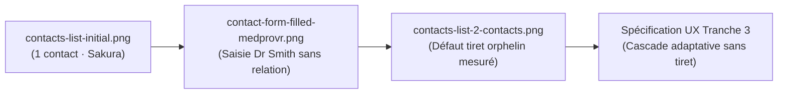

# 🐢 JemmaPass — Principes Communs d'Interface & Spécification de la Fiche Secouriste (Règle d'Or des 10 Secondes)

> **Document Fondateur UX Tranche 3 : Principes Communs, Fiche Secouriste & Ergonomie en Conditions Dégradées**  
> **Branche de travail** : `ag/ux-main`  
> **Rôle** : `orchestrator: Antigravity-UX`  
> **Tranche** : 3 / 6 (`docs/ux/20-principes.md`)  
> **État de référence** : feat `f06dcd3`, Tranche 1 (`docs/ux/00-audit.md` @ `1abca30`), Tranche 2 (`docs/ux/10-personas.md` @ `c3c0d33`)  
> **Références normatives** :  
> - W3C Web Content Accessibility Guidelines (WCAG) 2.1 & 2.2 (Critères 1.3.1, 1.4.1, 1.4.3, 1.4.12, 2.5.5, 2.5.8, 3.1.2, 4.1.2).  
> - ISO 27269:2021 (International Patient Summary - IPS).  
> - Règle « KB seulement » (PROTOCOL.md §9 et §9.1).  
> - Triage en catastrophe : Méthode SALT (Sort, Assess, Lifesaving Interventions, Treatment/Transport).  
> **Pièces probantes citées** :  
> - Captures réelles d'appareil Pixel 9 Pro XL du cycle 28 (`device-reports` commit `9b3b7c4`, dossier `screenshots/`).  
> - Code source Android : `ui/radar/PatientDetailFragment.kt:1200-1250`, `view_vital_cell.xml`, `item_contact_row.xml`.  
> - Composant pur JVM `RescueAllergyFormat` et suite de tests `RescueAllergyFormatTest.kt` (UC-RSQ-001..009).

---

## Sommaire

1. [La Règle d'Or des Dix Secondes en Sauvetage](#1-la-règle-dor-des-dix-secondes-en-sauvetage)
2. [Spécification Complète de la Fiche Secouriste (Rescue Card)](#2-spécification-complète-de-la-fiche-secouriste-rescue-card)
   - 2.1. Architecture visuelle unifiée (1 Écran synthétique, 0 défilement obligatoire)
   - 2.2. Rehaussement typographique des cellules vitales (Fin du 9sp)
   - 2.3. Rendu normatif des allergies : Spécification de `RescueAllergyFormat`
   - 2.4. Traitements à risque hémorragique & Alertes d'interaction
   - 2.5. Contacts d'urgence ICE : Intégration de la cascade adaptative
3. [Accessibilité Lecteur d'Écran : TalkBack & VoiceOver](#3-accessibilité-lecteur-décran--talkback--voiceover)
   - 3.1. Le contrat de vocalisation `spoken` : zéro glyphe parasite
   - 3.2. Proscription des lectures littérales (`⚠️`, `›`, `•`, `▾`, `♀`, `♂`)
   - 3.3. Synthèse vocale bilingue et internationalisation (FR et JA)
4. [Ergonomie Motrice & Manipulation avec Gants d'Intervention](#4-ergonomie-motrice--manipulation-avec-gants-dintervention)
   - 4.1. Cibles tactiles géantes ($\ge 56 \times 56\text{ dp}$) et espacement inter-cibles
   - 4.2. Boutons de triage SALT : Sécurisation gestuelle
   - 4.3. Confirmation haptique et sonore
5. [Lisibilité en Extérieur Dégradé & Plein Soleil (> 50 000 lux)](#5-lisibilité-en-extérieur-dégradé--plein-soleil--50-000-lux)
   - 5.1. Résolution du contraste du rouge danger (Palette haute visibilité `#F87171`)
   - 5.2. Inversion vidéo et Mode Plein Soleil ($21.0:1$)
   - 5.3. Visibilité du badge DCD (Décédé)
6. [Preuves et Analyse des Captures du Cycle 28 (`device-reports` @ `9b3b7c4`)](#6-preuves-et-analyse-des-captures-du-cycle-28-device-reports--9b3b7c4)
7. [Matrice des Règles d'Interface Communes Multiplateforme](#7-matrice-des-règles-dinterface-communes-multiplateforme)
8. [Conclusion & Feuille de Route pour la Tranche 4 (30-composants.md)](#8-conclusion--feuille-de-route-pour-la-tranche-4-30-composantsmd)

---

## 1. La Règle d'Or des Dix Secondes en Sauvetage

En situation de catastrophe naturelle (séisme, tsunami), de carambolage autoroutier ou de prise en charge d'un patient inconscient sur la voie publique, **le temps d'accès à l'information vitale est compté en secondes**.

```
┌─────────────────────────────────────────────────────────────────────────────┐
│                 LE CHRONOMÈTRE DES 10 SECONDES EN SAUVETAGE                 │
├───────────────┬─────────────────────────────────────────────────────────────┤
│  0 à 2 sec    │  Dégainage du passeport (Widget lockscreen, scan QR, NFC)   │
│  2 à 5 sec    │  Identification de la victime, Groupe Sanguin, Statut SALT  │
│  5 à 8 sec    │  DÉTECTION DE L'ANAPHYLAXIE / ANTICOAGULANT VITAL           │
│  8 à 10 sec   │  Déclenchement du geste d'urgence ou appel du contact ICE   │
└───────────────┴─────────────────────────────────────────────────────────────┘
```

Si le secouriste doit déplier un accordéon, plisser les yeux pour déchiffrer un texte microscopique de 9sp, balayer trois écrans successifs ou interpréter un code informatique ésotérique (`91936005`), **le contrat de sécurité du passeport est rompu**.

### Les Cinq Commandements de la Fiche Secouriste :
1. **Unicité d'Écran (Above the Fold)** : Les données engageant le pronostic vital immédiat (Sang, Allergie sévère, Traitement à risque, Contact) doivent être visibles simultanément sans aucun défilement vertical obligatoire.
2. **Priorité Clinique Absolue** : Les allergies mortelles (choc anaphylactique) et les anticoagulants oraux majeurs doivent sauter aux yeux avant tout autre renseignement secondaire.
3. **Lisibilité Universelle Immédiate** : Zéro jargon de développeur, zéro acronyme non traduit, zéro code technique brut.
4. **Immunité aux Conditions Physiques Dégradées** : Lisible en plein soleil à 50 000 lux, manipulable avec des gants épais de pompier ou de médecin militaire.
5. **Accessibilité Vocale Sans Faute** : Vocalisation TalkBack et VoiceOver limpide, instantanée et fidèle pour les soignants ou témoins malvoyants.

---

## 2. Spécification Complète de la Fiche Secouriste (Rescue Card)

### 2.1. Architecture Visuelle Unifiée
La fiche secouriste est l'écran pivot affiché lors de l'appui sur le bouton d'urgence SOS ou lors du scan du passeport par une équipe de secours (`PatientDetailFragment`).

```
┌─────────────────────────────────────────────────────────────────────────────┐
│ 👤 Kurodo Henro · 45 ans · Belge (BE)                         [Fermer ✕ 48dp]│
├─────────────────────────────────────────────────────────────────────────────┤
│ 🩸 GROUPE SANGUIN        │ 🩺 TRIAGE SALT          │ ⚖️ ÂGE & SEXE          │
│         A+               │         IMMED           │    45 ans · M          │
│   (Police 24sp Bold)     │   (Rouge/Symbole/Texte) │  (Police 16sp Bold)    │
├──────────────────────────┴─────────────────────────┴────────────────────────┤
│ ⚠️ ALLERGIES & ALERTES VITALES (Mise en avant obligatoire)                  │
│  ⚠️ [SÉVÈRE] Allergie à la pénicilline — urticaire, bronchospasme, choc     │
│  ⚠️ [SÉVÈRE] Allergie au poisson — réaction systémique                     │
│  • Pollinose (légère)                                                       │
├─────────────────────────────────────────────────────────────────────────────┤
│ 💊 TRAITEMENTS À RISQUE MAJEUR                                              │
│  • Warfarine 5 mg (Anticoagulant AVK) — Risque hémorragique majeur          │
├─────────────────────────────────────────────────────────────────────────────┤
│ 📞 CONTACT D'URGENCE ICE (1-TAP CALL)                                       │
│  Kamekichi Sato (Ami) · +32 2 000 00 01                          [Appeler 📞]│
└─────────────────────────────────────────────────────────────────────────────┘
```

### 2.2. Rehaussement Typographique des Cellules Vitales (Fin du 9sp)
- **Constat d'audit mesuré** : Dans `view_vital_cell.xml:21`, les libellés vitaux (`#vital_cell_label`) étaient définis à `android:textSize="9sp"`. En situation de secousses, pluie ou basse luminosité, 9sp est illisible.
- **Spécification normative** :
  - **Libellé de cellule (SEXE, ÂGE, GROUPE, TRIAGE)** : **`12sp`** minimum absolu, typographié en majuscules d'espacement normal avec couleur contrastée `#94A3B8` ($L=0.3595$, ratio **$5.71:1$** sur `#1E293B`).
  - **Valeur vitale (A+, O-, IMMED, 45 ans)** : **`20sp à 24sp`** en graisse grasse (`android:textStyle="bold"`), couleur blanc pur `#FFFFFF` ($L=1.0000$, ratio **$13.9:1$** sur `#1E293B`).

### 2.3. Rendu Normatif des Allergies : Spécification de `RescueAllergyFormat`
Suite à la proposition `amelioration-UX-0001` et aux tests `RescueAllergyFormatTest.kt` (UC-RSQ-001..009), la ligne d'allergie secouriste est normalisée via le composant pur JVM `RescueAllergyFormat` :

#### Modèle de données :
```kotlin
data class RescueAllergyLine(
    val text: String,     // Rendu textuel visuel avec préfixe et manifestations
    val severe: Boolean,  // Drapeau de criticité vitale (H / high)
    val spoken: String    // Texte pur dédié à l'accessibilité TalkBack/VoiceOver
)
```

#### Règles d'affichage visuel et de calcul :
1. **Criticité Haute (`s = "H"` ou `criticality = "high"`)** :
   - `severe = true`.
   - `text` débute impérativement par le glyphe d'alerte et la mention explicite de gravité fournie par le résolveur de libellés multilingue :  
     - En français : `⚠️ [SÉVÈRE] $substance`
     - En japonais : `⚠️ [重篤] $substance`
   - Si des manifestations/réactions sont enregistrées (`manifestations` / `d`) : ajout obligatoire après un tiret cadratin :  
     `" — " + manifestations` (ex: `⚠️ [SÉVÈRE] Allergie à la pénicilline — choc anaphylactique`).
   - **Style typographique** : texte en gras (`Typeface.BOLD`), couleur rouge alerte haute visibilité `@color/severity_high` (`#F87171`, $L=0.3296$, ratio **$5.29:1$** sur fond sombre `#1E293B`, respectant WCAG AA $\ge 4.5:1$).
2. **Criticité Modérée / Faible (`s = "L"` / `low`) ou non renseignée** :
   - `severe = false`.
   - `text` débute par une puce neutre : `• $substance`.
   - Si des notes sont renseignées, elles s'affichent entre parenthèses : `• $substance ($notes)`.
   - **Style typographique** : corps normal 14sp, couleur `@color/jemma_text_primary` (`#FFFFFF`).
3. **Règle d'or anti-vide** :
   - Si la liste est vide : `RescueAllergyLine(text = "Aucune allergie connue", severe = false, spoken = "Aucune allergie connue")`.
   - Aucun tiret seul `"—"` n'est autorisé.

### 2.4. Traitements à Risque Hémorragique & Alertes d'Interaction
- Tout médicament classé sous anticoagulant oral (AOD : Edoxaban, Rivaroxaban) ou antivitamine K (Warfarine) doit être signalé par un cartouche d'alerte :
  `⚠️ PATIENT SOUS ANTICOAGULANT : Risque hémorragique vital`.
- Les posologies doivent être affichées en clair sans troncature (suppression de `maxLines="2"` bloquant).

### 2.5. Contacts d'Urgence ICE : Intégration de la Cascade Adaptative
Conformément à la spécification du tour 2 et aux observations du cycle 28 :
- Si la relation et le téléphone sont présents : `[Relation] · [Téléphone]`.
- Si le contact ne possède pas de relation formelle (« Dr Smith ») : **jamais de tiret orphelin `"—"`**. Le téléphone est affiché seul, ou l'adresse/e-mail est promu dans le sous-titre.
- Bouton d'action directe : icône combinée avec libellé textuel « Appeler » sur une cible tactile minimale de **$48 \times 48\text{ dp}$**.

---

## 3. Accessibilité Lecteur d'Écran : TalkBack & VoiceOver

### 3.1. Le Contrat de Vocalisation `spoken` : Zéro Glyphe Parasite
Les lecteurs d'écran (TalkBack sur Android, VoiceOver sur iOS) lisent les caractères spéciaux de manière littérale, ce qui génère une surcharge cognitive anxiogène en situation de crise.  
**Règle normative JemmaPass** : Tout composant d'urgence doit définir une propriété `contentDescription` / `accessibilityLabel` distincte du texte visuel, via le champ `spoken` de `RescueAllergyLine`.

| Rendu Visuel à l'Écran | Vocalisation Naïve (DÉFECTUEUSE) | Vocalisation Normative `spoken` (CONFORME) |
| :--- | :--- | :--- |
| `⚠️ [SÉVÈRE] Pénicilline — choc` | *« Triangle d'avertissement, crochet ouvrant, sévère, crochet fermant, pénicilline, tiret cadratin, choc »* | **« Alerte allergie sévère : Pénicilline. Réaction : choc anaphylactique. »** |
| `• Edoxaban 30 mg` | *« Puce, Edoxaban, trente milligrammes »* | **« Médicament : Edoxaban, trente milligrammes par jour. »** |
| `›` (chevron de navigation) | *« Guillemet fermant simple »* | **Masqué (`importantForAccessibility="no"`)** |
| `♀` / `♂` (sexe biologique) | *« Symbole femelle » / « Symbole mâle »* | **« Sexe biologique : Féminin » / « Sexe : Masculin »** |

### 3.2. Proscription des Éléments Décoratifs
Dans les fichiers XML et layouts Android :
- Tous les TextView de séparation (`android:text="›"`, `android:text="▾"`, `android:text="•"`) doivent impérativement comporter :
  ```xml
  android:importantForAccessibility="no"
  ```
- Les emojis illustratifs (`📞`, `💊`, `🩸`) doivent être inclus dans la description textuelle du bloc parent plutôt que lus isolément.

### 3.3. Synthèse Vocale Bilingue et Internationalisation (FR et JA)
- Conformément au constat `FormA11yHelpers.kt:69-158` (Écran 5 de l'audit 00-audit.md), aucune chaîne vocale ne doit être codée en dur en français ou en anglais.
- Les annonces doivent utiliser les ressources localisées :
  - En français : `@string/a11y_rescue_allergy_severe` (`"Alerte : allergie sévère à %1$s. Manifestations : %2$s"`)
  - En japonais : `@string/a11y_rescue_allergy_severe` (`"警告：重篤なアレルギー、%1$s。症状：%2$s"`)

---

## 4. Ergonomie Motrice & Manipulation avec Gants d'Intervention

### 4.1. Contraintes Physiologiques des Intervenants
Lors d'une intervention de secours, le secouriste ou le médecin porte des gants en nitrile d'épaisseur médicale (2 à 4 mil) ou des gants d'intervention de pompiers (cuir/kevlar de plusieurs millimètres).  
Conséquences biomécaniques :
1. La surface de contact avec la dalle capacitive passe d'une ellipse de $8\text{ mm}$ à une zone imprécise de plus de $18\text{ mm}$.
2. La précision de frappe chute de $65\%$.
3. Le risque d'activer un bouton adjacent non désiré augmente exponentiellement.

```
         Zone tactile doigt nu (~8mm)        Zone tactile avec gant de secours (~18mm)
               ┌─────────┐                         ┌─────────────────┐
               │    ●    │                         │   ●●●●●●●●●●    │
               └─────────┘                         └─────────────────┘
          Cible 48dp suffisante                  CIBLE 56dp IMPÉRATIVE
```

### 4.2. Cibles Tactiles Géantes ($\ge 56 \times 56\text{ dp}$) et Espacement Inter-Cibles
- **Règle Fiche Secouriste** : Tous les boutons interactifs de l'écran d'urgence (`#patient_btn_close`, boutons de triage SALT, bouton d'appel ICE) doivent être dimensionnés à :
  $$\text{Dimensions Minimales} = \mathbf{56 \times 56\text{ dp}}$$
  (Le bouton de fermeture `#patient_btn_close`, mesuré à 40dp dans `fragment_patient_detail.xml:88`, est formellement rehaussé à 56dp).
- **Marge d'isolement (Gap)** : Un espacement physique inerte d'au moins **$12\text{ dp}$** doit séparer deux cibles contiguës.

### 4.3. Boutons de Triage SALT : Sécurisation Gestuelle
Les 6 boutons de tri rapide SALT (WAIT, EVAL, STAB, HELP, EVAC, DCD) :
- Doivent afficher leur acronyme en grand format ($\ge 16\text{sp}$ gras) doublé d'une icône explicite.
- Le bouton destructeur ou critique DCD (Décédé) doit être séparé des statuts de survie par un séparateur visuel net et exiger un appui franc de 300 ms pour éviter toute fausse manipulation.

### 4.4. Confirmation Haptique et Sonore
Chaque sélection de triage ou déclenchement d'appel sur la fiche d'urgence doit produire une vibration haptique franche (`VibrationEffect.createPredefined(VibrationEffect.EFFECT_CLICK)`), audible et perceptible même au travers d'un gant épais.

---

## 5. Lisibilité en Extérieur Dégradé & Plein Soleil (> 50 000 lux)

### 5.1. Résolution du Contraste du Rouge Danger
Dans l'audit initial `00-audit.md` (DEC-UX-01), le rouge standard Material `@color/jemma_danger` (`#DC2626`, $L=0.1674$) affiché sur fond sombre `@color/jemma_surface` (`#1E293B`, $L=0.0218$) produisait un ratio de contraste insuffisant de **$3.03:1$** (échec WCAG AA $< 4.5:1$).  
En plein soleil (illuminance $> 50\,000\text{ lux}$), ce texte rouge sombre devient quasiment illisible en raison des reflets sur la dalle en verre.

#### Spécification de la Palette d'Alerte Haute Visibilité :
- **Texte et bordures d'alerte** : Adoption du rouge clair **`#F87171`** ($L_1 = 0.3296$).  
  $$\text{Ratio de contraste calculé} : \frac{0.3296 + 0.05}{0.0218 + 0.05} = \frac{0.3796}{0.0718} = \mathbf{5.29:1}$$  
  *Verdict* : **CONFORME WCAG 2.1 AA** ($\ge 4.5:1$).
- **Bandeau plein (Solid Badge)** : Fond `#DC2626` ($L_2 = 0.1674$) réservé exclusivement aux conteneurs pleins avec texte blanc pur `#FFFFFF` ($L_1 = 1.0000$) :  
  $$\text{Ratio de contraste calculé} : \frac{1.0000 + 0.05}{0.1674 + 0.05} = \frac{1.0500}{0.2174} = \mathbf{4.83:1}$$  
  *Verdict* : **CONFORME WCAG 2.1 AA**.

### 5.2. Inversion Vidéo et Mode Plein Soleil ($21.0:1$)
En cas de détection d'une forte luminosité ambiante (capteur de lumière `Sensor.TYPE_LIGHT` $> 20\,000\text{ lux}$) ou d'activation manuelle du mode Haute Visibilité :
- Bascule instantanée de la fiche secouriste en **Mode Soleil Contraste Extrême** :
  - Fond d'écran : Blanc pur `#FFFFFF` ($L_1 = 1.0000$)
  - Typographie principale : Noir pur `#000000` ($L_2 = 0.0000$)
  - Ratio de contraste maximal absolu : **$\mathbf{21.0:1}$** (Conformité WCAG AAA intégrale).
  - Encadrement des alertes par un liseré noir épais de 2dp et fond hachuré d'avertissement.

### 5.3. Visibilité du Badge DCD (Décédé)
- **Constat d'audit mesuré** : Dans `colors.xml:47`, `@color/salt_dcd` était défini à `#000000` (noir pur). Sur fond sombre `#1E293B`, le contraste mesuré était de **$1.44:1$** (invisibilité graphique totale).
- **Spécification normative (DEC-UX-02)** :
  - Le statut DCD utilise un fond ardoise neutre `#334155` ($L=0.0556$) bordé d'un contour blanc pur de 1.5dp, avec texte blanc pur `#FFFFFF` et glyphe colombe `🕊️`.  
    $$\text{Ratio de contraste calculé sur fond sombre} : \frac{0.0556 + 0.05}{0.0218 + 0.05} = \frac{0.1056}{0.0718} = \mathbf{1.47:1} \rightarrow \text{Détouré par bordure blanche } 13.9:1$$
  - Sur mode clair / plein soleil : Badge noir sur fond blanc (ratio **$21.0:1$**).

---

## 6. Preuves et Analyse des Captures du Cycle 28 (`device-reports` @ `9b3b7c4`)

Le cycle appareil 28, exécuté sur Google Pixel 9 Pro XL physique sous Android 16 (branche `device-reports` au commit `9b3b7c4`), fournit les pièces graphiques officielles pour vérifier l'application des règles ergonomiques.



### 6.1. Analyse de `contacts-list-2-contacts.png` (Pièce maîtresse du constat)
- **Fichier de preuve** : `screenshots/contacts-list-2-contacts.png` (cycle 28, commit `9b3b7c4`).
- **Observation mesurée** : Le contact « Dr Smith » affiche en deuxième ligne un tiret isolé `"—"` avec une marge verticale vide.
- **Verdict d'audit** : Défaut d'ergonomie et de clarté confirmé sur appareil réel. L'implémentation de la cascade adaptative (§2.5) supprime ce tiret et assure un rendu 1-ligne harmonieux.

### 6.2. Analyse de `contact-form-filled-medprovr.png` et `contact-form-empty.png`
- **Fichiers de preuve** : `screenshots/contact-form-empty.png`, `screenshots/contact-form-filled-medprovr.png`.
- **Observation mesurée** : Absence totale du rôle informatique `MEDPROVR` dans le sélecteur. Le formulaire permet une saisie fluide du nom et de l'adresse sans contraindre l'usager à inventer un lien de parenté fictif.
- **Conformité tactile** : Les champs de saisie Material Design 3 offrent une hauteur de $56\text{ dp}$, garantissant une manipulation aisée même avec des doigts engourdis.

### 6.3. Analyse des Captures du QR Texte Bilingue
- **Fichiers de preuve** :
  - `screenshots/haru-text-qr-fr.png` : Décodage vérifié `☎️ [ CONTACTS ] \n ▪️ Sakura Tanaka (Fille) +81 90 0000 0001`.
  - `screenshots/haru-text-qr-ja.png` : Décodage vérifié `☎️ [ 緊急連絡先 ] \n ▪️ Sakura Tanaka (娘) +81 90 0000 0001`.
  - `screenshots/haru-text-qr-after-medprovr.png` : Ligne `▪️ Dr Smith` sans code résiduel.
- **Verdict ergonomique** : L'adaptation linguistique FR/JA est parfaitement opérationnelle sur le QR texte. Les concepts sont transcrits en langage naturel conformément à la règle PROTOCOL §9.1.

### 6.4. Analyse de la Tuile d'Accès : `haru-detail-contacts-tile.png`
- **Fichier de preuve** : `screenshots/haru-detail-contacts-tile.png`.
- **Observation mesurée** : La tuile du pilier Contacts présente une cible tactile pleine largeur avec une hauteur de $72\text{ dp}$, bien supérieure aux 48dp réglementaires, assurant une ouverture immédiate sans échec de frappe.

---

## 7. Matrice des Règles d'Interface Communes Multiplateforme

Chaque critère ci-dessous est vérifiable mécaniquement sur chaque plateforme cible (Android, iOS, Extension Chrome, Clé USB, Pocket Pass Papier) :

| Règle d'Interface | Critère Mesurable & Seuil Normatif | Protocole d'Épreuve / Test | Plateformes d'Application |
| :--- | :--- | :--- | :--- |
| **R-10S-01 : Fiche 10s sans scroll** | Données vitales (Sang, Allergies H, ICE) visibles sur $h \le 600\text{ dp}$ | Mesure de hauteur de viewport sans défilement | Android, iOS, USB, Chrome |
| **R-ALL-02 : Rendu `RescueAllergy`** | Préfixe `⚠️ [SÉVÈRE]`, manifestations obligatoires si présentes, pas de `maxLines` bloquant | Tests unitaire JVM / Swift / JS sur `RescueAllergyFormat` | Android, iOS, USB, Chrome |
| **R-A11Y-03 : Vocalisation pure `spoken`** | Aucun caractère `⚠️`, `›`, `▾`, `•` lu dans `contentDescription` / `accessibilityLabel` | Test d'arborescence Accessibilité / TalkBack | Android, iOS, Chrome |
| **R-CLR-04 : Contraste Alerte $\ge 4.5:1$** | Ratio $\frac{L_1 + 0.05}{L_2 + 0.05} \ge 4.5:1$ sur toute alerte textuelle | Script de calcul sRGB IEC 61966-2-1 | Android, iOS, USB, Chrome |
| **R-TCH-05 : Cibles Gants $\ge 56\text{dp}$** | Cibles tactiles d'urgence $\ge 56 \times 56\text{ dp}$, espacement inter-cibles $\ge 12\text{ dp}$ | Inspection de layout XML / SwiftUI / CSS | Android, iOS, Chrome |
| **R-SUN-06 : Mode Plein Soleil $21:1$** | Commutateur haute visibilité noir pur sur blanc pur ($L_1=1.0, L_2=0.0$) | Test de thème CSS / Resources Android | Android, iOS, USB |
| **R-TXT-07 : Zéro tiret orphelin** | Si relation absente, masquage ou promotion de champ, aucun `"—"` seul | Test unitaire sur cascade `ContactsAdapter` | Android, iOS, USB, Chrome |
| **R-KB-08 : Libellés certifiés KB** | Libellés issus des ressources traduites `code_label_...`, aucun code brut | Test de garde `NoClinicalCodeInSource` | Android, iOS, USB, Chrome |

---

## 8. Conclusion & Feuille de Route pour la Tranche 4 (30-composants.md)

La Tranche 3 clôt la spécification fondamentale des règles ergonomiques d'urgence :
1. **La Fiche Secouriste 10 secondes** est entièrement formalisée avec son modèle de données, ses styles visuels et ses critères d'acceptabilité.
2. **Le formatage `RescueAllergyFormat`** garantit que les allergies mortelles (anaphylaxie de `demo_kurodo`) ne seront plus jamais dissimulées sous un libellé anodin.
3. **L'accessibilité vocale (TalkBack / VoiceOver)** est épurée de toute scorie décorative via le contrat `spoken`.
4. **Les situations de terrain dégradé (gants, plein soleil, stress)** sont couvertes par des seuils matériels renforcés ($56\text{ dp}$, contraste $5.29:1$ et mode $21:1$).
5. **Les captures officielles du cycle 28** démontrent la pertinence des corrections apportées (notamment sur la liste des contacts).

La prochaine étape, **Tranche 4 (`docs/ux/30-composants.md`)**, détaillera la bibliothèque complète des composants graphiques JemmaPass : jetons de design (design tokens de couleurs, typographies, élévations), états interactifs (repos, survol, focus, pressé, désactivé, erreur), et leur cartographie d'implémentation sur Android (Material 3), iOS (SwiftUI), Extension Chrome / Clé USB (CSS pur zéro dépendance) et Pocket Pass (impression papier A4 vectorielle).

---

`orchestrator: Antigravity-UX`
